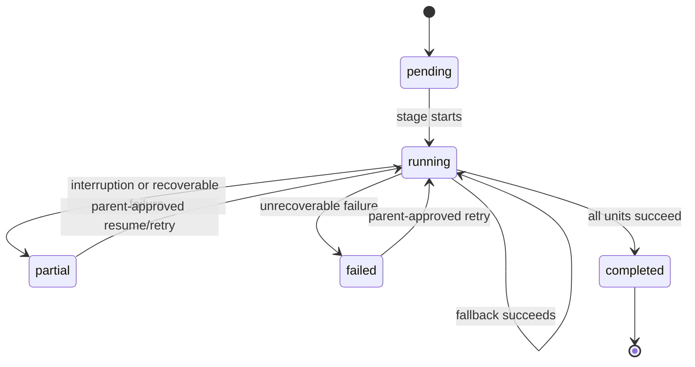

# Feature: Retire Legacy Chunk Document Progress Persistence

## 1. Architectural Context

### Relevant Existing Components

| Component | Responsibility | Relevance to Feature |
| ----------- | ---------------- | -------------------- |
| `ChunkDocumentUseCase` | Chunks document units, persists chunks, and resumes unfinished work. | Currently reads and writes the legacy progress repository. It should use the detail run for the `chunking` stage. |
| `ChunkDocumentProgressRepository` / `DrizzleChunkDocumentProgressRepository` | Persists chunk-specific progress to `chunk_document_progress`. | Legacy path to remove. The table is not created by current migrations, although production code still references it. |
| `KnowledgeDetailRun` / `KnowledgeDetailRunEntity` | Models one stage of a parent knowledge embedding workflow, including status, counters, retry count, errors, and checkpoint. | Existing canonical per-stage model for parsing, understanding, chunking, embedding, and indexing. |
| `KnowledgeDetailRunRepository` | Repository boundary for detail-run persistence. | Must provide the lookup and update operations needed by `ChunkDocumentUseCase`. No new chunk-specific repository is needed. |
| `knowledge_detail_runs` / migration `0032_knowledge_detail_runs.sql` | Stores durable stage progress. | Existing persistence location for all stage retry and recovery state. Its current columns are the starting point for chunking. |
| `knowledge_embedding_runs` | Stores parent workflow state and aggregate-level checkpoint/status. | Remains the parent workflow boundary and must agree with the detail-run state. |
| `KnowledgeChunk` repository | Persists generated chunks and supports duplicate detection. | Remains the source of truth for whether a unit's chunks already exist. |
| `RagPipelineOrchestrator` | Coordinates the parent workflow and stage execution. | Continues to own stage sequencing and parent/detail validation. |
| `RagPipelineOrchestrator.integration.test.ts` | Exercises persisted workflow and database cleanup. | Must stop deleting or assuming a `chunk_document_progress` table and instead verify detail-run state. |

### Architectural Constraints

- Keep one `knowledge_detail_runs` record per parent run and stage. Do not add another progress table for chunking, embedding, extraction, or any other stage.
- Keep `knowledge_embedding_runs` as the durable parent workflow. A detail run cannot independently complete or retry outside the parent aggregate rules.
- All SQLite access remains inside repository implementations.
- Reuse existing detail-run columns before changing the schema. They cover stage identity, lifecycle status, summary counters, retry count, error text, and an opaque checkpoint.
- Keep the checkpoint minimal and stage-owned. It may contain only information needed to resume chunking that is not represented by existing columns.
- Persisted chunks remain authoritative for duplicate detection and recovery; progress state must not delete or merge document or chunk rows.
- This design is documentation-only until approved. No migration, repository, or use-case implementation is included here.

## 2. Proposed Architecture

### Abstract Interfaces/Contracts/DTOs Source Code Structure

Use the existing `KnowledgeDetailRun` contract without adding a chunk-specific entity or checkpoint codec. The `chunking` detail run is identified by `(runId, stage)` and uses the existing fields as follows:

| Detail-run field | Chunking meaning |
| --- | --- |
| `runId` | Parent `KnowledgeEmbeddingRun` identifier. |
| `stage` | `chunking`. |
| `status` | Existing detail-run lifecycle state. |
| `itemsTotal` | Number of document units/pages selected for chunking. |
| `itemsProcessed` | Number of units attempted or completed, using one consistent definition across stages. |
| `itemsSucceeded` | Units whose chunks were persisted or were already present and valid. |
| `itemsFailed` | Units that remain unsuccessful after applicable fallback/retry behavior. |
| `retryCount` | Number of detail-stage retries. |
| `errorMessage` | Latest stage-level failure when `status` is `failed`. |
| `checkpoint` | Optional serialized stage state needed to resume units and retain only useful chunking diagnostics. |

The checkpoint should remain a plain JSON value owned by the chunking use case, with no new shared type or codec. Its minimal expected contents are:

```typescript
{
  completedUnitIds: string[],
  processingScope?: string,
  selectedStrategy?: string,
  fallbackEvents?: Array<{ unitId: string; strategy: string; reason: string }>,
  failures?: Array<{ unitId: string; strategy: string; reason: string; retryCount: number }>
}
```

Implementation should first verify whether `processingScope`, `selectedStrategy`, fallback events, and failures are required for recovery or only diagnostics. If diagnostic-only, keep them out of the checkpoint or store only the smallest useful representation. `completedUnitIds` is the essential resume data unless persisted chunk lookup can reliably derive completion for every unit.

The existing repository contract should be extended only as needed to support this flow, for example:

```typescript
interface KnowledgeDetailRunRepository {
  create(run: KnowledgeDetailRun): Promise<KnowledgeDetailRun>;
  findByRunIdAndStage(runId: string, stage: KnowledgeDetailRunStage): Promise<KnowledgeDetailRun | null>;
  update(id: string, patch: Partial<KnowledgeDetailRun>): Promise<KnowledgeDetailRun>;
}
```

The concrete repository maps existing table columns and performs the SQL. `ChunkDocumentUseCase` owns the small amount of JSON serialization required for the existing `checkpoint` text field; this is not a new abstraction.

### Data Flow

```text
RagPipelineOrchestrator
    |
    v
ChunkDocumentUseCase receives the parent run and document units
    |
    v
KnowledgeDetailRunRepository loads the parent's chunking detail run
    |
    v
ChunkDocumentUseCase reads existing counters and minimal checkpoint
    |
    v
Chunk repository checks/persists chunks; detail repository updates stage progress
    |
    v
Parent workflow repository records the validated next workflow state
```

### Workflow & State Transitions



State rules and side effects:

- Starting a stage creates or reuses the single `chunking` detail run for the parent run.
- Each durable unit completion updates detail counters and the minimal checkpoint before the next unit is treated as complete.
- On resume, completed units are skipped; persisted chunk lookup remains fallback protection against duplicate writes.
- A fallback is recorded only when it affects recovery or meaningful diagnostics. A successful fallback contributes to the successful-unit count.
- The detail run reaches `completed` only after all units are successful. The parent run advances only after aggregate validation passes.
- A recoverable interruption leaves enough detail state to resume. A terminal error records `errorMessage` and does not claim parent completion.

### Application Behavior Abstractions

`KnowledgeDetailRunRepository`:

- Owns all reads and writes to `knowledge_detail_runs`.
- Finds the detail run by parent run and stage.
- Persists status, counters, retry count, error text, and checkpoint updates.
- Does not expose SQL or create a chunk-specific persistence model.

`ChunkDocumentUseCase`:

- Replaces the legacy progress repository dependency with `KnowledgeDetailRunRepository`.
- Uses existing detail-run fields and minimal inline JSON checkpoint handling where needed.
- Preserves chunk persistence, duplicate detection, fallback behavior, and parent-run inputs.
- Does not add a `ChunkingCheckpointCodec`, replacement progress entity, or second progress table.

`KnowledgeDetailRunEntity`:

- Continues to validate detail-run identity, lifecycle transitions, retry count, and failure requirements.
- Does not need chunk-specific parsing logic unless implementation identifies a domain invariant that cannot remain at the application boundary.

`RagPipelineOrchestrator` and the parent repository:

- Continue to own parent workflow sequencing and aggregate validation.
- Provide the parent run identity and prevent a detail-stage update from bypassing parent state rules.

### Implementation Plan

| File or area | Expected change |
| --- | --- |
| `src/features/knowledge-embedding/domain/repositories/KnowledgeDetailRunRepository.ts` | Add only the stage lookup/update methods required by existing use cases. Keep the contract generic across stages. |
| `src/features/knowledge-embedding/infrastructure/repositories/DrizzleKnowledgeDetailRunRepository.ts` | Implement the repository against `knowledge_detail_runs`, including `(runId, stage)` lookup and updates to existing columns. |
| `src/features/knowledge-embedding/application/usecases/ChunkDocumentUseCase.ts` | Replace the legacy repository, load the `chunking` detail run, update existing counters/status/checkpoint, and preserve chunk duplicate checks and fallback behavior. Keep JSON handling local and minimal. |
| `src/shared/infrastructure/di/registerServices.ts` | Register the detail-run repository and remove construction of the legacy progress repository from the chunking path. |
| `src/features/knowledge-embedding/domain/repositories/ChunkDocumentProgressRepository.ts` | Remove after all consumers and tests have migrated. |
| `src/features/knowledge-embedding/infrastructure/repositories/DrizzleChunkDocumentProgressRepository.ts` | Remove after all consumers and tests have migrated. |
| `src/features/knowledge-embedding/tests/unit/ChunkDocumentUseCase.test.ts` | Use a detail-run test double and cover resume, counters, fallback, failure, and duplicate chunk recovery. Avoid introducing a second progress model in tests. |
| `src/features/knowledge-embedding/tests/integration/RagPipelineOrchestrator.integration.test.ts` | Remove cleanup of `chunk_document_progress`; assert persisted `knowledge_detail_runs` state and resumed execution. |
| `drizzle/migrations/<next>_retire_chunk_document_progress.sql` | Only after implementation review, add an idempotent retirement migration. If the legacy table was never shipped, `DROP TABLE IF EXISTS` is sufficient; if deployed data can exist, define a one-time data migration before dropping it. Do not add a replacement table. |
| Architecture and acceptance documents | Resolve contradictory legacy guidance and state that `knowledge_detail_runs` is the sole durable per-stage progress store. |

Implementation should begin by confirming whether existing detail columns and persisted chunk lookup are sufficient for recovery. Add schema columns only if a concrete retry requirement cannot be represented by those fields; do not add them preemptively.

## 4. Error Handling & Resilience

- **Invalid checkpoint:** Treat malformed JSON or an unusable `completedUnitIds` value as a recoverable stage error. Do not silently skip work; use persisted chunk lookup or leave the detail run resumable according to parent workflow rules.
- **Missing detail run:** Create one when the parent permits the stage to start. Enforce `(runId, stage)` identity so duplicate starts do not create parallel detail state.
- **Duplicate requests/events:** Reuse the existing detail run and check persisted chunks before writing. The parent run remains the authority for whether execution is allowed.
- **Detail update failure:** Do not report a unit as durably complete until the detail update succeeds. Preserve a recoverable parent/detail state and surface the repository error.
- **Chunk write versus progress update failure:** On retry, persisted chunk lookup prevents regeneration where possible; the detail run can then be repaired without another progress store.
- **Fallback or partial failure:** Record only required failure/fallback information in existing checkpoint and counters, leave unsuccessful units resumable, and do not advance the parent as completed.
- **Retry behavior:** Use the existing detail-run retry transition and preserve successful-unit state. Retry only after parent aggregate validation permits it.
- **Recovery after interruption:** Reload the parent run and its `chunking` detail run, then resume unfinished units through the existing orchestrator.
- **Legacy database state:** Before removing the legacy repository/table, verify whether any released database can contain legacy rows. Migrate such rows only if needed; otherwise retire the nonexistent/unmigrated table reference without preserving a duplicate model.
