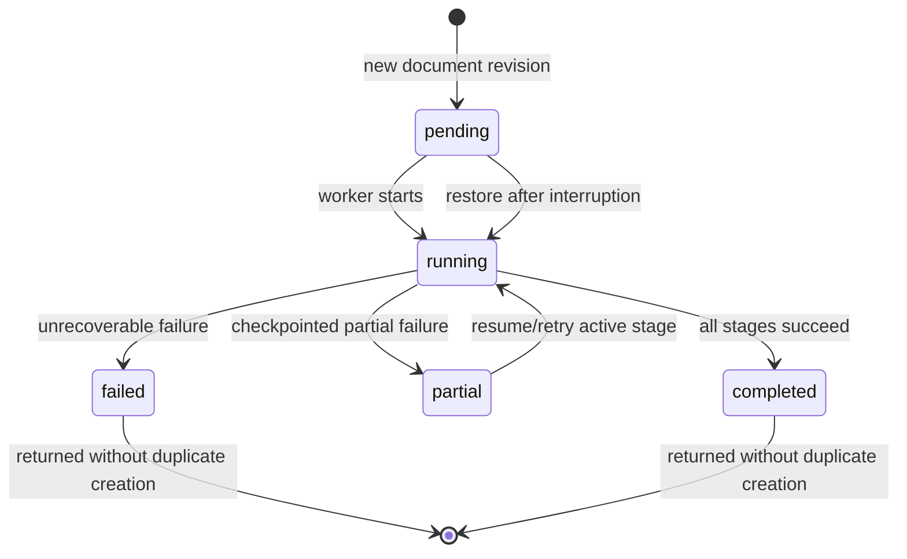

# Feature: Document ID and Knowledge Embedding Run De-duplication

## 1. Architectural Context

### Relevant Existing Components

| Component | Responsibility | Relevance to Feature |
| ----------- | -------------- | ------------------- |
| `DocumentEntity` | Represents a persisted document and can generate a document ID when one is not supplied. | Its generated ID is `doc_<timestamp>_<random>`; it is not derived from the filename. |
| `ReceiveDocumentUseCase` | Creates a document identity and first document-version workflow record. | Generates `doc-<timestamp>-<random>` and `doc-version-<timestamp>-<random>` IDs; the input filename is metadata only. |
| `useKnowledgeEmbeddingFlow` | Passes the selected document into the embedding document service. | Supplies `document.id` as `documentId`; it does not derive the ID from `name` or `uri`. |
| `KnowledgeEmbeddingDocumentService` | Persists documents, creates workflow records, and queues processing. | Current active onboarding de-duplicates by `(documentId, documentVersion)`. |
| `DrizzleDocumentChunkingWorkflowRepository` | SQLite repository for `knowledge_embedding_runs`. | Looks up by document/version or latest document; the database has indexes, but no uniqueness constraint. |
| `KnowledgeEmbeddingRunEntity` | Domain model for an embedding execution run. | `id` identifies the run; `documentId` identifies the source document. It validates presence but does not generate either value. |
| `RagPipelineOrchestrator` | Creates or reuses a run and publishes it to an in-memory queue. | Its `execute` and `resume` methods de-duplicate by `documentId`; it is not registered in the current DI setup. |

### Architectural Constraints

* A document ID is an opaque application identity, not a natural key based on filename, URI, or file content.
* A run ID, logical document ID, and content revision ID must remain separate concepts: one logical document can have multiple immutable revisions, while a run ID identifies one processing workflow.
* SQLite's `documents.local_id` is an internal auto-increment storage key; `documents.id` is the existing domain identifier used by repositories and soft relationships.
* The current active service uses the existing `DocumentChunkingWorkflowRepository` and SQLite `knowledge_embedding_runs` table.
* Repository implementations are the only persistence boundary.
* Do not introduce a second document identity scheme or a second orchestration engine for the same workflow.

## 2. Proposed Architecture

### Abstract Interfaces/Contracts/DTOs Source Code Structure

The existing structure is sufficient. The intended contracts are:

```ts
interface DocumentIdentity {
  documentId: string;       // stable opaque identity for the source document
    revisionId: string;       // identity of one immutable content revision
    contentHash: string;      // SHA-256 of the exact accepted file bytes
    ingestedAt: Date;         // when this revision entered the local system
}

interface KnowledgeEmbeddingRun {
  id: string;               // identity of this processing run/record
    documentId: string;       // stable logical source-document identity
    revisionId: string;       // immutable content revision being processed
    contentHash: string;      // exact-byte identity for idempotency
    ingestedAt: Date;         // retrieval ordering metadata
  status: RunStatus;
  currentStage?: RunStage;
  createdAt: Date;
  updatedAt?: Date;
}

interface KnowledgeEmbeddingRunRepository {
  findByDocumentId(documentId: string): Promise<KnowledgeEmbeddingRun | null>;
    findByContentHash(scopeKey: string, contentHash: string): Promise<KnowledgeEmbeddingRun | null>;
  findById(id: string): Promise<KnowledgeEmbeddingRun | null>;
  create(run: KnowledgeEmbeddingRun): Promise<KnowledgeEmbeddingRun>;
  update(id: string, patch: Partial<KnowledgeEmbeddingRun>): Promise<KnowledgeEmbeddingRun>;
}
```

The intake contract should carry identity evidence explicitly:

```ts
interface DocumentIntakeIdentity {
    documentId: string;       // generated once for a logical document
    revisionId: string;       // generated or derived for one immutable revision
    contentHash: string;      // SHA-256 of file bytes, lowercase hex
    scopeKey: string;         // project/owner/source scope for duplicate lookup
    ingestedAt: Date;
}
```

Required invariants:

* `documentId`, run `id`, and `createdAt` are non-empty/valid.
* `revisionId`, `contentHash`, and `scopeKey` are non-empty; `ingestedAt` is valid.
* `(scopeKey, contentHash)` is the exact-content idempotency key at intake.
* `(documentId, revisionId)` is the embedding workflow idempotency key.
* A different hash is a new revision only when the caller has reliable evidence that it belongs to the same logical document.

### Document Identity Options

There is no universally reliable way to derive a logical document identity from a filename. The correct option depends on what “duplicate” means:

| Option | Candidate identity | Strengths | Weaknesses | Best use |
| --- | --- | --- | --- | --- |
| A. Generated opaque ID | UUID/ULID created once at document intake | Collision-resistant and independent of mutable metadata | Cannot detect the same file imported twice unless the original ID travels with it | Primary identity for one persisted document record |
| B. Canonical source key | Normalized provider/storage key | Stable when documents have a durable storage identity; cheap to compare | Not available for arbitrary local files; key may change after copy/move | Documents managed by an external storage system |
| C. Content hash | SHA-256 of the exact file bytes | Detects byte-for-byte duplicates regardless of filename/path | Requires reading the complete file; changed bytes produce a new hash | Duplicate upload detection and idempotent processing |
| D. Metadata fingerprint | Normalized filename + size + modified time | Cheap and available before reading the file | False positives and false negatives | Optional pre-check only, never the authoritative key |
| E. Composite identity | Scope + source key when available, otherwise generated ID, plus content hash | Handles logical identity and repeated imports | Requires an explicit policy and more fields | Recommended general-purpose design |

### Auto-Increment Versus Domain Document ID

SQLite auto-increment is sufficient as an internal surrogate key for the `documents` table, but it should not replace the domain-level `documents.id` in this application. The current schema already has both:

* `documents.local_id`: SQLite-generated row key, suitable for local joins and storage internals.
* `documents.id`: application-level string identifier referenced by `Document`, workflow records, chunks, search filters, and other soft relationships.

Recommended choice:

* Keep `local_id` as the internal auto-increment primary key.
* Keep a generated opaque `documents.id` as the stable domain identity. It may be a UUID/ULID or the existing generated string format; it does not need to encode the hash.
* Add `contentHash`/`checksum` as a separate indexed value for exact-content deduplication.
* Do not expose or propagate `local_id` as `documentId`; local row IDs are implementation details and can be unsafe across import/export, synchronization, or future storage changes.

If this feature is strictly local and no document references need to survive database replacement, using `local_id` as the domain ID would reduce one field. That is not the conservative choice here because the current code already treats `documents.id` as the domain contract and embedding records store string `document_id` values.

Recommended policy:

1. Generate an opaque `documentId` once when the application accepts a new logical document. Never derive it from filename; do not replace it with SQLite `local_id`.
2. Compute a SHA-256 `contentHash` while ingesting the file. Use `(scope, contentHash)` to detect an identical file already known to the application.
3. Create a `revisionId` and record `ingestedAt` for every accepted content revision. A revision is immutable.
4. Link a different hash to the same `documentId` only when the user, source-system key, or explicit replacement workflow establishes lineage. Otherwise create a new logical document.
5. Use `(documentId, revisionId)` for embedding workflow identity and `(scope, contentHash)` for exact-content intake deduplication.
6. Use `ingestedAt` to rank or group retrieved context, but do not use timestamps as identity: timestamps can collide, change with clock state, and do not prove content equality.

A hash alone is not a suitable replacement for `documentId`: two projects may intentionally contain the same file, and different hashes cannot prove that two files are revisions of the same logical document.

### Data Flow

```text
Document picker or caller-provided document object
    ↓
Read bytes and compute SHA-256 contentHash
    ↓
Find existing revision by (scopeKey, contentHash)
    ↓
Reuse existing revision or create documentId/revisionId/ingestedAt
    ↓
DocumentRepository + KnowledgeEmbeddingRunRepository
    ↓
InMemoryWorkflowQueue
```

The filename and URI remain metadata. The content hash is calculated from file bytes, not from filename, URI, or timestamp. `DocumentEntity.create` and `ReceiveDocumentUseCase` currently generate randomised IDs; the intake flow must compute the hash before deciding whether to reuse an existing revision.

The active service currently checks `findByDocumentVersion(documentId, documentVersion)`. It should instead check the content-hash index at intake, then use the stable revision identity when creating or reusing the embedding run. The existing numeric version may be retained as a display/order sequence, but it must not be treated as proof that two files are semantically different.

The separate `RagPipelineOrchestrator` checks `findByDocumentId(documentId)`. If a record exists, it reuses it and queues it only when recoverable. Otherwise it creates an ID of the form `run-${Date.now().toString(36)}`. This path is covered by unit tests but is not wired in `registerServices.ts`.

### State Flow



```text
Document bytes accepted
    ↓
No record for (scopeKey, contentHash)
    ↓ create and queue
Pending → Running → Completed
              ↓
           Partial → Running
              ↓
           Failed

Existing active/partial record
    ↓
Reuse existing record and queue/resume

Existing completed/failed record
    ↓
Return existing record; do not create a duplicate
```

The exact transition rules are owned by the workflow service/entity. A retry or resume must preserve the document ID, revision ID, content hash, and run ID; it should not create a new revision merely because processing is repeated. A new hash enters the new-revision path only when lineage is explicitly known.

## 3. Data / Persistence Changes

Persistence changes are required for the recommended design.

The existing table stores both values independently:

* `id`: primary key for the workflow record.
* `document_id`: indexed source-document identity.
* `document_version`: existing indexed sequence field, currently defaulting to `1`; it may remain as a display/order sequence, but it is not a content identity.

For the recommended design, persist content identity at the document/version boundary rather than in the run identity:

* `content_hash`: SHA-256 of the accepted file bytes.
* `revision_id`: immutable identity for one content revision.
* `ingested_at`: timestamp used for retrieval ordering and audit history.
* `scope_key` or the existing project/owner relationship: bounds duplicate detection to the intended ownership scope.
* A unique index on `(scope_key, content_hash)` if identical-file intake must be rejected or reused.
* A unique index on `(document_id, revision_id)` to make embedding creation race-safe.

The current `Document` entity already exposes `checksum`, and `ReceiveDocumentInput` accepts `checksum`, but the active knowledge-embedding command does not carry or persist it. Reuse that field only after defining it as a content hash; otherwise add an explicit `contentHash` field.

Important current limitation: the schema defines indexes, not uniqueness constraints for content or revision identity. Application-level lookup prevents ordinary duplicates, but concurrent callers could still race and insert multiple records for the same content hash or revision.

## 4. Error Handling & Resilience

* Empty document IDs are rejected before orchestration.
* Missing persisted document state causes the active document service to reject an existing workflow record that has no corresponding document.
* Repeated requests are idempotent when they reach the repository lookup and use the same scope and content hash.
* Resume after interruption restores pending, partial, and running records from persisted status.
* A filename change or URI change does not alter identity. A content replacement creates a new revision only when its relationship to the logical document is explicitly known.
* A content hash detects identical bytes, not identical document meaning.
* Duplicate prevention is not fully race-safe until the persistence layer enforces uniqueness or the create operation is transactional/upsert-based.

## 5. Implementation Sequence

1. Treat `Document.id` as the stable logical document identity and keep it independent from filename and URI metadata.
2. Define the duplicate scope and compute a SHA-256 content hash during document intake.
3. Reuse `Document.checksum` only after documenting that it stores the content hash; otherwise add explicit `contentHash`, `revisionId`, and `ingestedAt` fields through the intake and persistence contracts.
4. Add an intake lookup by `(scopeKey, contentHash)` before creating a new revision or queue item.
5. Create a new immutable revision for changed bytes only when the caller has reliable lineage; otherwise create a new logical document.
6. Decide which workflow abstraction is authoritative: the active `KnowledgeEmbeddingDocumentService` path or the currently isolated `RagPipelineOrchestrator` path.
7. Replace version-only workflow identity with `(documentId, revisionId)` while retaining `documentVersion` only as an optional ordering/display field.
8. Add uniqueness constraints or transactional upserts for `(scope, content_hash)` and `(document_id, revision_id)` where race-safe duplicate prevention is required.
9. Propagate `ingestedAt` and revision metadata into search results so retrieved context can be re-ranked by time without changing semantic similarity.
10. Add tests covering repeated adds, identical bytes under different filenames, same filename with different bytes, explicit replacement lineage, scope isolation, timestamp ordering, and concurrent creation.

Only deterministic exact-content deduplication, explicit revision lineage, and timestamp-aware retrieval ordering are in scope. Semantic equivalence detection, automatic inference that different hashes represent the same real-world document, and filename-based identity are out of scope.