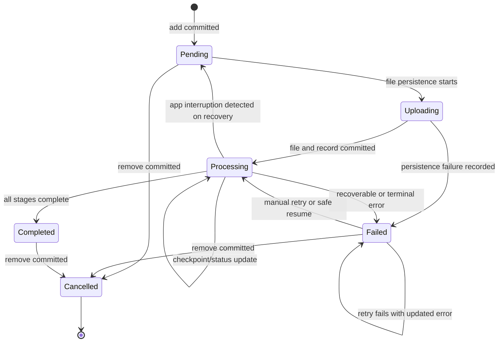

# Feature: Persisted Document Processing Queue and Resume

## 1. Architectural Context

### Relevant Existing Components

| Component | Responsibility | Relevance to Feature |
| --------- | -------------- | ------------------- |
| `src/features/knowledge-embedding/hooks/useKnowledgeEmbeddingFlow.ts` | Owns the current onboarding flow state and exposes add/remove actions | Must stop treating the React document array as the source of truth; delegate mutations and reloads to application services. |
| `src/features/knowledge-embedding/application/services/RagPipelineOrchestrator.ts` | Creates, resumes, and restores knowledge workflow runs | Already supports durable-run lookup and queue hydration, but currently restores only `pending` and `partial` runs and uses an in-memory queue. |
| `src/features/knowledge-embedding/application/services/InMemoryWorkflowQueue.ts` | Deduplicates and publishes runtime work items in memory | Remains a runtime dispatch queue, but must be hydrated from durable records after startup/foreground recovery. It must not become a second source of lifecycle state. |
| `src/features/knowledge-embedding/domain/entities/KnowledgeEmbeddingRun.ts` | Represents the end-to-end knowledge-processing lifecycle for one document/version and validates retry/resume transitions | Remains the durable domain aggregate and lifecycle owner. It does not need to be the runtime queue payload. |
| `src/features/knowledge-embedding/infrastructure/repositories/DrizzleDocumentChunkingWorkflowRepository.ts` | Persists workflow checkpoints in `knowledge_embedding_runs` | Must expose atomic create/update/find/delete operations and map persisted error/checkpoint data. |
| `src/shared/infrastructure/database/schema.ts` | Canonical SQLite schema, including `documents` and `knowledge_embedding_runs` | Reuse these tables where their existing meaning fits; add only fields needed for processing status, error details, and durable file identity. |
| `src/shared/domain/repositories/DocumentRepository.ts` and `src/shared/infrastructure/repositories/DrizzleDocumentRepository.ts` | Repository boundary for local document metadata and file references | Provides the existing document persistence boundary for the list and local path/storage key. |
| `src/shared/domain/services/DocumentStorageEngine.ts` | Saves and deletes local document files | Provides the file operation contract; it must participate in the add/remove operation's commit and compensation rules. |
| `src/shared/infrastructure/files/MobileFileSystemAdapter.ts` | Native private-file copy, existence, and deletion operations | Reusable mobile capability, but it is not currently connected to the knowledge-embedding flow. |
| `src/shared/infrastructure/database/connection.ts` | Initializes SQLite and runs migrations | Must expose or support a transaction-capable operation for atomic persistence. |
| `src/shared/infrastructure/di/registerServices.ts` | Registers repositories and runtime services | Register the new knowledge document queue/query/command services here. |

### Architectural Constraints

* SQLite and the existing Drizzle/repository boundary remain the canonical source of truth; do not introduce a second document database or a separate persisted queue.
* `KnowledgeEmbeddingRun` owns processing lifecycle state. Do not introduce a parallel `KnowledgeProcessingDocument` aggregate with duplicate status, retry, checkpoint, or error state.
* Screens and hooks must not issue raw SQL or directly coordinate file/database persistence.
* The in-memory queue is a dispatch mechanism, not durable state. It must be reconstructible from persisted records and must not be treated as a second queue of domain state.
* Add and remove operations are atomic from the user's perspective: a failed persistence operation must not expose a partial database, file, or in-memory change.
* Existing parent-run and child-stage retry invariants remain in force. A parent run must validate retry state before a stage is resumed.
* Document identity must be stable and unique so repeated add and retry requests are idempotent.
* No cloud synchronization is introduced by this feature.

## 2. Proposed Architecture

### Abstract Interfaces/Contracts/DTOs Source Code Structure

Place feature-specific contracts under `src/features/knowledge-embedding` and keep SQLite/file implementations behind repositories and infrastructure adapters:

```text
src/features/knowledge-embedding/
  domain/entities/KnowledgeEmbeddingRun.ts
  domain/repositories/KnowledgeEmbeddingRunRepository.ts
  application/contracts/KnowledgeEmbeddingRunContracts.ts
  application/services/KnowledgeEmbeddingDocumentService.ts
  infrastructure/repositories/DrizzleKnowledgeEmbeddingRunRepository.ts
  infrastructure/services/KnowledgeProcessingRecoveryService.ts
  hooks/useKnowledgeEmbeddingFlow.ts
src/shared/infrastructure/database/
  schema.ts
  migrations.ts
src/shared/infrastructure/di/
  registerServices.ts
```

The exact names may follow existing local conventions, but the responsibilities must remain separate.

Suggested language-agnostic contracts:

```typescript
interface KnowledgeEmbeddingRun {
  id: string;
  documentId: string;
  documentVersion: number;
  status: 'pending' | 'running' | 'completed' | 'partial' | 'failed' | 'cancelled';
  currentStage?: 'parsing' | 'understanding' | 'chunking' | 'embedding' | 'indexing';
  errorMessage?: string;
  retryCount: number;
  checkpointId?: string;
  resumeFromCheckpoint: boolean;
  createdAt: Date;
  updatedAt: Date;
}

// Runtime-only dispatch data. This is an address, not a second lifecycle model.
interface KnowledgeEmbeddingQueueItem {
  runId: string;
  documentId: string;
  documentVersion: number;
}

interface AddKnowledgeDocumentCommand {
  document: Omit<KnowledgeEmbeddingRun, 'id' | 'status' | 'retryCount' | 'createdAt' | 'updatedAt'>;
}

interface DocumentMutationResult {
  run: KnowledgeEmbeddingRun;
  alreadyHandled: boolean;
}

interface KnowledgeEmbeddingRunRepository {
  listByProcessableStatus(): Promise<KnowledgeEmbeddingRun[]>;
  findByDocumentVersion(documentId: string, version: number): Promise<KnowledgeEmbeddingRun | null>;
  addAtomically(command: AddKnowledgeDocumentCommand): Promise<DocumentMutationResult>;
  updateStatus(id: string, status: KnowledgeEmbeddingRun['status'], errorMessage?: string): Promise<KnowledgeEmbeddingRun>;
  removeAtomically(id: string): Promise<void>;
}

interface KnowledgeEmbeddingRecoveryService {
  restore(): Promise<KnowledgeEmbeddingRun[]>;
  resumeOrMarkRetryable(documentId: string): Promise<void>;
  retry(documentId: string): Promise<void>;
}

interface WorkflowQueue {
  enqueue(item: KnowledgeEmbeddingQueueItem): void;
  dequeue(): KnowledgeEmbeddingQueueItem | undefined;
  hydrate(items: KnowledgeEmbeddingQueueItem[]): void;
}
```

`KnowledgeEmbeddingRun` is the durable aggregate and owns processing state. `InMemoryWorkflowQueue` is only a runtime dispatch buffer. It should store `KnowledgeEmbeddingQueueItem` rather than a full run snapshot: the item contains the stable address (`runId`, `documentId`, and `documentVersion`) needed to reload the current aggregate. The `queuedIds` set is only a deduplication index, not another queue or persistence model. A worker dequeues an item, loads the current run from `KnowledgeEmbeddingRunRepository`, validates that it is still processable, and then performs the next stage. This prevents a stale queued object from overwriting a newer checkpoint or status. Queue listeners should receive the queue item and resolve the run through the application service.

The existing `documents` row remains the source for general document metadata and the local file reference; the run references that document by stable `documentId` and `documentVersion`. Adding a document creates the document row and its initial embedding run together. `addAtomically` must persist the local file, document row, and initial run as one logical operation. Because the file system is not part of SQLite's transaction, implementation must use a staged file plus database transaction and compensate/delete the staged file if the database commit fails. `removeAtomically` must preserve the document, run, and file if deletion cannot be completed.

### Data Flow

```text
KnowledgeEmbeddingLaunchScreen
    ↓
useKnowledgeEmbeddingFlow
    ↓
  KnowledgeEmbeddingDocumentService
    ↓
  DocumentRepository + DocumentStorageEngine + KnowledgeEmbeddingRunRepository
    ↓
SQLite documents / knowledge_embedding_runs and app-private file storage
    ↓
RagPipelineOrchestrator / InMemoryWorkflowQueue
  ↓
Runtime queue item resolves the current run
```

The hook queries persisted documents joined with their current `KnowledgeEmbeddingRun` on initial load and after foreground recovery. Add/remove/retry commands update durable state first; the hook then refreshes its view from the repository. Processing status changes update the specific run, including checkpoint, retry count, and error details. Queue entries are published only after the document and run commit succeeds. Queue entries contain identifiers only; status, checkpoint, retry count, and errors are read from the durable run when work starts.

### State Flow



* `Pending -> Uploading` is guarded by a valid document identity and source URI.
* `Uploading -> Processing` occurs only after the local file and durable records commit successfully.
* Any failed mutation must compensate staged file changes and leave the prior visible state unchanged.
* On foreground/startup recovery, stale `uploading` or `processing` records are reconciled from their last durable checkpoint. They either resume safely or become `failed`/retryable with an actionable error.
* `Failed -> Processing` requires the existing parent-run retry eligibility check and increments retry metadata.
* `remove` is idempotent for an absent document and must not remove a different document with a reused transient identifier.

## 4. Data / Persistence Changes

* Reuse the existing `documents` row for user-facing document metadata, local path/storage key, and stable document identity.
* Extend `knowledge_embedding_runs` as the durable processing aggregate and owner of processing status, current stage, checkpoint, retry count, interruption/recovery state, and error details. It is the source from which runtime queue items are rebuilt, not a second queue storage format.
* Add an explicit relationship or stable lookup between the user-facing document record and its `KnowledgeEmbeddingRun`. The relationship must support one active run per document/version and duplicate detection.
* Add the minimum status, retry, interruption/recovery, and error fields that are absent from the current canonical tables. Prefer existing `status`, `workflow_state`, `checkpoint_id`, `last_event`, `retry_count`, and `validation_reason` fields where their semantics match.
* Add indexes/unique constraints needed for lookup by document identity, processable status, and active document version.
* Add a forward-only SQLite migration and update the Drizzle schema definition together. Existing document and workflow rows must remain readable.
* Do not persist the same document list in AsyncStorage or another parallel store.
* Atomicity across SQLite and local files requires a staged-file/compensation protocol or an equivalent repository-level transaction coordinator; SQLite transaction atomicity alone is insufficient for the file system side effect.

## 5. Error Handling & Resilience

* Invalid or incomplete add input is rejected before any file or database mutation.
* Duplicate add requests return the existing persisted record and do not enqueue duplicate work.
* File copy/save failure leaves no newly visible document record and cleans up any staged file.
* Database insert/update failure leaves the previous database and in-memory state intact and cleans up any newly staged file.
* Remove failure leaves the existing record and file reference available for retry. Removing an already absent record succeeds.
* Processing errors update only the affected document/run, preserve the last successful checkpoint, and expose an error code/message plus retry eligibility.
* A foreground event must be serialized or deduplicated so repeated events cannot enqueue the same document more than once.
* `pending`, stale `uploading`, `processing`, and retryable `failed` records are reloaded on startup/foreground. `completed`, `cancelled`, or irrecoverably invalid records are not automatically reprocessed.
* If recovery cannot prove which side effect committed before interruption, it reconciles using durable records and file existence, then leaves the document retryable rather than marking it completed.
* User navigation or screen unmount must not cancel or erase durable work. The hook must ignore stale async results after unmount while the service continues to own persistence.

## 6. Implementation Sequence

1. Confirm the existing `documents` and `knowledge_embedding_runs` meanings and define the stable document/run relationship and status mapping.
2. Extend domain contracts/entities with document processing status, error details, retry metadata, and recovery invariants.
3. Add the schema/migration changes and any unique indexes required for idempotent document/version lookup.
4. Add repository methods for listing processable documents, finding by identity, updating status/error details, and atomic add/remove coordination.
5. Extend `KnowledgeEmbeddingRun` and its repository to coordinate file persistence, document metadata, run creation/update, compensation, and queue publication; do not create a parallel processing-document entity.
6. Define the runtime-only `KnowledgeEmbeddingQueueItem`, then update `RagPipelineOrchestrator` and `InMemoryWorkflowQueue` so durable pending/interrupted records are restored into identifier-only queue items, including recoverable `running` records, without duplicate publication. The consumer must reload and validate the current `KnowledgeEmbeddingRun` before processing.
7. Add foreground/startup recovery wiring at the app or knowledge-flow lifecycle boundary using React Native `AppState`; keep lifecycle detection separate from persistence and processing rules.
8. Refactor `useKnowledgeEmbeddingFlow` to load its document list from the application query, await add/remove/retry commands, and expose operation errors and per-document status/error details.
9. Update the knowledge-embedding screen to present persisted status/error details and manual retry, while preserving the existing UI scope.
10. Add unit tests for idempotent add/remove, atomic compensation, status/error updates, duplicate queue publication, and recovery transitions.
11. Add integration tests against SQLite and the file-storage test double for restart/foreground reload, interrupted operations, migration compatibility, and parent-run resume.
12. Run the targeted knowledge-embedding tests and `npx tsc --noEmit`; verify that no raw persistence access was added to screens or hooks.