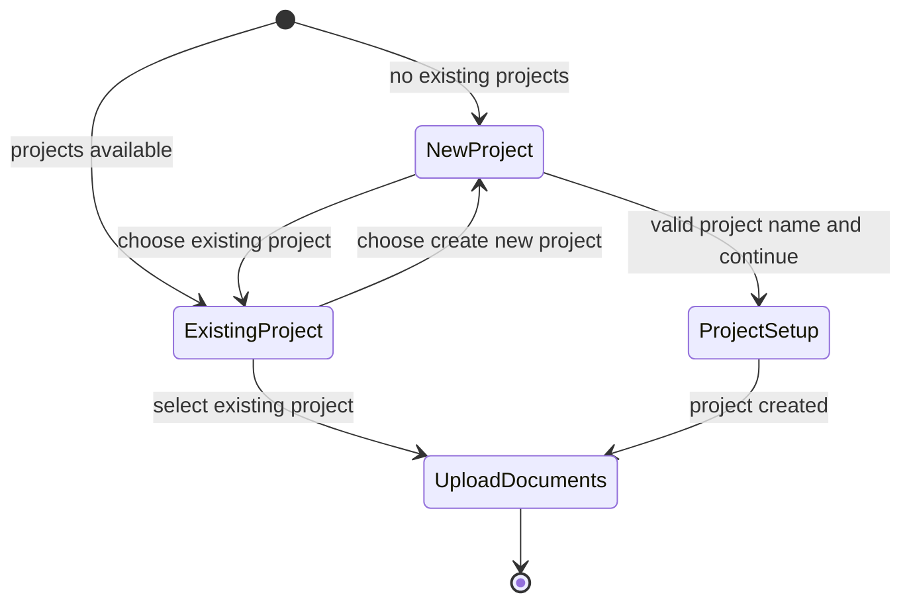

# Feature: Knowledge Embedding Project Selection

## 1. Architectural Context

### Relevant Existing Components

| Component | Responsibility | Relevance to Feature |
| --------- | -------------- | ------------------- |
| `src/features/knowledge-embedding/screens/KnowledgeEmbeddingLaunchScreen.tsx` | Renders the welcome, project setup, upload, and processing steps | Owns the first-step UI and must present either project selection or new-project fields. |
| `src/features/knowledge-embedding/hooks/useKnowledgeEmbeddingFlow.ts` | Owns knowledge-embedding step and document state | Must expose the selected project mode and support advancing directly to upload. |
| `src/features/projects/hooks/useProjects.ts` | Loads projects through React Query and exposes project operations | Supplies the existing project list and loading/error state. |
| `src/shared/domain/entities/Project.ts` | Defines the project identity and user-facing project fields | Provides the existing project ID, name, and location data shown in the selector. |
| `src/features/knowledge-embedding/domain/value-objects/KnowledgeEmbeddingStep.ts` | Defines flow steps | Existing `UPLOAD_DOCUMENTS` state is the target for an existing-project selection. |
| `src/features/knowledge-embedding/tests/**` | Tests flow and document behavior | Add focused coverage for project availability, selection, field visibility, and transitions. |

### Architectural Constraints

* Keep project loading behind `useProjects`; the screen must not access repositories or SQLite directly.
* Reuse the existing `KnowledgeEmbeddingLaunchScreen` and `useKnowledgeEmbeddingFlow` rather than creating a second onboarding flow.
* Treat project selection as screen/application state; do not add database fields or a duplicate project entity.
* Preserve the current new-project path: project name is required and address/location is optional.
* Do not change document parsing, embedding, processing, or project-editing behavior.

## 2. Proposed Architecture

### Abstract Interfaces/Contracts/DTOs Source Code Structure

Keep the change local to the knowledge-embedding screen and flow hook:

```text
src/features/knowledge-embedding/screens/KnowledgeEmbeddingLaunchScreen.tsx
  Render project selector or new-project fields in WelcomeStep.

src/features/knowledge-embedding/hooks/useKnowledgeEmbeddingFlow.ts
  Track the selected existing project or new-project mode and reset draft fields
  when the mode changes.

src/features/knowledge-embedding/tests/**
  Cover project availability and first-step transitions.
```

The screen consumes the existing project list and represents the choice with a small UI state contract:

```typescript
type ProjectSelection =
  | { mode: 'existing'; projectId: string }
  | { mode: 'new' };

interface KnowledgeEmbeddingProjectOption {
  id: string;
  name: string;
  address?: string;
}
```

Rules:

* At least one project makes `existing` options available and selected by default.
* An empty project list exposes only `new` mode.
* Existing mode hides project name and address inputs.
* New mode shows the current project name and address inputs.
* Switching mode clears unsaved new-project name and address values.

### Data Flow

```text
KnowledgeEmbeddingLaunchScreen
    ↓
useProjects → existing project options
    ↓
WelcomeStep project selection
    ↓
useKnowledgeEmbeddingFlow project mode / selected project ID
    ↓
Existing upload-documents step or current new-project setup flow
```

Project data is read through `useProjects`. The selected project ID is retained as transient flow context while the user advances to Upload Documents. Creating a new project continues through the existing `createProject` operation; selecting an existing project does not edit that project.

### State Flow



* With projects available, the initial state is `ExistingProject` using a valid project ID.
* With no projects, the existing new-project fields are shown and `ExistingProject` is unavailable.
* Selecting an existing project hides both new-project fields and advances directly to `UploadDocuments`.
* Selecting new-project mode clears unsaved draft name/address and restores the current new-project flow.
* New-project continuation remains blocked until the name contains non-whitespace text.

## 4. Data / Persistence Changes

No persistence changes are required.

Existing projects remain managed by the current project repository/use case path. The selected project ID and unsaved new-project fields are transient knowledge-embedding flow state. No project entity or document-processing schema changes are needed.

## 5. Error Handling & Resilience

* While the project list is loading, the first step must not present an incorrect default; retain the existing loading state or disable selection until data is available.
* If loading projects fails, preserve the existing new-project path and surface the existing project-loading error behavior.
* An empty project list hides existing-project choices.
* A new project cannot continue without a non-empty project name.
* Selecting an existing project must not mutate or overwrite its name or address.
* Repeated selection changes must consistently clear unsaved new-project details.
* Leaving and returning to the flow may reset transient selection and draft state; persisted projects remain available through the existing project query.

## 6. Implementation Sequence

1. Add a transient project-selection model to the knowledge-embedding flow state.
2. Load existing projects through `useProjects` and determine the initial mode after loading.
3. Update the first-step UI to show existing-project options when available and retain the current new-project fields for new mode.
4. On existing-project selection, preserve the selected project ID and advance directly to Upload Documents.
5. On mode changes, clear unsaved new-project name and address values.
6. Preserve the existing new-project creation and validation behavior.
7. Add focused unit/component tests for project availability, defaults, field visibility, clearing, and step transitions.
8. Run the knowledge-embedding tests and `npx tsc --noEmit`.

Do not implement project editing, new persistence fields, native file-picker changes, or embedding-pipeline changes.
