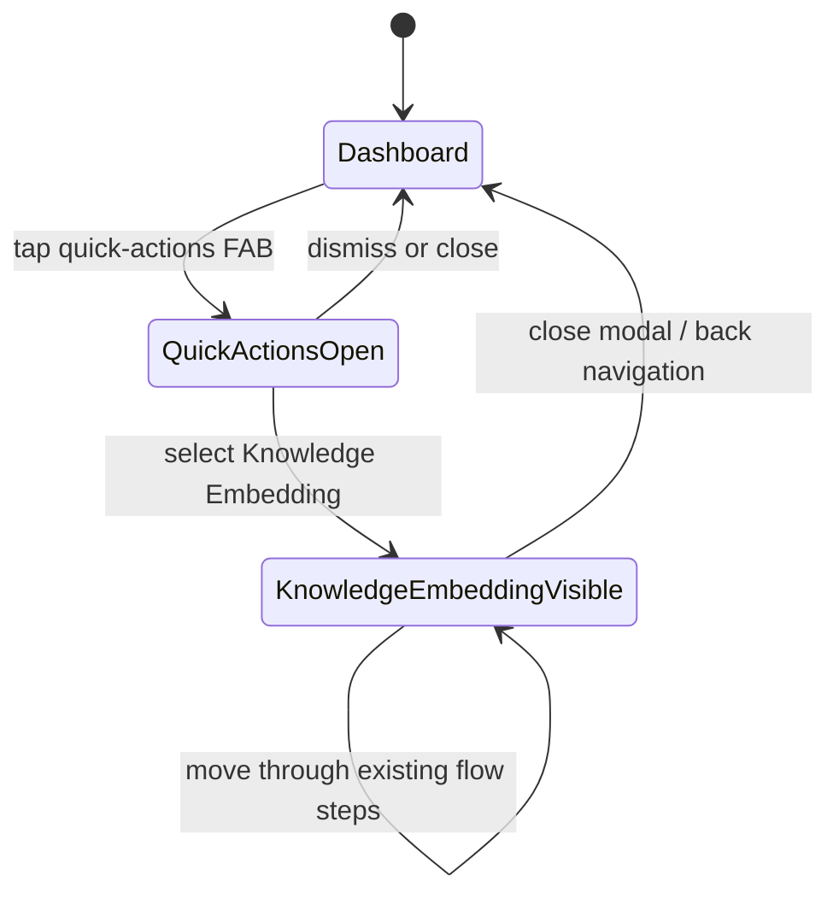

# Feature: Make Knowledge Embedding Screen Reachable

## 1. Architectural Context

### Relevant Existing Components

| Component | Responsibility | Relevance to Feature |
| --------- | -------------- | ------------------- |
| `src/features/dashboard/screens/DashboardScreen.tsx` | Renders the dashboard, floating quick-actions menu, and feature modals | Provides the user-facing button entry point and hosts the launched screen. |
| `src/features/dashboard/hooks/useDashboard.ts` | Owns dashboard presentation state and quick-action routing | Must expose one new quick action and the corresponding modal visibility/close behavior. |
| `src/features/knowledge-embedding/screens/KnowledgeEmbeddingLaunchScreen.tsx` | Renders the welcome, project setup, document upload, and processing flow | Existing screen to make reachable; its internal upload flow is reused unchanged. |
| `src/features/knowledge-embedding/hooks/useKnowledgeEmbeddingFlow.ts` | Manages knowledge-embedding step state and document-service calls | Remains the owner of screen workflow state; no dashboard state should duplicate it. |
| `src/features/knowledge-embedding/navigation/KnowledgeEmbeddingNavigator.tsx` | Wraps the launch screen in a native stack | Is exported but not currently registered in the project-user tab tree; it is not required for this narrow entry-point change. |
| `App.tsx` | Selects the initial no-project experience versus the tab layout | Confirms why the screen is currently visible only for users without projects. |
| `src/features/dashboard/tests/unit/useDashboard.test.ts` | Tests quick-action definitions and routing state | Covers the new action and its open/close behavior. |
| `src/features/dashboard/tests/unit/screens/DashboardScreen.test.tsx` | Tests dashboard rendering from the view model | Covers that the new modal is wired to the existing screen. |

### Architectural Constraints

* Keep dashboard orchestration in `useDashboard`; `DashboardScreen` remains presentation-only.
* Reuse `KnowledgeEmbeddingLaunchScreen` and `useKnowledgeEmbeddingFlow`; do not create a second upload flow.
* Keep persistence behind `KnowledgeEmbeddingDocumentService` and its repositories. The dashboard must not access SQLite, files, or the DI container directly.
* Preserve the existing no-project startup behavior in `App.tsx`.
* Do not add a new navigation stack or dependency for a single feature entry point when the dashboard already uses modal feature surfaces.
* Do not change document parsing, embedding, queue, retry, or upload-picker behavior as part of reachability work.

## 2. Proposed Architecture

### Abstract Interfaces/Contracts/DTOs Source Code Structure

Extend the dashboard presentation contract only:

```typescript
interface DashboardViewModel {
  // existing fields
  showKnowledgeEmbedding: boolean;
  openKnowledgeEmbedding: () => void;
  closeKnowledgeEmbedding: () => void;
  handleQuickAction: (actionId: string) => void;
}

interface QuickAction {
  id: string;
  title: string;
  icon: ComponentType<...>;
  color: string;
}
```

Use a new stable quick-action ID and a document-oriented icon from `lucide-react-native`. The action handler closes the quick-actions sheet before opening the knowledge-embedding modal, matching the existing receipt, invoice, quotation, and task actions.

Expected source changes:

```text
src/features/dashboard/hooks/useDashboard.ts
  Add quick-action metadata, modal state, and open/close handlers.

src/features/dashboard/screens/DashboardScreen.tsx
  Render one modal containing KnowledgeEmbeddingLaunchScreen.

src/features/dashboard/tests/unit/useDashboard.test.ts
  Test the new action and state transitions.

src/features/dashboard/tests/unit/screens/DashboardScreen.test.tsx
  Test modal visibility and screen mounting.
```

No changes are required to the knowledge-embedding domain, application service, repository, schema, or navigator for this entry point.

### Data Flow

```text
Dashboard FAB
    ↓
Quick Actions modal
    ↓
useDashboard.handleQuickAction(new action ID)
    ↓
Dashboard Knowledge Embedding modal
    ↓
KnowledgeEmbeddingLaunchScreen
    ↓
useKnowledgeEmbeddingFlow
    ↓
KnowledgeEmbeddingDocumentService / existing persistence
```

The dashboard only selects and presents the feature. Once mounted, the knowledge-embedding screen initializes its existing flow hook, which loads persisted document runs through the registered document service. Closing the modal removes the presentation surface but must not clear or cancel durable document-processing state.

### State Flow



* `Dashboard -> QuickActionsOpen` is controlled by the existing `showQuickActions` state.
* Selecting the new action first sets `showQuickActions` to `false`, then sets `showKnowledgeEmbedding` to `true`.
* The modal uses the existing `KnowledgeEmbeddingLaunchScreen` as its content and does not reset its internal state while it remains mounted.
* Closing the modal only changes dashboard presentation state. It must not delete documents or invoke workflow cancellation.
* The existing no-project path continues to render the launch screen directly and does not depend on the new dashboard action.

## 4. Data / Persistence Changes

No persistence changes are required.

The feature only adds a presentation entry point. Existing document loading and mutations continue through `useKnowledgeEmbeddingFlow` and `KnowledgeEmbeddingDocumentService` when the screen is mounted.

## 5. Error Handling & Resilience

* If the knowledge-embedding screen's existing initialization reports an error, its current loading/error behavior remains authoritative; the dashboard should not duplicate it.
* If opening the modal fails at the React render boundary, the existing application error boundary remains responsible for reporting it.
* Repeated taps must not leave the quick-actions sheet visible behind the feature modal; the action handler closes the sheet before opening the feature.
* Closing or navigating away from the modal must not remove persisted documents or interrupt durable processing. Existing foreground recovery behavior remains owned by `useKnowledgeEmbeddingFlow` and its service.
* The new action should be covered for unknown IDs so existing quick-action behavior remains unchanged for all other actions.
* Actual native file selection, file validation, upload progress, and processing failures are out of scope; this change only makes the current screen reachable.

## 6. Implementation Sequence

1. Add the new quick-action metadata and a dedicated `showKnowledgeEmbedding` state field to `useDashboard`.
2. Add stable open/close callbacks and route the new action ID through `handleQuickAction`, closing the quick-actions sheet first.
3. Import and render `KnowledgeEmbeddingLaunchScreen` in a dashboard modal controlled by the new view-model state.
4. Add hook unit tests for the new action, modal opening, and close behavior.
5. Add dashboard screen tests for visible and hidden knowledge-embedding modal states and screen mounting.
6. Run the focused dashboard tests, then run `npx tsc --noEmit`.
7. Verify that no knowledge-embedding persistence or workflow files changed and that the no-project startup path still renders the same screen.

Do not implement native file picking, new navigation routes, database changes, or changes to the embedding pipeline as part of this feature.
