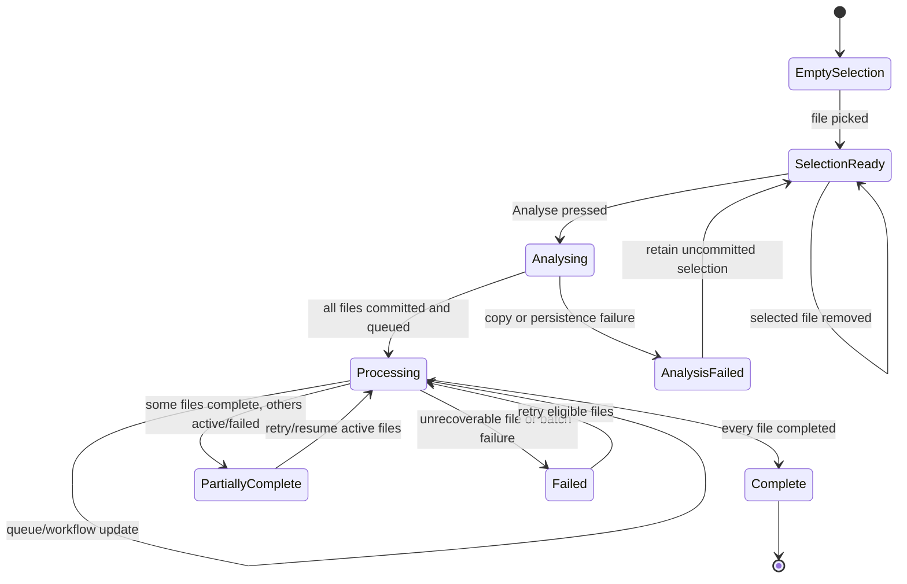

# Feature: Knowledge Embedding Document Selection, Analysis, and Progress

## 1. Architectural Context

### Relevant Existing Components

| Component | Responsibility | Relevance to Feature |
| --------- | -------------- | ------------------- |
| `src/features/knowledge-embedding/screens/KnowledgeEmbeddingLaunchScreen.tsx` | Renders onboarding, Documents, and Processing steps | Documents shows only current-session selections; Processing shows one status row per committed file. |
| `src/features/knowledge-embedding/hooks/useKnowledgeEmbeddingFlow.ts` | Owns transient flow state and step navigation | Holds selected files, commits them on Analyse, and exposes committed run/progress views to the final step. |
| `src/features/knowledge-embedding/application/contracts/KnowledgeEmbeddingRunContracts.ts` | Defines document commands and workflow views | Provides the contract for committed documents and their status/stage/error data. |
| `src/features/knowledge-embedding/application/services/KnowledgeEmbeddingDocumentService.ts` | Copies files, persists documents/workflows, and publishes queue work | Owns the Analyse commit boundary and supplies per-document workflow status. |
| `src/features/knowledge-embedding/application/services/InMemoryWorkflowQueue.ts` | Deduplicates and notifies consumers of queued work | Provides wake-up events after enqueue/retry; its current item payload is not itself a progress model. |
| `src/features/knowledge-embedding/application/services/RagPipelineOrchestrator.ts` | Creates/resumes embedding runs and publishes queue items | Preserves idempotent start/resume behavior for each committed document. |
| `src/features/knowledge-embedding/domain/entities/KnowledgeEmbeddingRun.ts` | Defines run status and stages | Canonical status vocabulary: `pending`, `running`, `partial`, `failed`, `completed`, `cancelled`; stages include parsing through indexing. |
| `src/shared/domain/repositories/DocumentChunkingWorkflowRepository.ts` | Persists document workflow records | Stores per-document status, workflow state, checkpoint, retry, and update timestamps used by the Processing step. |
| `src/shared/infrastructure/files/IFilePickerAdapter.ts` | Abstracts native file selection | Supplies transient file metadata before Analyse. |
| `src/shared/infrastructure/files/IFileSystemAdapter.ts` | Abstracts application-storage copying | Runs only at Analyse commit time. |
| `src/features/knowledge-embedding/application/services/InMemoryWorkflowQueue.ts` | Dispatches work to processing consumers | Can notify the UI/service to refresh status, but does not replace persisted workflow state. |

### Architectural Constraints

* The Documents step is a transient selection queue; it must not load or display all files linked to the selected project.
* Selecting a file must not copy it, create a document record, or enqueue embedding work.
* Analyse is the durable commit boundary for copying, document creation, workflow creation, and queue publication.
* The Processing step must show the committed files from the Analyse result, not re-query all project-linked files.
* Persisted workflow status and stage are the authoritative progress source; a queue item is only a work notification/identity.
* Keep file I/O, SQLite access, workflow mutation, and queue handling outside the screen component.
* Preserve the existing document, workflow, checksum/RAG reuse, retry, and foreground recovery behavior.
* Reuse existing picker, filesystem, document service, workflow repository, and queue abstractions. Do not add a second processing engine.
* Do not use a time-based animation as a substitute for workflow status.

## 2. Proposed Architecture

### Abstract Interfaces/Contracts/DTOs Source Code Structure

```text
src/features/knowledge-embedding/application/contracts/KnowledgeEmbeddingRunContracts.ts
  Keep transient picker selections separate from persisted document/run views.
  Reuse KnowledgeEmbeddingRunView for status/stage observation.

src/features/knowledge-embedding/application/services/KnowledgeEmbeddingDocumentService.ts
  Commit selected files on Analyse.
  Return committed KnowledgeEmbeddingRunView values and refresh them by document ID.

src/features/knowledge-embedding/application/services/InMemoryWorkflowQueue.ts
  Retain queue identity and subscription behavior.
  Optionally expose a typed progress notification or wake-up event without making the queue
  the owner of durable progress.

src/features/knowledge-embedding/hooks/useKnowledgeEmbeddingFlow.ts
  Store selected files in memory.
  Commit them on Analyse and track the committed document IDs/run IDs.
  Subscribe or refresh on workflow queue events while Processing is visible.

src/features/knowledge-embedding/screens/KnowledgeEmbeddingLaunchScreen.tsx
  Render selected files in Documents and one live status row per committed file in Processing.

src/features/knowledge-embedding/tests/**
  Cover deferred commit, queue notification, status refresh, per-file mapping, completion,
  partial/failure states, retry/recovery, and stale subscription cleanup.
```

```typescript
interface SelectedKnowledgeEmbeddingFile {
  id: string;
  name: string;
  size: string;
  type: KnowledgeEmbeddingDocumentType;
  uri: string;
  mimeType?: string;
}

interface CommitKnowledgeEmbeddingDocumentsCommand {
  projectId?: string;
  files: SelectedKnowledgeEmbeddingFile[];
}

interface KnowledgeEmbeddingDocumentService {
  commitDocuments(
    command: CommitKnowledgeEmbeddingDocumentsCommand,
  ): Promise<KnowledgeEmbeddingRunView[]>;
  getRuns(documentIds: string[]): Promise<KnowledgeEmbeddingRunView[]>;
}
```

Invariants:

* A selected file requires a non-empty URI and filename before commit.
* Selection IDs are transient UI identifiers; committed document IDs/run IDs are the durable processing identities.
* `commitDocuments` copies each source URI to app storage, saves its document record, creates its workflow record, and publishes its queue item in that order.
* Every committed file has exactly one `KnowledgeEmbeddingRun` keyed by its committed document/run identity.
* `complete` maps from durable `KnowledgeEmbeddingRun.status === 'completed'`; `processing` maps from `pending` or `running`; `partial`, `failed`, and `cancelled` remain distinguishable.
* `KnowledgeEmbeddingRun.currentStage` supplies stage-level progress. Numeric percentage is not part of the current entity and must not be fabricated from elapsed time.
* Queue notifications trigger refreshes but do not overwrite durable status with optimistic values.

### Data Flow

Selection phase:

```text
IFilePickerAdapter.pickDocument()
    ↓
useKnowledgeEmbeddingFlow.selectedFiles
    ↓
UploadDocumentsStep renders current-session rows only
```

Analyse and progress phase:

```text
selectedFiles + selectedProjectId
    ↓
KnowledgeEmbeddingDocumentService.commitDocuments()
    ↓
IFileSystemAdapter.copyToAppStorage()
    ↓
DocumentRepository.save(Document)
    ↓
WorkflowRepository.upsert(workflow record)
    ↓
InMemoryWorkflowQueue.publish(queue item)
    ↓
RAG worker updates workflow status/stage/progress
    ↓
Queue notification or refresh trigger
    ↓
  KnowledgeEmbeddingDocumentService.getRuns(documentIds)
    ↓
ProcessingStep renders file_1/file_2 status rows
```

The queue carries work identity and wake-up signals. `KnowledgeEmbeddingRun` and its repository carry durable status and stage. `KnowledgeEmbeddingRunView` adds the persisted document metadata needed to label each row. The hook should retain the committed document IDs/run IDs so the final step refreshes exactly the files selected in this session, not every document associated with the project.

### State Flow



* `EmptySelection -> SelectionReady` stores metadata only.
* `SelectionReady -> Analysing` requires at least one selected file and disables duplicate Analyse actions.
* `Analysing -> Processing` occurs only after all selected files have committed successfully and their queue work has been published.
* `Processing -> Processing` is driven by queue notifications, foreground recovery, or a bounded refresh strategy; each refresh reads durable workflow state.
* `Processing -> Complete` requires every committed file to have status `completed`.
* `Processing -> PartiallyComplete` represents mixed per-file outcomes and must retain each row’s own status.
* A picker cancellation leaves selection unchanged. Removing a selected file is local-only before Analyse.

## 4. Data / Persistence Changes

No new database table is required. Existing document and workflow persistence remains canonical.

Required behavior changes:

* Add a commit operation that persists selected files only when Analyse is pressed.
* Return or retain the committed document/run identities for the Processing step.
* Expose a project-scoped or ID-scoped progress query that maps workflow records to file display metadata.
* Ensure workflow updates persist status, current stage/workflow state, error, retry, checkpoint, and update time as they do today.
* Use `KnowledgeEmbeddingRun.status`, `currentStage`, `errorMessage`, `retryCount`, and timestamps for Processing. Do not introduce `KnowledgeEmbeddingDocumentProgress`.
* If numeric embedding progress is required later, extend the existing run/detail/progress persistence model deliberately; do not store it in the screen or create a parallel progress entity.
* Do not use project-wide document listing to populate Processing; the session’s committed IDs are the scope.

## 5. Error Handling & Resilience

* Picker cancellation is a no-op.
* Invalid picker metadata is rejected before commit.
* Copy, document-save, workflow-save, and queue-publication failures retain the appropriate selection or committed identities and never report the entire batch as complete.
* Partial batch commit must return per-file results or compensate successfully created records so retry cannot silently duplicate work.
* Queue delivery is not treated as proof of completion. Missing or delayed notifications are covered by refresh on screen focus/foreground and a bounded polling fallback while active work exists.
* A failed file displays its error and remains independently retryable when the domain state permits retry; completed files are not restarted.
* `partial`, `failed`, and `cancelled` are not collapsed into `complete`.
* Background/foreground recovery calls existing workflow restoration, then refreshes only the committed document IDs.
* Queue subscriptions are removed when Processing unmounts or the flow leaves the step to prevent updates to stale UI.
* If a progress percentage is unavailable, show the current stage and status; never fabricate a percentage from elapsed time.

## 6. Implementation Sequence

1. Confirm how the active RAG worker writes workflow status/stage and whether numeric embedding-unit progress is already persisted.
2. Define transient selected-file DTOs, commit results, committed run identity, and per-file progress view types.
3. Refactor the document service or add the smallest feature-local commit use case so Analyse performs copy, document save, workflow creation, and queue publication.
4. Add an ID-scoped progress/read operation that maps workflow records to the committed file metadata.
5. Update `useKnowledgeEmbeddingFlow` to retain selected files before Analyse, retain committed IDs after Analyse, and subscribe/refresh progress while Processing is active.
6. Replace the time-based `ProcessingStep` animation with per-file rows driven directly by `KnowledgeEmbeddingRunView.status` and `currentStage`, for example `file_1: complete` and `file_2: processing`.
7. Add retry/resume handling for failed or partial files without restarting completed files.
8. Add tests for transient-only selection, deferred persistence, queue notifications, missed-notification refresh, per-file status mapping, all-complete detection, mixed outcomes, retry, foreground recovery, and subscription cleanup.
9. Run targeted knowledge-embedding tests and `npx tsc --noEmit`.

Do not implement project-wide document listing in this flow, automatic import of existing project files, cloud upload behavior, a new processing engine, or changes to parsing/chunking/embedding algorithms.
