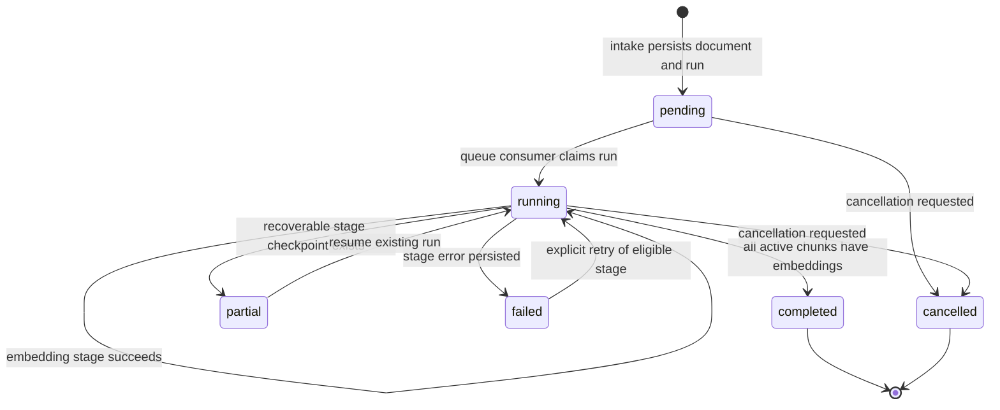

# Feature: Knowledge Embedding Vertical Slices

## 1. Architectural Context

### Relevant Existing Components

| Component | Responsibility | Relevance to Feature |
| ----------- | ---------------- | -------------------- |
| `KnowledgeEmbeddingDocumentService` | Persists uploaded documents, applies checksum/source reuse, creates workflow records, and publishes work | Defines the document-intake boundary and currently combines storage, deduplication, workflow creation, and queue dispatch |
| `KnowledgeEmbeddingRunEntity` / `KnowledgeDetailRunEntity` | Models the durable parent workflow and per-stage progress/retry state | Belongs to the workflow slice as its aggregate boundary; it must not be duplicated by another slice |
| `RagPipelineOrchestrator` | Executes parsing, extraction reuse, chunking, embedding, and completion state transitions | Defines the workflow boundary and is the main coupling point to reduce |
| `KnowledgeEmbeddingQueueConsumer` / `InMemoryWorkflowQueue` | Restores and drains queued work with one active processor per run | Remains one container-cached runtime projection for the whole bounded context |
| `ParseDocumentUseCase`, `ExtractParsedDocumentUseCase`, `DocumentParserService` | Selects parsers and persists/reloads extracted document text | Forms the parsing and extraction portion of the document-processing slice |
| `ChunkDocumentUseCase`, chunking strategies, progress repositories | Turns extracted text into durable knowledge chunks and checkpoints progress | Forms the chunking portion of the document-processing slice |
| `EmbeddingRuntimeService`, `EmbedChunkUseCaseImpl`, embedding repository | Produces and persists vectors with provider/model metadata | Forms the embedding slice and remains independent of document parsing concerns |
| `SearchKnowledgeUseCaseImpl`, semantic/keyword services, search repository | Combines semantic and keyword retrieval | Forms the retrieval slice; it consumes persisted artifacts rather than owning pipeline execution |
| `useKnowledgeEmbeddingFlow`, launch screen, navigator | Owns the upload/progress user journey and resolves feature services through DI | Becomes the UI composition root for the intake and workflow slices |
| `registerServices.ts` | Composes repositories, use cases, services, queue, and consumer | Must remain the only cross-slice wiring location during the migration |
| `docs/Embedding-Data-Flow.md` and existing acceptance/architecture documents | Describe the canonical persistence chain and recovery rules | Remain the source of truth for boundaries and invariants while folders are reorganized |

### Architectural Constraints

- Keep `knowledge-embedding` as one bounded context with nested vertical slices; do not create a second top-level feature or orchestration engine.
- Do not create a generic `shared` directory under `knowledge-embedding`. A type belongs in the slice that owns its lifecycle; cross-slice dependencies use explicit ports/contracts.
- Keep SQLite plus Drizzle as the canonical persistence layer. Repositories remain the only code that executes persistence operations.
- Preserve the chain `documents -> extracted_document_text -> knowledge_chunks -> knowledge_embeddings`.
- Preserve `knowledge_embedding_runs` as the durable parent workflow and `knowledge_detail_runs` as stage-level progress/retry state.
- Keep `InMemoryWorkflowQueue` as a transient projection only, with one container-cached `KnowledgeEmbeddingQueueConsumer`.
- Preserve duplicate document rows and `rag_source_document_id` reuse semantics. A checksum is content identity, not document identity.
- The first refactor should not change database tables, state values, or public UI behavior. It should move ownership behind stable contracts before changing behavior.
- Existing stage idempotency and recovery guards remain required: stored extracted text, chunk progress, existing chunks, and existing embeddings must be reused.

## 2. Proposed Architecture

### Abstract Interfaces/Contracts/DTOs Source Code Structure

Retain the bounded-context root and organize each vertical slice with its own application, domain, infrastructure, UI, and tests folders:

```text
src/features/knowledge-embedding/
  document-intake/
    application/
      contracts/
        DocumentIntakeContracts.ts
      services/
        KnowledgeEmbeddingDocumentService.ts
      usecases/
        ReceiveDocumentUseCase.ts
    infrastructure/
      repositories/          # adapters for documents and workflow creation
      storage/                # file copy and checksum adapters
    ui/
      hooks/useDocumentIntake.ts
    tests/

  workflow/
    domain/
      entities/
        KnowledgeEmbeddingRun.ts
        KnowledgeDetailRun.ts
      repositories/
        KnowledgeEmbeddingRunRepository.ts
        KnowledgeDetailRunRepository.ts
      value-objects/
        KnowledgeEmbeddingStep.ts
    application/
      contracts/
        WorkflowContracts.ts
      services/
        RagPipelineOrchestrator.ts
        KnowledgeEmbeddingQueueConsumer.ts
        InMemoryWorkflowQueue.ts
      usecases/
        StartKnowledgeEmbeddingFlowUseCase.ts
    infrastructure/
      repositories/          # workflow persistence adapters
    tests/

  document-processing/
    domain/
      entities/
        ExtractedDocumentText.ts
        KnowledgeChunk.ts
      repositories/
        ExtractedDocumentTextRepository.ts
        ChunkDocumentProgressRepository.ts
    application/
      contracts/
        DocumentProcessingContracts.ts
      services/
        DocumentParserService.ts
        DefaultDocumentChunkingService.ts
        StructuredDocumentChunkingStrategy.ts
      usecases/
        ValidateDocumentUseCase.ts
        ParseDocumentUseCase.ts
        ExtractParsedDocumentUseCase.ts
        ChunkDocumentUseCase.ts
    infrastructure/
      parsers/PdfTextParser.ts
      repositories/
        DrizzleExtractedDocumentTextRepository.ts
        DrizzleChunkRepository.ts
        DrizzleChunkDocumentProgressRepository.ts
    tests/

  embedding/
    domain/
      entities/
        KnowledgeEmbedding.ts
    application/
      contracts/
        EmbeddingContracts.ts
      services/EmbeddingRuntimeService.ts
      usecases/EmbedChunkUseCase.ts
    infrastructure/
      repositories/          # embedding persistence adapter
    tests/

  retrieval/
    application/
      contracts/SearchKnowledgeContracts.ts
      services/
        SemanticSearchService.ts
        KeywordSearchService.ts
      usecases/SearchKnowledgeUseCase.ts
    infrastructure/repositories/DrizzleSemanticSearchRepository.ts
    tests/

  ui/
    screens/KnowledgeEmbeddingLaunchScreen.tsx
    navigation/KnowledgeEmbeddingNavigator.tsx
    index.ts
```

There is intentionally no generic `shared` directory inside this bounded context. The workflow aggregate belongs to `workflow`; extracted text and chunks belong to `document-processing`; vectors belong to `embedding`; and retrieval owns its result DTOs. The existing `src/shared` application/infrastructure modules remain external dependencies and are not reclassified as knowledge-embedding slices.

Slice dependency direction:

```text
UI composition
  -> document-intake contracts and workflow status queries
workflow
  -> document-intake read/commit port
  -> document-processing stage ports
  -> embedding stage port
  -> workflow repositories and queue contracts
document-intake
  -> existing document/file-system ports from src/shared
document-processing
  -> its extracted-text/chunk repositories
embedding
  -> its embedding repository and embedding provider port
retrieval
  -> explicit read ports from document-processing and embedding
```
`workflow` is the only slice allowed to coordinate stages. A processing or embedding slice may expose a stage use case, but it must not publish queue items, mutate the parent run directly, or create another workflow state machine.
`workflow` is the only slice allowed to coordinate stages. A processing or embedding slice may expose a stage use case, but it must not publish queue items, mutate the parent run directly, or create another workflow state machine.

### Data Flow

```text
Document intake UI
  -> document-intake service
  -> documents repository + file storage
  -> workflow parent-run port
  -> workflow InMemoryWorkflowQueue projection
  -> one KnowledgeEmbeddingQueueConsumer
  -> workflow orchestrator
  -> document-processing: parse/extract, then chunk
  -> extracted_document_text and knowledge_chunks repositories
  -> embedding: embed non-superseded chunks
  -> knowledge_embeddings repository
  -> retrieval slice reads chunks and vectors
```

### Domain Entities & DTOs

The refactor should preserve the existing domain entities and narrow cross-slice contracts around them:

```ts
interface ReceiveDocumentCommand {
  documentId: string;
  documentVersion: number;
  projectId?: string;
  metadata: DocumentMetadata;
}

interface DocumentIntakeResult {
  documentId: string;
  documentVersion: number;
  runId: string;
  alreadyHandled: boolean;
}

interface WorkflowQueueItem {
  runId: string;
  documentId: string;
  documentVersion: number;
}

interface DocumentProcessingStage {
  execute(input: ProcessDocumentInput): Promise<ProcessDocumentResult>;
}

interface EmbeddingStage {
  execute(input: EmbedChunkCommand): Promise<EmbedChunkResult>;
}

interface SearchKnowledgeQuery {
  text: string;
  projectId?: string;
  limit?: number;
}
```

Required invariants remain:

- `documentId` and `documentVersion` identify one workflow version; duplicate queue items must resolve to the same persisted `runId`.
- The parent run validates child stage ownership and retry eligibility before a stage is resumed or retried.
- A completed or cancelled parent cannot receive new child progress or retry work.
- A document with matching checksum remains an independent `documents` row; only its RAG source reference is reused.
- Extracted text, chunks, and embeddings are durable artifacts and must be safe to reload on replay.
- Embedding vectors must retain provider, model version, dimension, and chunk identity.

### Workflow & State Transitions

The workflow state remains owned by `workflow`; the other slices report stage results through ports.



State-change rules:

- Intake creates one pending parent record, persists the document, then publishes the queue projection. A duplicate request returns the existing run or source run and does not publish duplicate work.
- The consumer reloads the durable record and verifies the queue item's `runId`, document ID, and version before execution.
- The orchestrator selects the starting stage from durable workflow/detail state. It must not reset every retry to parsing.
- Parsing persists `extracted_document_text` before the workflow advances to chunking.
- Chunking persists chunks and its stage checkpoint before the workflow advances to embedding.
- Embedding persists vectors before the parent can become completed.
- Any stage failure persists the current stage, error, retry metadata, and recovery marker before the error reaches the consumer.
- Resume and retry enqueue the existing identity. They do not create a new parent run.

### Application Behavior Abstractions

The initial move should keep current public service methods working while introducing narrow ports for cross-slice calls:

```ts
interface DocumentIntakeService {
  commitDocuments(command: CommitKnowledgeEmbeddingDocumentsCommand): Promise<DocumentIntakeResult[]>;
  listDocuments(): Promise<KnowledgeEmbeddingRunView[]>;
  getRuns(documentIds: string[]): Promise<KnowledgeEmbeddingRunView[]>;
  removeDocument(documentId: string, documentVersion: number): Promise<void>;
  retryDocument(documentId: string, documentVersion: number): Promise<KnowledgeEmbeddingRunView>;
}

interface WorkflowRuntime {
  executeQueuedItem(item: WorkflowQueueItem): Promise<WorkflowRunRecord>;
  restorePipelineQueue(): Promise<WorkflowRunRecord[]>;
  resume(documentId: string): Promise<KnowledgeEmbeddingRun>;
}

interface DocumentProcessingPort {
  parse(input: ParseDocumentInput): Promise<ExtractedDocumentText>;
  chunk(input: ChunkDocumentInput): Promise<ChunkDocumentResult>;
}

interface EmbeddingPort {
  embedChunk(input: EmbedChunkCommand): Promise<EmbedChunkResult>;
}

interface KnowledgeSearchService {
  search(query: SearchKnowledgeQuery): Promise<KnowledgeSearchResult>;
}
```

Responsibilities and errors:

- `DocumentIntakeService` owns file storage, checksum matching, document persistence, parent-run creation, and queue publication. It returns typed duplicate/already-handled results and does not execute pipeline stages.
- `WorkflowRuntime` owns queue hydration, single-flight execution, parent state transitions, stage ordering, retry/resume dispatch, and completion. It is the only cross-stage coordinator.
- `DocumentProcessingPort` owns validation, parser selection, extracted-text persistence, chunk generation, and chunk-progress recovery. It reports invalid input and parse/chunk failures without mutating unrelated run state.
- `EmbeddingPort` owns provider/model selection and vector generation. It reports provider unavailability, dimension mismatch, and embedding failures through the existing result/error contract.
- `KnowledgeSearchService` owns semantic/keyword retrieval and query validation. It never starts or changes an embedding workflow.
- Repositories remain concrete infrastructure adapters. No screen, hook, use case, or stage service may issue raw SQLite calls.

## 4. Error Handling & Resilience

- Invalid intake commands fail before persistence when identity, URI, name, or file selection is missing. A batch commit should retain the current all-or-fail validation behavior unless a product requirement explicitly allows partial intake.
- Duplicate requests are resolved by `(documentId, documentVersion)` and checksum/source matching. The result identifies whether work was already handled; no duplicate parent run or queue item is created.
- Parser and extraction failures persist the parent/detail stage error and recovery marker. A later retry reuses a valid extracted artifact when present; otherwise it repeats parsing.
- Chunking failures preserve extracted text and durable chunk progress. Retry resumes unfinished work and must not supersede or recreate completed chunks unnecessarily.
- Embedding failures preserve chunks and retry only chunks without an existing vector. Provider/model or dimension mismatches are non-successful stage results, not silent fallbacks.
- Queue execution remains single-flight per `runId`. The consumer catches execution failures only after durable failure state is written; it does not invent a second retry policy.
- Startup recovery restores `pending`, `partial`, and interrupted `running` parent records into the one in-memory queue before draining.
- User navigation or app backgrounding does not cancel durable work implicitly. Re-entering the screen observes persisted run state; app activation invokes the existing restore/resume path.
- Completed and cancelled runs are terminal. A retry request is rejected by the parent aggregate rather than silently creating a replacement workflow.
- Migration risk is controlled by moving files behind compatibility exports first, then changing imports and DI registrations. Each move should preserve the existing test names and behavior until the slice boundary is proven.

## Implementation Plan

### Phase 1: Establish the slice boundaries

- Create the nested slice directories and workflow contracts without changing runtime behavior.
- Move or re-export the run entities, value object, and queue/result types into `workflow` from their current locations.
- Keep compatibility exports from the existing paths temporarily so current imports and tests continue to compile.

### Phase 2: Extract document intake

- Move `KnowledgeEmbeddingDocumentService` contracts and implementation into `document-intake`.
- Move intake-focused tests: document receive, validation, duplicate handling, commit, list, removal, and retry request behavior.
- Inject a workflow port for parent-run creation and queue publication instead of importing the orchestrator internals.

### Phase 3: Extract workflow runtime

- Move `RagPipelineOrchestrator`, `KnowledgeEmbeddingQueueConsumer`, and `InMemoryWorkflowQueue` into `workflow`.
- Keep the one `KnowledgeEmbeddingQueueConsumer` registration in `registerServices.ts` using `instanceCachingFactory`.
- Replace the orchestrator's direct knowledge of concrete processing/embedding classes with `DocumentProcessingPort` and `EmbeddingPort` dependencies.
- Add focused tests for stage dispatch, stale queue identity, terminal runs, duplicate run IDs, startup restoration, and retry/resume.

### Phase 4: Extract document processing

- Move parser, extraction, validation, chunking services/use cases, parser adapters, and their repositories into `document-processing`.
- Keep document processing responsible for artifact persistence, not parent workflow state transitions.
- Preserve existing chunk progress behavior during the move; do not remove or reinterpret that repository as part of folder cleanup without a separate approved design change.

### Phase 5: Extract embedding and retrieval

- Move embedding contracts, runtime service, embed use case, and embedding adapter behind `EmbeddingPort`.
- Move semantic/keyword search services, search use case, contracts, and semantic repository into `retrieval`.
- Keep query embedding as a retrieval dependency and chunk embedding as a processing/runtime dependency; they may share the provider port but must not share workflow ownership.

### Phase 6: Rewire UI and DI, then remove compatibility paths

- Keep the launch screen, navigator, and flow hook under the bounded-context UI root, importing only intake and workflow contracts.
- Update `registerServices.ts` as the composition root for all nested slices; do not add slice-local containers.
- Update architecture/data-flow documentation and test paths after imports are stable.
- Remove temporary compatibility exports only after `npx tsc --noEmit` and the complete knowledge-embedding Jest slice pass.

### Data Model Changes

No schema or migration changes are required for this decomposition. The existing tables remain authoritative:

```text
documents
  -> knowledge_embedding_runs
      -> knowledge_detail_runs
  -> extracted_document_text
  -> knowledge_chunks
      -> knowledge_embeddings
```

Any later change to stage-level resume semantics should be a separate feature design. This folder refactor should not introduce a new queue table, workflow table, or duplicate run aggregate.

### Validation Plan

- After each slice move, run `npx tsc --noEmit` and the smallest affected Jest test group.
- Before removing compatibility exports, run `npx jest src/features/knowledge-embedding/tests/unit --runInBand`.
- Finish with `npx jest src/features/knowledge-embedding/tests --runInBand` and `npx tsc --noEmit`.
- Verify the data-flow documentation still matches the DI graph and that no UI or use case contains direct SQLite access.