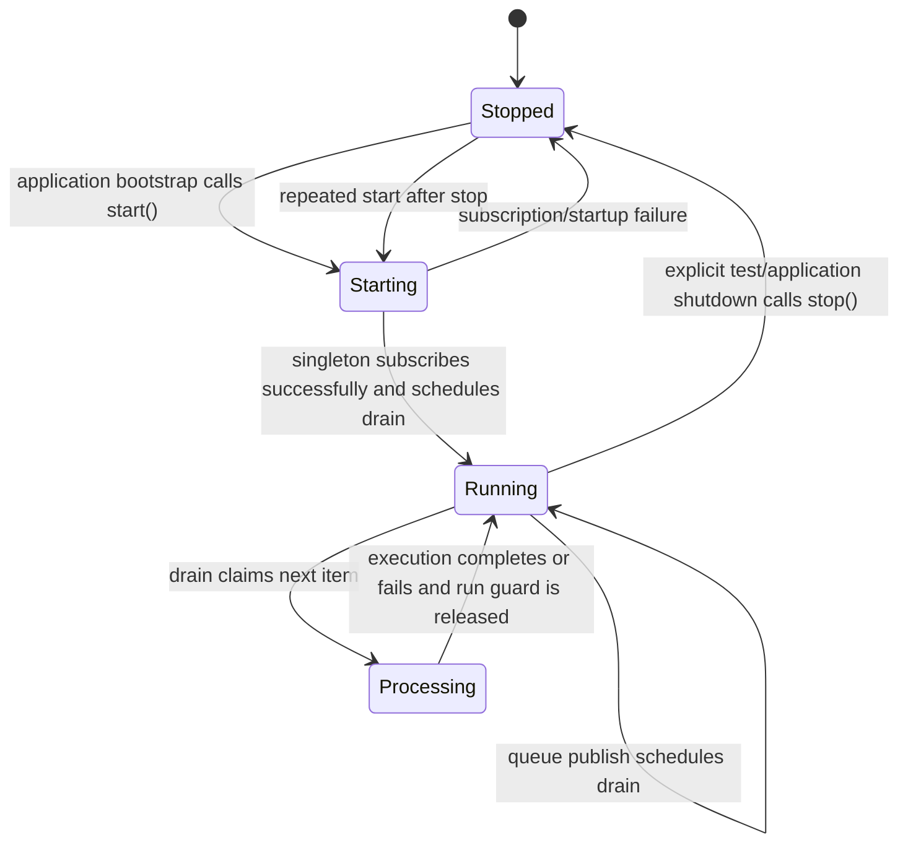

# Feature: Lifecycle-Independent Knowledge Embedding Queue

## 1. Architectural Context

### Relevant Existing Components

| Component | Responsibility | Relevance to Feature |
| ----------- | ---------------- | -------------------- |
| `InMemoryWorkflowQueue` | Holds queued knowledge-embedding work, deduplicates queue items, hydrates persisted work, and notifies a subscriber when work is published. | Must remain the single application-owned runtime queue and must not be recreated across app or screen lifecycle changes. |
| `KnowledgeEmbeddingQueueConsumer` | Subscribes to the workflow queue, drains queued items, and delegates execution to the pipeline executor. | Owns the queue subscription and concurrency protection. It must be one application-wide instance. |
| `RagPipelineOrchestrator` | Restores durable workflow rows and executes queued pipeline work through the document parsing, chunking, and embedding stages. | Remains the consumer's executor; no orchestration logic moves into the queue or UI. |
| `KnowledgeEmbeddingDocumentService` | Commits documents, publishes workflow items, restores interrupted work, and exposes workflow views. | Continues to be the producer and persistence-facing service. |
| `AppContent` bootstrap effect | Initializes the database, restores the durable queue, and starts the queue consumer. | Becomes the sole startup owner. Consumer shutdown must not be coupled to a screen or foreground/background transition. |
| `useKnowledgeEmbeddingFlow` | Manages screen state and refreshes committed workflow views. | Must stop subscribing directly to the queue because that conflicts with the consumer's single listener. |
| `registerServices.ts` | Registers shared services in the root TSyringe container. | Must register both queue and consumer with application-root singleton lifetime. |
| `KnowledgeEmbeddingQueueConsumer.test.ts` and `KnowledgeEmbeddingQueueRegistration.integration.test.ts` | Verify consumer concurrency and DI identity behavior. | Extend these tests to cover singleton lifetime, idempotent startup, and completion notification behavior. |

### Architectural Constraints

- Durable workflow state remains in SQLite through the existing repositories; the in-memory queue is only a runtime dispatch projection.
- The aggregate boundary remains intact: `RagPipelineOrchestrator` validates and resumes workflow state before executing stages.
- `InMemoryWorkflowQueue` currently permits exactly one subscriber. The consumer must be that subscriber.
- Queue and consumer lifetime must be independent of React screen mounting, navigation, and foreground/background events.
- `drainPromise` must remain the guard preventing multiple drain loops from running concurrently.
- `activeRunIds` must remain the guard preventing the same workflow run from executing concurrently.
- No second queue, orchestration engine, persistence path, or external dependency is required.

## 2. Proposed Architecture

### Abstract Interfaces/Contracts/DTOs Source Code Structure

The existing queue item remains the dispatch DTO:

```typescript
interface KnowledgeEmbeddingQueueItem {
  runId: string;
  documentId: string;
  documentVersion: number;
}
```

The existing pipeline executor contract remains the application boundary:

```typescript
interface KnowledgeEmbeddingPipelineExecutor {
  executeQueuedItem(item: KnowledgeEmbeddingQueueItem): Promise<unknown>;
}
```

The consumer should expose a narrow completion notification mechanism for UI-facing refreshes without exposing the queue subscription. The implementation may use a consumer callback/listener contract, provided that it is independent from `InMemoryWorkflowQueue` subscription ownership:

```typescript
interface KnowledgeEmbeddingConsumerListener {
  (item: KnowledgeEmbeddingQueueItem): void;
}

interface KnowledgeEmbeddingQueueConsumer {
  start(): void;
  stop(): void;
  drain(): Promise<void>;
  addListener(listener: KnowledgeEmbeddingConsumerListener): () => void;
}
```

The notification is informational and must not control execution. The consumer remains responsible for queue subscription, drain scheduling, and run-level concurrency. The UI may register and remove consumer listeners as its screen lifecycle changes, because these listeners are not queue subscribers.

### Data Flow

```text
AppContent bootstrap
    |
    v
Root DI container resolves singleton queue and singleton consumer
    |
    v
RagPipelineOrchestrator restores durable pending/partial/running rows
    |
    v
InMemoryWorkflowQueue hydrates and publishes KnowledgeEmbeddingQueueItem
    |
    v
KnowledgeEmbeddingQueueConsumer receives the only queue subscription
    |
    v
drainPromise serializes drain loops; activeRunIds prevents duplicate run execution
    |
    v
RagPipelineOrchestrator executes and persists workflow progress
    |
    v
Consumer completion listener notifies the knowledge-embedding hook
    |
    v
KnowledgeEmbeddingDocumentService reloads committed workflow views
```

### Workflow & State Transitions



State rules:

- `start()` is idempotent on the singleton. Repeated calls do not subscribe again or create another drain loop.
- `stop()` is reserved for explicit shutdown and tests. It must not be called merely because a screen unmounts or the app changes foreground state.
- A queue item is dequeued before execution and is processed through the existing orchestrator. Execution failures are logged and do not prevent later items from being drained.
- A second consumer resolved from the root container must be the same object. A consumer created manually against the same queue remains an invalid configuration and should continue to be rejected by the queue's single-subscriber invariant.
- Completion notifications are best-effort UI signals. They must not replace durable status updates or cause a second queue drain.

### Application Behavior Abstractions

`InMemoryWorkflowQueue`:

- Remains a root-container singleton.
- Keeps FIFO ordering and queue-item deduplication.
- Retains one queue subscriber, owned exclusively by `KnowledgeEmbeddingQueueConsumer`.
- Does not know about React, `AppState`, screens, or completion refreshes.

`KnowledgeEmbeddingQueueConsumer`:

- Is registered as an application-root singleton, using a cached factory if constructor injection requires the existing factory shape; it must not use `instancePerContainerCachingFactory` because that permits one instance per child container.
- Subscribes once in `start()` and treats subsequent `start()` calls as no-ops.
- Keeps the existing `drainPromise` lock around the full drain operation.
- Keeps `activeRunIds` around executor calls and releases each run ID in `finally`.
- Emits a completion notification only after an item has finished, whether execution succeeds or fails, if the hook needs to refresh status for that item.
- Does not subscribe or unsubscribe based on `AppState`.

`AppContent`:

- Resolves the singleton consumer after database initialization and queue restoration.
- Calls `start()` exactly once during application bootstrap.
- Does not stop the consumer from a React component cleanup that can run during UI lifecycle changes. If an explicit process shutdown hook is retained for tests or platform teardown, it must be separate from screen lifecycle behavior.

`useKnowledgeEmbeddingFlow`:

- Removes its direct call to `workflowQueue.subscribe()`.
- Registers only a consumer notification listener while the processing view needs refreshes, or uses an existing application query invalidation mechanism if that is selected during implementation.
- Cleans up that notification listener on effect teardown.
- Continues to use `AppState` only to request durable recovery through `restoreAndResume()`, not to start or stop the consumer.

`registerServices.ts`:

- Registers `InMemoryWorkflowQueue` as a singleton.
- Registers the consumer as a singleton in the root container while preserving its injected orchestrator and queue.
- Keeps all feature ownership under `src/features/knowledge-embedding`; shared DI remains wiring only.

### Implementation Plan

| File or area | Expected change |
| --- | --- |
| `src/shared/infrastructure/di/registerServices.ts` | Replace the per-container consumer caching registration with an application-root singleton registration strategy compatible with the current factory-based constructor wiring. Keep the queue singleton registration. |
| `src/features/knowledge-embedding/application/services/KnowledgeEmbeddingQueueConsumer.ts` | Preserve `drainPromise`, `activeRunIds`, FIFO draining, and failure continuation. Add a consumer-level notification API if needed for UI refreshes and make startup behavior explicitly idempotent. |
| `src/features/knowledge-embedding/application/services/InMemoryWorkflowQueue.ts` | Keep the single queue subscriber invariant and document it through tests. No UI-specific listener behavior should be added here. |
| `App.tsx` | Keep database restore followed by consumer startup. Remove lifecycle coupling that stops the application singleton during UI cleanup unless an explicit process-shutdown path is proven necessary. |
| `src/features/knowledge-embedding/hooks/useKnowledgeEmbeddingFlow.ts` | Remove direct workflow queue subscription. Resolve the singleton consumer and attach a removable completion listener for committed-run refreshes; retain foreground recovery without controlling consumer lifetime. |
| `src/features/knowledge-embedding/tests/unit/KnowledgeEmbeddingQueueConsumer.test.ts` | Add tests for repeated `start()` calls, concurrent `drain()` calls sharing one promise/execution loop, listener notification cleanup, and continued single-run protection. Update the second-consumer test only if the singleton contract changes its expected construction path. |
| `src/features/knowledge-embedding/tests/integration/KnowledgeEmbeddingQueueRegistration.integration.test.ts` | Assert that repeated root-container resolutions return the same queue and consumer and that the consumer's dependencies reference the shared queue. |
| `src/features/knowledge-embedding/tests` hook/integration coverage | Add a regression test proving processing can transition to committed state without attempting a second queue subscription, while completed workflow status still refreshes. |

No database schema, domain entity, repository, or external API change is required.

## 4. Error Handling & Resilience

- **Invalid input:** Queue items remain validated by the existing workflow/orchestrator boundaries. The consumer should treat malformed executor input as an execution failure and release its run guard in `finally`.
- **Duplicate requests/events:** Queue deduplication prevents repeated identical queue items; `activeRunIds` prevents concurrent execution of the same run; singleton DI prevents duplicate root consumer ownership.
- **Concurrent drain triggers:** Queue publish events and explicit `drain()` calls share `drainPromise`. Only one drain loop may consume the queue at a time.
- **Execution failures:** The consumer logs the failure, releases the run ID, and continues draining later queue items. Durable workflow failure state remains the orchestrator/repository responsibility.
- **Subscription failure:** A failed startup must be surfaced to bootstrap logging and must not silently create a second consumer. The queue's single-subscriber error remains a configuration diagnostic.
- **Foreground/background transitions:** Returning to the foreground may invoke durable `restoreAndResume()` as a recovery operation, but it must not create, start, stop, or resubscribe the singleton consumer. Queue deduplication and workflow state validation make recovery repeatable.
- **Navigation or screen unmount:** Removing the processing screen removes only its consumer notification listener. Work continues in the application singleton and is not cancelled by UI navigation.
- **Explicit shutdown/tests:** `stop()` must release the consumer's queue subscription so isolated tests and deliberate teardown can restart cleanly. A subsequent `start()` must be able to subscribe again without leaving stale listeners.
- **Partial failures and interruption:** Existing persisted `pending`, `partial`, and interrupted `running` rows remain the recovery source. Bootstrap restores them before starting the consumer, and foreground recovery republishes or resumes them through the existing document service.