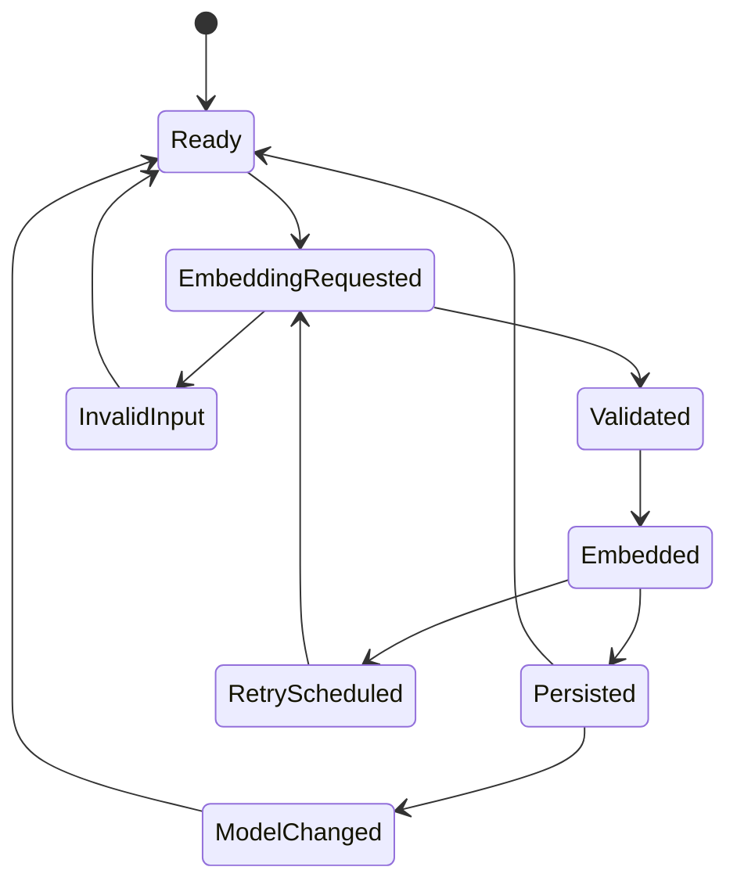

# Feature: Local Embedding Service

## 1. Architectural Context

### Relevant Existing Components

| Component | Responsibility | Relevance to Feature |
| ----------- | ---------------- | -------------------- |
| `ChunkDocumentUseCase` | Converts parsed document text into persisted `KnowledgeChunk` records | Defines the downstream boundary where embedding generation begins |
| `KnowledgeChunkEntity` | Validates minimum chunk invariants and ensures content is present | Provides the chunk text contract that must be embedded |
| `KnowledgeEmbedding` / `KnowledgeEmbeddingEntity` | Represents the derived vector payload for a chunk | Should live under the feature-local domain layer, not the shared domain layer |
| `DrizzleEmbeddingRepository` | Persists and reloads embedding rows from SQLite | Feature-specific persistence boundary for vector records |
| `knowledge_embeddings` schema | Stores `vector`, `dimension`, `provider`, `model_version`, and `created_at` | Confirms local persistence already exists and can be reused for chunk/query vector storage |
| `registerServices` | Wires feature services into the app container | Required injection point for the local embedding provider |

### Architectural Constraints

* Keep the feature local-first and offline-safe; no remote embedding network dependency is allowed.
* Preserve the existing clean architecture flow: app/use-case -> domain contract -> repository/infrastructure boundary.
* Reuse the current SQLite persistence pattern rather than introducing a second storage system for the first version.
* Keep the model contract provider-agnostic at the domain boundary while still allowing a single concrete local implementation.
* Do not add query retrieval logic in this feature; this feature only covers embedding generation and persistence.
* Preserve the repository pattern already used by document and chunk persistence.

---

## 2. Proposed Architecture

### Abstract Interfaces/Contracts/DTOs Source Code Structure

```text
src/
  features/
    knowledge-embedding/
      application/
        services/
          EmbeddingProviderEmbeddingService.ts
      domain/
        entities/
          KnowledgeChunk.ts
          KnowledgeEmbedding.ts
        value-objects/
          EmbeddingVector.ts
        validation/
          RagValidation.ts
      infrastructure/
        repositories/
          DrizzleEmbeddingRepository.ts
  shared/
    infrastructure/
      database/
        schema.ts
      di/
        registerServices.ts
```

The key interfaces should be minimal and stable. These are feature-specific contracts, so they should remain in the knowledge-embedding slice rather than the shared domain layer.

```ts
interface EmbeddingProviderConfig {
  provider: string;
  modelVersion?: string;
  dimension: number;
}

interface EmbeddingService {
  readonly provider: string;
  readonly modelVersion?: string;
  readonly dimension: number;
  embed(text: string): Promise<Float32Array>;
  embedBatch(texts: string[]): Promise<Float32Array[]>;
  embedWithRetry(text: string, retries?: number): Promise<Float32Array>;
}

interface QueryEmbeddingRequest {
  query: string;
  modelVersion?: string;
  provider?: string;
}

interface KnowledgeEmbeddingRecord {
  id: string;
  chunkId: string;
  vector: number[];
  dimension: number;
  provider?: string;
  modelVersion?: string;
  createdAt: Date;
  fingerprint?: string;
}
```

Important design decision: the same embedding configuration must be used for both stored chunks and user queries. This is the core correctness rule for vector search. `KnowledgeChunk` remains the source text record; `KnowledgeEmbedding` is the derived search vector and belongs to the feature-local model boundary.

### Data Flow

```text
ChunkDocumentUseCase
    ↓
EmbeddingService contract
    ↓
LocalEmbeddingModel (offline/local)
    ↓
KnowledgeEmbedding domain object
    ↓
DrizzleEmbeddingRepository
    ↓
SQLite knowledge_embeddings table
```

Important transitions:

1. The chunking stage produces normalized `KnowledgeChunk` content.
2. A later embedding use case or orchestration service requests embeddings for that chunk content.
3. The local embedding provider converts chunk text and search query text into vectors using a shared model and dimension.
4. The vector is validated against the configured dimension before persistence.
5. The vector record is stored with provider/model metadata and later used by retrieval/search operations.

### State Flow



These states are intentionally internal to the embedding step and are only used to support resume/retry behavior at the operation boundary. They are not the public business workflow status. The business workflow should only need to know whether the embedding step succeeded or failed, and if it failed, the failure reason. Internal details such as validation, retry scheduling, and model-version reconciliation are implementation-level concerns used to resume or recover the step safely.

Important states:

* `Ready`: internal step is waiting for chunk or query text.
* `EmbeddingRequested`: request has been received and model configuration is checked.
* `Validated`: input is non-empty and model/dimension assumptions are valid.
* `Embedded`: vector was successfully generated.
* `Persisted`: vector record has been saved with provider/model metadata.
* `RetryScheduled`: transient generation issue requires retry.
* `InvalidInput`: text is empty or structurally invalid.
* `ModelChanged`: a provider or model-version swap is active and the new version metadata must be recorded.

---

## 4. Data / Persistence Changes

No schema expansion is required for the first version because the repository and SQLite schema already include the required embedding table and columns. The existing `knowledge_embeddings` table already supports:

* `vector`
* `dimension`
* `provider`
* `model_version`
* `created_at`

The key distinction is that this table stores the derived embedding payloads, not the chunk text itself. `knowledge_chunks` continues to hold the source content and chunk metadata; `knowledge_embeddings` holds the searchable numeric representation derived from that chunk and the model metadata required to interpret it. The implementation should enforce that these fields remain consistent for both chunk embeddings and query embeddings. The domain invariant is not simply “vector is saved,” but “vector is saved with the correct dimension and the selected model metadata.”

Required data rules:

* `vector.length === dimension`
* `provider` identifies the local provider family
* `modelVersion` identifies the exact model build
* `createdAt` must be recorded when the embedding is saved
* query embeddings may not be persisted in the same table unless the feature later decides to retain search-history data; the initial requirement does not require query result persistence
* the same model/dimension contract must be used for chunk and query embeddings to guarantee compatibility in vector search

This avoids introducing a new storage schema while still ensuring the system can distinguish embeddings by model and version.

---

## 5. Error Handling & Resilience

* Invalid input: empty or whitespace-only text must fail fast and must not create a vector record.
* Transient failure: an embedding generation failure should be retriable without changing the pipeline contract. At the business-workflow boundary, the failure is exposed as `embedding_failed` plus a structured reason, while the internal step retains detailed retry state for resume.
* Model mismatch: if the configured provider or model version differs from prior embeddings, the system must surface a clear mismatch error rather than silently mixing vector spaces.
* Duplicate chunk text: repeated chunk embedding requests should be handled consistently; the system should not silently create conflicting embeddings for the same content unless deduplication is explicitly defined by the calling workflow.
* Batch failure: a batch operation should not return partial vector data without a clear failure outcome.
* External dependency absence: no remote service dependency means failures are local and should be treated as deterministic model failures or retryable runtime failures, not network failures.
* Recovery after interruption: vector generation should be treated as retryable and idempotent at the orchestration boundary; the repository should be able to reconcile saved embeddings without duplicate records.

---

## 6. Implementation Sequence

1. Confirm and enforce the embedding contract at the domain layer: vector length, finite numeric values, and model metadata validity.
2. Add the local provider abstraction and the first concrete local embedding service behind the existing service/repository pattern.
3. Wire the provider into the app container using the existing dependency registration pattern in `registerServices`.
4. Extend the embedding repository usage so the same model/dimension metadata is applied to both stored chunk embeddings and query embeddings.
5. Add the validation and retry rules around empty input, invalid dimensions, and transient generation failures.
6. Add unit tests around the vector contract, batch support, query embedding compatibility, and persistence metadata.
7. Validate the end-to-end flow from chunk generation to embedding persistence without introducing retrieval logic or search ranking.

Important guardrails:

* Do not add a remote embedding provider in this slice.
* Do not introduce vector-search or ranking logic in this feature.
* Do not broaden the feature beyond chunk + query embedding compatibility and metadata persistence.
* Keep the provider contract replaceable, but only one local provider should be active during the first implementation.
