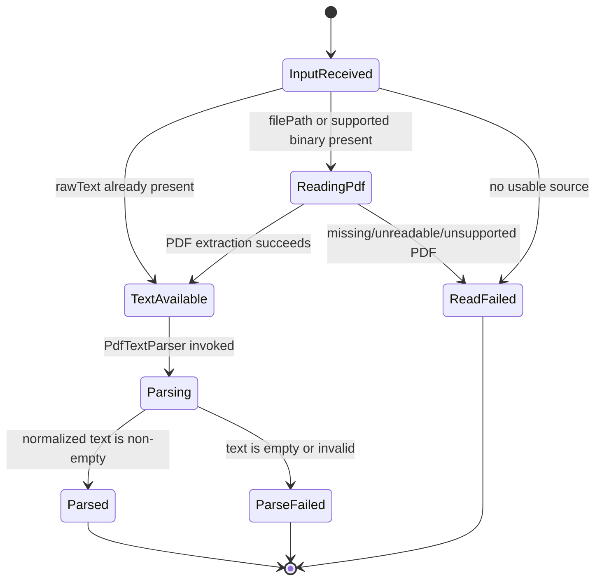

# Feature: Separate PDF Text Reading from PdfTextParser

## 1. Architectural Context

### Relevant Existing Components

| Component | Responsibility | Relevance to Feature |
| ----------- | ---------------- | -------------------- |
| `DocumentParseInput` | Carries document identity, source type, optional content, and source references into parsing | Defines the parser's accepted input shape. |
| `DocumentParser` | Selects and parses a supported document input | Establishes the parser boundary and keeps callers independent of a concrete parser. |
| `ParserRegistry` | Selects a parser by `sourceType` and normalizes the returned text | Owns parser dispatch and shared normalization, not file access. |
| `RagPipelineOrchestrator.toParseInput` | Maps a persisted `Document` into `DocumentParseInput` | Currently supplies `filePath` and optional `ocrText`, but does not load binary content. |
| `PdfTextParser` | Validates PDF input, consumes already-read text, normalizes it, and creates section hints | Should remain a lightweight text-processing parser and should not read files or decode raw PDF bytes. |
| `PdfTextReader` | Reads a PDF source and returns extracted text or a text-bearing binary payload | New focused collaborator that resolves `filePath` before `PdfTextParser` runs. |
| `ParseDocumentUseCase` | Validates the request, invokes the registry, persists extracted text, and updates parse state | Treats the parser as an application boundary and rejects empty results. |
| `IFileSystemAdapter` / mobile filesystem implementation | Provides platform-specific file operations for React Native | Provides the low-level file access needed by `PdfTextReader`; it should not be called directly by `PdfTextParser`. |
| `ExtractedDocumentTextRepository` | Persists parsed text and metadata | Receives parser output after successful parsing. |

### Architectural Constraints

- `DocumentParseInput` must remain the single input contract for parser dispatch.
- Repositories remain the persistence boundary; parsing must not write directly to SQLite.
- The RAG chain remains `documents -> extracted_document_text -> knowledge_chunks -> knowledge_embeddings`.
- Existing parser registration through `ParserRegistry` and dependency injection must be preserved.
- A local file path is a reference to source content, not parsed content. It must be resolved by `PdfTextReader`.
- Existing inline `rawText` and `binary` callers must continue to work.
- Raw PDF bytes must not be passed through `TextDecoder` as if they were extracted text.
- Empty or unreadable source content must fail explicitly rather than producing an empty extracted-text row.

## 2. Proposed Architecture

### Abstract Interfaces/Contracts/DTOs Source Code Structure

The existing `DocumentParseInput` contract remains the DTO passed into the parser workflow:

```ts
interface DocumentParseInput {
  documentId: string;
  documentVersion: number;
  projectId?: string;
  sourceType: 'pdf' | 'image' | 'text' | 'docx';
  contentType?: string;
  filePath?: string;
  rawText?: string;
  binary?: ArrayBuffer | Uint8Array;
  storageKey?: string;
  options?: {
    preservePages?: boolean;
    includePageBreaks?: boolean;
    normalizeWhitespace?: boolean;
  };
}
```

Add a focused reader contract near the knowledge-embedding application services or shared document parsing boundary:

```ts
interface PdfTextReader {
        read(input: PdfTextReadInput): Promise<PdfTextReadResult>;
}

interface PdfTextReadInput {
        documentId: string;
        documentVersion: number;
        filePath?: string;
        contentType?: string;
        binary?: ArrayBuffer | Uint8Array;
}

interface PdfTextReadResult {
        rawText: string;
        warnings?: string[];
}
```

The reader's source precedence should be:

1. Use `binary` only when the reader contract explicitly identifies it as PDF content and the configured extraction implementation can process PDF bytes.
2. Otherwise require `filePath`, read the file through the injected filesystem adapter, and extract its text with the chosen PDF extraction implementation.
3. Reject missing, unreadable, zero-byte, or textless input.

The application service that coordinates parsing should enrich or construct the `DocumentParseInput` with the reader result before invoking `PdfTextParser`:

```ts
interface PdfDocumentPreparationService {
        prepare(input: DocumentParseInput): Promise<DocumentParseInput>;
}
```

`PdfDocumentPreparationService` should preserve document identity and metadata, set `rawText` from `PdfTextReader`, and avoid passing raw PDF bytes as `binary` unless the downstream parser contract explicitly supports them.

`PdfTextParser` then has a narrower responsibility:

- Confirm `sourceType === 'pdf'`.
- Require non-empty extracted `rawText`.
- Normalize text according to the existing parser/registry behavior.
- Build section hints from normalized text.
- Return `ParsedDocumentText` with document identity and metadata.

It is not responsible for file I/O, PDF decoding, parser selection, persistence, workflow state, upload copying, or queue management.

The implementation should use the existing filesystem interface through the narrowest read operation already available. If that interface cannot return bytes, add one focused read method or adapter at the infrastructure boundary and inject it into `PdfTextParser`; do not read React Native modules directly from the parser.

### Data Flow

```text
Document picker / persisted Document
        |
        v
RagPipelineOrchestrator.toParseInput
        |
        |-- rawText when text extraction already exists
        |-- filePath when the PDF must be read
        v
PdfDocumentPreparationService
        |
        v
PdfTextReader
        |
        |-- read file through IFileSystemAdapter
        |-- extract text from PDF bytes
        v
DocumentParseInput with rawText
        |
        v
ParserRegistry.selectParser
        |
        v
PdfTextParser
        |
        |-- normalize extracted text
        |-- create section hints
        v
ParseDocumentUseCase
        |
        |-- validate non-empty parsed text
        |-- persist extracted_document_text
        |-- update document version workflow state
        v
Chunking and embedding pipeline
```

### Workflow & State Transitions



- `InputReceived -> TextAvailable`: guard that existing `rawText` is non-empty; no file read occurs.
- `InputReceived -> ReadingPdf`: guard that a file path or supported PDF byte source exists; reader performs I/O and extraction.
- `ReadingPdf -> TextAvailable`: reader returns non-empty extracted text; no persistence occurs yet.
- `ReadingPdf -> ReadFailed`: reader reports source, filesystem, or extraction failure; the application layer records the failure through existing workflow handling.
- `TextAvailable -> Parsing`: preparation service passes the enriched DTO to the existing parser registry.
- `Parsing -> Parsed`: parser returns normalized, non-empty text and section hints.
- `Parsing -> ParseFailed`: parser rejects invalid or empty text; extracted text is not persisted.

## 4. Error Handling & Resilience

- Invalid identity or version is rejected by `ParseDocumentUseCase` before parser execution.
- Non-PDF input is rejected by `PdfTextParser.canHandle` / parser selection.
- An absent `rawText`, absent `binary`, and absent `filePath` produces an explicit parse failure.
- A missing or unreadable `filePath` produces a reader failure that preserves the underlying filesystem or PDF extraction error where possible; the use case records it as the document version's failure reason.
- Zero-byte files and files that resolve to empty text remain failures and must not be persisted as successful extraction.
- Existing non-empty `rawText` takes precedence and avoids unnecessary filesystem reads.
- Raw `binary` takes precedence only when it is a supported PDF input for the configured reader; it must never be decoded blindly as UTF-8.
- Existing stored extracted text may still be reused by `DefaultDocumentParserService`; parsing should not re-read the file in that path.
- Retry behavior remains owned by the existing document-version and parent workflow state machines. The parser should be deterministic for the same input and have no side effects.
- Filesystem reads and PDF extraction should be awaited and should not leave partial persistence: extracted text is saved only after reading and parsing complete successfully.
- Tests should cover raw-text bypass, file-path reading, reader failures, empty extraction, parser-only behavior, and preservation of the existing `ParsedDocumentText` shape.

## 5. Implementation Plan

1. Extend or adapt `IFileSystemAdapter` with the narrowest read operation required by the reader, implemented by `MobileFileSystemAdapter` and test fakes.
2. Add the `PdfTextReader` contract and implementation under the knowledge-embedding infrastructure/application boundary; inject the filesystem adapter and the selected PDF extraction dependency.
3. Add `PdfDocumentPreparationService` or equivalent orchestration at the parser application boundary. It should enrich `DocumentParseInput` with extracted `rawText` before registry dispatch.
4. Reduce `PdfTextParser` to source validation, text normalization, section-hint generation, and `ParsedDocumentText` construction. Remove file reading and raw-PDF byte decoding from it.
5. Update `RagPipelineOrchestrator` or `ParseDocumentUseCase` to invoke preparation before `ParserRegistry.parse`, keeping persistence and workflow updates where they are.
6. Update DI registration so the reader, preparation service, filesystem adapter, and PDF extraction implementation are constructed once and shared through the existing container.
7. Add focused unit tests for reader success/failure, raw-text bypass, parser-only behavior, and one orchestrator integration test proving a PDF with only `filePath` reaches `PdfTextParser` with populated `rawText`.
8. Run the targeted knowledge-embedding tests and TypeScript typecheck.

No database schema change, new queue, or parser registry redesign is required. The only new workflow states above are conceptual reader/parse outcomes; existing persisted document-version states remain authoritative.
