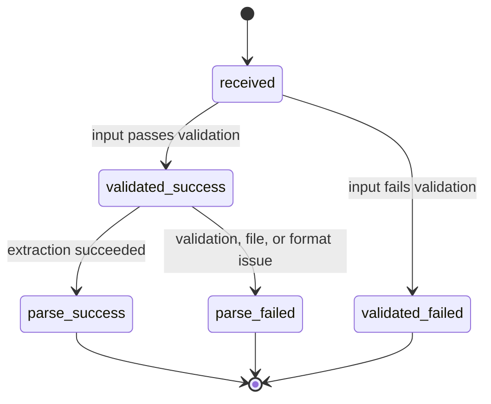

# Feature: PDF Text Parsing for Chunking

## 1. Architectural Context

### Relevant Existing Components

| Component | Responsibility | Relevance to Feature |
| --- | --- | --- |
| [src/shared/domain/services/DocumentParser.ts](../src/shared/domain/services/DocumentParser.ts) | Defines the parser contract, document input, normalized output, and page/section metadata types. | This remains the shared domain contract for parse input/output. The parser feature can consume it without forcing the shared layer to own file-specific behavior. |
| [src/features/knowledge-embedding/application/services/DocumentParserService.ts](../src/features/knowledge-embedding/application/services/DocumentParserService.ts) | Feature-local parser registration and normalization for the knowledge-embedding workflow. | This is the correct home for the registry and the PDF parser selection logic once the feature is scoped to knowledge embedding. |
| [src/features/knowledge-embedding/infrastructure/parsers/PdfTextParser.ts](../src/features/knowledge-embedding/infrastructure/parsers/PdfTextParser.ts) | PDF-specific extraction and page/section shaping within the feature. | This is the immediate implementation point for the feature. It should be moved under the knowledge-embedding feature and remain responsible for parsing only. |
| [src/features/knowledge-embedding/application/usecases/ParseDocumentUseCase.ts](../src/features/knowledge-embedding/application/usecases/ParseDocumentUseCase.ts) | Validates the document and coordinates parser execution. | This is the orchestrator and the owner of the four parse states: `received`, `validated`, `parse_failed`, and `parse_success`. |
| [src/features/knowledge-embedding/domain/entities/ExtractedDocumentText.ts](../src/features/knowledge-embedding/domain/entities/ExtractedDocumentText.ts) | Durable extracted-text artifact used after parsing. | The parser result is persisted by the orchestrator. This entity remains the durable representation after a successful parse. |
| [src/shared/infrastructure/di/registerServices.ts](../src/shared/infrastructure/di/registerServices.ts) | Registers the feature’s services in the dependency container. | Service registration should point to the feature-local parser service and PDF parser under the knowledge-embedding feature. |

### Architectural Constraints

* Keep the PDF parser feature-local to the knowledge-embedding feature instead of placing it in the shared layer.
* Preserve the dependency flow: feature application use cases depend on shared domain contracts, while feature-specific infrastructure adapters live under the knowledge-embedding feature.
* Keep parsing logic responsible only for extraction and structure shaping; the orchestrator remains responsible for validation, persistence, deduplication, retry, and error classification.
* Reuse the existing `DocumentParser` and `ParserRegistry` contracts instead of introducing a new parsing framework or a second document model.
* If page metadata or section hints are unavailable, the parse is still considered successful as long as the PDF text extraction itself succeeds; this is not a separate state.
* The orchestrator owns the error reason classification (`validation error`, `file error`, `format error`, etc.) and decides whether to retry, reject, or persist the failure.

---

## 2. Proposed Architecture

### Abstract Interfaces/Contracts/DTOs Source Code Structure

The feature already fits the existing domain model and should remain mostly additive. The essential contracts are:

```ts
interface DocumentParseInput {
  documentId: string;
  documentVersion: number;
  projectId?: string;
  sourceType: 'pdf' | 'image' | 'text' | 'docx';
  contentType?: string;
  filePath?: string;
  rawText?: string;
  binary?: ArrayBuffer | Uint8Array;
  storageKey?: string;
  options?: {
    preservePages?: boolean;
    includePageBreaks?: boolean;
    normalizeWhitespace?: boolean;
  };
}

interface ParsedDocumentPage {
  pageNumber: number;
  text: string;
  startOffset: number;
  endOffset: number;
}

interface SectionHint {
  heading: string;
  text: string;
}

interface ParsedDocumentText {
  documentId: string;
  documentVersion: number;
  projectId?: string;
  text: string;
  pageMetadata: ParsedDocumentPage[];
  sectionHints?: SectionHint[];
  elements?: ParsedDocumentElement[];
  language?: string;
  warnings?: string[];
  createdAt: Date;
}

interface DocumentParser {
  canHandle(input: DocumentParseInput): boolean;
  parse(input: DocumentParseInput): Promise<ParsedDocumentText>;
}
```

Key invariants:

* `documentId` and `documentVersion` are required and must match the version of the source document being parsed.
* `pageMetadata` is ordered and page numbers are 1-based when page-level extraction is available.
* `text` is the flattened, normalized extracted body content for the document.
* `sectionHints` is optional and may be empty if the extraction engine has no heading metadata.
* A parser must not silently return empty text for a valid PDF extraction attempt; it must either return a valid result with content or raise an error.

Source-code structure:

```text
src/
  shared/
    domain/services/DocumentParser.ts          # shared parser contract and DTOs
  features/
    knowledge-embedding/
      application/
        services/DocumentParserService.ts       # feature-local registry and normalization
        usecases/ParseDocumentUseCase.ts         # orchestrator with parse lifecycle state
      infrastructure/
        parsers/PdfTextParser.ts                # feature-local PDF extraction implementation
      domain/
        entities/ExtractedDocumentText.ts
```

### Data Flow

```text
ParseDocumentUseCase.execute(input)
    ↓
Validate input and document metadata
    ↓
Feature-local ParserRegistry.selectParser(input)
    ↓
PdfTextParser.parse(input)
    ↓
Extract text and optional pageMetadata/sectionHints
    ↓
ParserRegistry.normalize(parsed)
    ↓
ParseDocumentUseCase records parse_success or parse_failed
    ↓
Persistence / deduplication / retry handling owned by orchestrator
```

Important transitions:

1. Input validation happens at the use case boundary. `documentId` and `documentVersion` must be valid before parser selection.
2. The parser capability check remains simple: only `sourceType === 'pdf'` can be handled by `PdfTextParser`.
3. The parser extracts and shapes data but does not decide whether to persist or retry. It simply returns a `ParsedDocumentText` or raises an error.
4. The normalizer in `ParserRegistry` remains the single place responsible for whitespace cleanup and stable text normalization for all parser implementations.
5. Any downstream orchestration may persist the result using the existing extracted-document repository pattern, but the parser itself remains intentionally thin and side-effect free.

### State Flow



The parse workflow is intentionally simple and owned by `ParseDocumentUseCase`. A successful parse does not require page metadata or section hints to exist; those are optional outputs. If extraction succeeds with no page data or no section hints, the document still transitions to `parse_success` and the orchestrator handles the metadata gap as ordinary success. Any specific failure reason is recorded by the orchestrator rather than by the parser itself.

---

## 4. Data / Persistence Changes

> No persistence changes are required for the parser itself.

The approved behavior already fits the current domain model and repository boundary:

* `DocumentParseInput` and `ParsedDocumentText` already exist in the shared domain contracts.
* `ParseDocumentUseCase` already validates required values and returns a parse result to the caller.
* The parse result is intentionally passed to orchestration for persistence, deduplication, and versioned handling.
* `pageMetadata` already supports page number, page text, and offsets, which is sufficient for downstream chunking needs.

The implementation should avoid adding a new database schema or a new parser-specific persistence model unless a later requirement explicitly demands storing parser provenance or extraction fingerprints. The only safe extension is to populate the existing optional fields (`pageMetadata`, `sectionHints`, `warnings`) in ways that remain backward compatible with the current model.

---

## 5. Error Handling & Resilience

The parser should fail loudly and intentionally. The relevant scenarios are:

* Invalid input: if `sourceType !== 'pdf'`, `PdfTextParser` rejects the request with a clear error and does not silently return partial data.
* Missing extraction content: if a valid PDF produces no extractable text, the parser should raise an error instead of returning a misleading empty result.
* Extraction engine failure: if the underlying PDF extraction process throws, the exception should bubble to the caller so the orchestrator can classify it as a validation, file, or format error and decide on retry or rejection.
* Missing page or section metadata: if the extraction engine cannot provide `pageMetadata` or `sectionHints`, the parser still returns a successful `ParsedDocumentText` result as long as text extraction succeeded; this is not a separate failure path.
* Unsupported or malformed document: the parser should reject malformed input or invalid parse contracts cleanly instead of hiding the issue downstream.
* Empty `sectionHints`: when no section-hint strategy is configured or no headings are detected, the parser should return `sectionHints: []` rather than fail the parse.
* Duplicate requests/retries: the parser itself remains stateless and idempotent because it does not own persistence or deduplication. The orchestrator decides whether the same document/version is allowed to be re-parsed and records the failure reason.

This keeps the parser observable, predictable, and easy to test while preserving retry policy decisions and error classification at the orchestrator boundary.

---

## 6. Implementation Sequence

1. Move the feature’s parser service and PDF parser implementation under the knowledge-embedding feature package, keeping the shared domain model in place.
2. Confirm the parser contract and validation rules already defined in the shared domain layer, especially `DocumentParseInput` and `ParsedDocumentText`.
3. Update `PdfTextParser.parse` so it accepts only valid PDF inputs and raises a clear error for unsupported or malformed cases.
4. Replace the current single-page placeholder logic with extraction that preserves page-level structure when available, using page numbers, text, and offsets.
5. Keep `sectionHints` optional and empty-by-default when no hint generation is configured or no headings are detectable.
6. Preserve `ParserRegistry` as the single normalization layer so all parser outputs are normalized consistently before returning to the orchestrator.
7. Keep `ParseDocumentUseCase` as the four-state orchestrator: `received`, `validated`, `parse_failed`, `parse_success`.
8. Add focused tests for: valid PDF parse success, missing page metadata without failure, empty/unsupported input behavior, parse engine failure propagation, and empty section-hint handling.
9. Validate with the repository typecheck and the relevant parser-focused Jest test set before considering the feature complete.

Implementation guardrails:

* Do not add extra persistence, retry, or deduplication logic inside `PdfTextParser`.
* Do not treat missing `pageMetadata` or `sectionHints` as a failure state if text extraction succeeded.
* Do not create new workflow states beyond the four parse states owned by `ParseDocumentUseCase`.
* Do not broaden the contract beyond `ParsedDocumentText`, `pageMetadata`, and optional `sectionHints`.
* Do not invent new parsing metaphors or workflow stages that the current architecture does not already support.
* Do not implement chunk-generation behavior here; this feature is extraction-only and must remain upstream of chunking.

---

