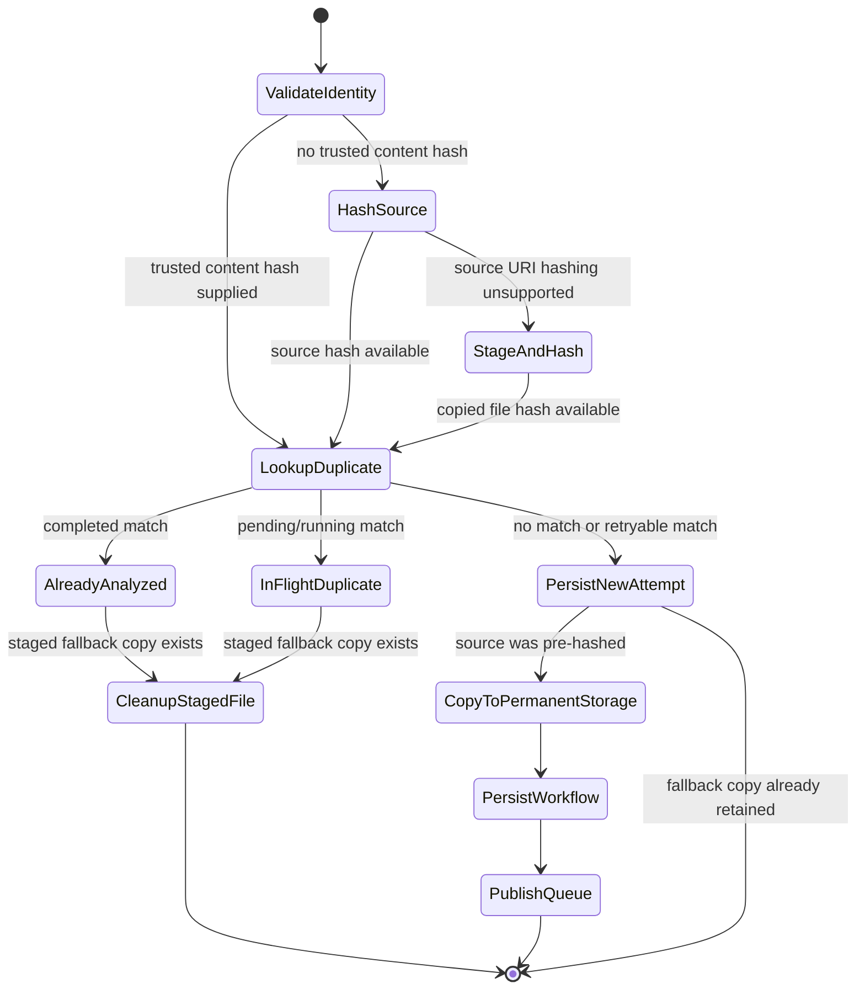

# Feature: Pre-Upload Duplicate Validation

## 1. Architectural Context

### Relevant Existing Components

| Component | Responsibility | Relevance to Feature |
| ----------- | -------------- | -------------------- |
| `useKnowledgeEmbeddingFlow` | Selects files and commits the selected batch for analysis. | Defines the user-facing commit boundary; duplicate validation should happen during commit before a permanent document is created. |
| `KnowledgeEmbeddingDocumentService` | Copies selected files, computes checksums, resolves duplicate status, persists documents and workflows, and publishes queue items. | Owns the duplicate decision and currently computes the checksum only after copying to app storage. |
| `AddKnowledgeEmbeddingDocumentCommand` | Carries file identity, project scope, URI, metadata, and an optional content hash. | Can accept a precomputed hash without changing the duplicate decision contract. |
| `DocumentRepository` / `DrizzleDocumentRepository` | Stores document metadata and supports checksum/project queries. | Provides the existing content-identity lookup used by duplicate validation. |
| `DocumentChunkingWorkflowRepository` | Stores durable workflow status for each document version. | Determines whether a checksum match is completed, queued, or retryable. |
| `IFileSystemAdapter` | Abstracts platform-specific file copying, hashing, existence checks, and deletion. | Must expose source-URI hashing if validation is to happen before permanent app-storage copy. |
| `MobileFileSystemAdapter` | Implements file operations with `react-native-fs`. | Must handle provider-backed picker URIs and normalize them before hashing or copying. |
| `InMemoryWorkflowQueue` | Publishes durable pending work for runtime processing. | Must not receive an item when pre-upload validation identifies a completed or in-flight duplicate. |

### Architectural Constraints

- `documents.checksum` remains content identity only; workflow status must still be checked before deciding whether content is reusable.
- Duplicate scope remains project-scoped, matching the current `findAll({ checksum, projectId })` lookup.
- Duplicate documents remain separate records only for accepted uploads; a blocked duplicate must not create a new document or workflow.
- Repository implementations remain the only layer that accesses SQLite.
- Queue publication occurs only after document and workflow persistence succeeds.
- The existing `completed`, `pending`/`running`, and retryable status policy remains unchanged.
- A filename, file size, modification date, or picker identity is not sufficient to prove duplicate content.
- Picker URIs may be temporary, security-scoped, provider-backed, or unreadable by `react-native-fs`; source hashing therefore needs a capability/fallback rather than an unconditional platform assumption.

## 2. Proposed Architecture

### Abstract Interfaces/Contracts/DTOs Source Code Structure

Reuse the current feature structure. The proposed change is limited to the filesystem boundary and the document intake service:

```text
src/features/knowledge-embedding/
  application/services/KnowledgeEmbeddingDocumentService.ts
  application/contracts/KnowledgeEmbeddingRunContracts.ts
  tests/unit/KnowledgeEmbeddingDocumentService.red.test.ts

src/shared/infrastructure/files/
  IFileSystemAdapter.ts
  MobileFileSystemAdapter.ts

architecture/
  pre-upload-duplicate-validation.md
```

Extend the existing filesystem adapter with an optional source-URI hash operation:

```ts
interface IFileSystemAdapter {
  copyToAppStorage(sourceUri: string, destinationFilename: string): Promise<string>;
  computeSha256?(filePath: string): Promise<string>;
  computeSha256FromUri?(sourceUri: string): Promise<string>;
  getDocumentsDirectory(): Promise<string>;
  exists(filePath: string): Promise<boolean>;
  deleteFile(filePath: string): Promise<void>;
}
```

The method is optional to preserve test doubles and non-mobile implementations. `KnowledgeEmbeddingDocumentService.addDocument` should use the following decision order:

1. Validate document identity and required metadata.
2. Preserve exact `(documentId, documentVersion)` idempotency before any file operation.
3. If `metadata.contentHash` is supplied by a trusted caller, use it for duplicate lookup.
4. Otherwise, if `computeSha256FromUri` is available, hash the picker URI before copying it to permanent storage.
5. Resolve checksum matches using the existing project-scoped, status-aware policy.
6. For `completed`, return the reusable source result without copying or persisting a new document.
7. For `pending` or `running`, return the in-flight duplicate result without creating another document, workflow, or queue item.
8. For `failed`, `partial`, or `cancelled`, copy the source to a unique permanent path and create the new independent attempt.
9. If no source-URI hash capability exists, copy to a unique staging/permanent path, hash the copied file, then apply the same duplicate decision. Delete the copied path when the result is blocked; retain it only for a newly accepted document or completed-source metadata as required by the existing service contract.

The optional method must not silently return a guessed hash. If source hashing is unsupported or fails, the service should use the existing copy-then-hash path or return a typed intake error, depending on whether the failure is recoverable. It must never treat an unknown hash as proof that the content is new or already analyzed.

### Domain Entities & DTOs

No new durable entity is required. Existing entities remain authoritative:

```ts
interface Document {
  id: string;
  projectId?: string;
  checksum?: string;
  ragSourceDocumentId?: string;
  localPath?: string;
  uri?: string;
  filename: string;
}

type DuplicateDecision =
  | { kind: 'new'; contentHash?: string }
  | { kind: 'already-analyzed'; sourceDocumentId: string; sourceRunId: string; contentHash: string }
  | { kind: 'in-flight'; sourceDocumentId: string; sourceRunId: string; contentHash: string };
```

`DuplicateDecision` is an application-level result/helper shape, not a new persisted table. Its invariants are:

- `already-analyzed` requires a matching workflow with status `completed`.
- `in-flight` requires status `pending` or `running`.
- `new` is the only decision that may persist a new document/workflow and publish a queue item.
- `failed`, `partial`, and `cancelled` matches resolve to `new` while preserving the original workflow.
- A content hash is authoritative only when produced by the filesystem, a trusted upstream provider, or a validated test fixture.

### Workflow & State Transitions



State side effects and guards:

| Transition | Guard | Side effect |
| ---------- | ----- | ----------- |
| `ValidateIdentity -> HashSource` | No trusted `contentHash`; adapter supports source hashing. | Read-only access to picker URI; no app document or queue mutation. |
| `ValidateIdentity -> LookupDuplicate` | Trusted hash already present. | No file operation required for duplicate lookup. |
| `HashSource -> StageAndHash` | Source URI cannot be hashed directly. | Copy to a unique temporary/permanent path so the local file can be hashed. |
| `LookupDuplicate -> AlreadyAnalyzed` | Same project/checksum has a `completed` workflow. | Return `alreadyHandled`; do not create a document, workflow, or queue item. |
| `LookupDuplicate -> InFlightDuplicate` | Same project/checksum has a `pending` or `running` workflow. | Return the existing in-flight result; do not create duplicate work. |
| `LookupDuplicate -> PersistNewAttempt` | No match, or only `failed`, `partial`, or `cancelled` matches. | Preserve prior attempts and create an independent document/workflow. |
| `PersistWorkflow -> PublishQueue` | Document and durable workflow persistence succeeded. | Publish exactly one runtime queue item. |
| Any persistence failure | File was copied. | Delete the newly copied path; do not leave a partial document/workflow visible. |

### Data Flow

```text
Document picker URI
    -> useKnowledgeEmbeddingFlow.processDocuments
    -> KnowledgeEmbeddingDocumentService.addDocument
    -> metadata.contentHash OR IFileSystemAdapter.computeSha256FromUri(uri)
    -> DocumentRepository.findAll({ checksum, projectId })
    -> WorkflowRepository status lookup
    -> completed/in-flight: return without permanent upload
    -> retryable/new: copy to unique app-storage path
    -> persist Document + pending workflow
    -> publish InMemoryWorkflowQueue item
    -> RAG pipeline consumer
```

### Pre-Upload Feasibility and Tradeoffs

A true pre-upload duplicate check is feasible only when the selected URI can be hashed directly. The mobile adapter can attempt to normalize and read the URI, but document-provider URIs may require temporary access or may not map to a path readable by `react-native-fs`. The adapter must report that capability explicitly rather than making the application depend on URI shape.

If direct source hashing is unavailable, the reliable fallback is to copy and hash before persisting the document. This prevents duplicate database/workflow/queue records, but it does not avoid the physical file transfer. It is therefore a validation-before-commit flow, not a zero-copy upload optimization.

File name and size checks may be used as an early UI hint, but they must not replace checksum validation because renamed files and different files with the same size are valid cases.

## 4. Error Handling & Resilience

- Invalid document identity, missing filename, or missing URI is rejected before hashing or copying.
- A direct source-hash failure caused by unsupported URI access falls back to staging and local hashing when possible.
- A hash failure after staging removes the staged file and returns an intake error; it must not guess a duplicate decision.
- A completed duplicate returns the existing `alreadyHandled` result and never creates a new durable record.
- An in-flight duplicate returns the existing queued/running result and never publishes another queue item.
- Failed, partial, and cancelled matches remain retryable and do not become reusable sources.
- If document/workflow persistence fails after a new copy, the existing compensation path deletes the copied file.
- Queue publication remains after durable persistence, preserving restart/recovery behavior.
- Repeated exact `(documentId, documentVersion)` requests remain idempotent before any hashing or copy operation.
- Concurrent uploads can still race if they independently hash and inspect before persistence. If this becomes a supported concurrent workflow, add a repository transaction or database-level successful-content claim keyed by project and checksum; source-URI hashing alone does not solve that race.
- Logging should record hash capability/fallback choice and duplicate decision without logging file contents or sensitive provider URIs.
