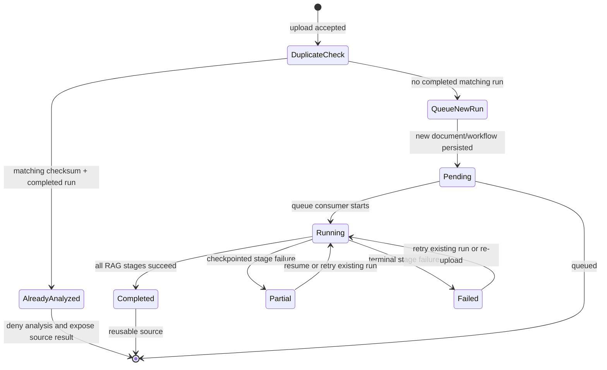

# Feature: RAG Duplicate Analysis and Failed-Upload Retry Policy

## 1. Architectural Context

### Relevant Existing Components

| Component | Responsibility | Relevance to Feature |
| ----------- | -------------- | -------------------- |
| `KnowledgeEmbeddingDocumentService` | Accepts selected files, persists `documents`, creates workflow records, and publishes queue items. | Current checksum de-duplication returns `alreadyHandled` whenever a matching workflow exists, regardless of its status. |
| `AddKnowledgeEmbeddingDocumentCommand` | Carries document identity, version, project, and file metadata into document intake. | Defines the input boundary for duplicate detection and re-upload behavior. |
| `DocumentRepository` / `DrizzleDocumentRepository` | Persists document metadata and content checksum. | Provides the set of documents with the same file content. |
| `DocumentChunkingWorkflowRepository` / `DrizzleDocumentChunkingWorkflowRepository` | Persists and retrieves the durable RAG workflow record. | Must support status-aware lookup for a checksum-matched document. |
| `KnowledgeEmbeddingRunStatus` | Defines `pending`, `running`, `completed`, `partial`, `failed`, and `cancelled`. | `completed` is the only status that proves the file has already been successfully analyzed. |
| `RagPipelineOrchestrator` | Executes queued work and restores pending, partial, and running work. | Confirms that partial work is retryable and that completed work is terminal. |
| `InMemoryWorkflowQueue` | Runtime-only queue with duplicate run protection. | Receives a new run only when the content is not successfully analyzed already. |
| `KnowledgeEmbeddingLaunchScreen` and `useKnowledgeEmbeddingFlow` | Selects files and presents processing state to the user. | Should receive a clear already-analyzed result for completed content and a queued result for retryable content. |

### Architectural Constraints

- Preserve the existing `documents -> extracted_document_text -> knowledge_chunks -> knowledge_embeddings` persistence chain.
- Keep duplicate uploads as separate `documents` rows; use `ragSourceDocumentId` only when reusing a completed RAG result.
- `documents.checksum` is content identity, not workflow status. A checksum match must be evaluated against the related RAG workflow.
- `knowledge_embedding_runs` is the durable workflow source of truth. The in-memory queue is only a dispatch projection.
- Repository implementations remain the only layer that performs SQLite access.
- Existing parent-run and child-stage retry invariants remain unchanged.
- A completed workflow must not be re-enqueued or analyzed again for the same content and duplicate scope.
- Failed, partial, pending, or running workflows do not establish successful analysis and must not block a new upload of the same content.

## 2. Proposed Architecture

### Abstract Interfaces/Contracts/DTOs Source Code Structure

Reuse the current feature structure. The behavior change belongs primarily in:

```text
src/features/knowledge-embedding/
  application/services/KnowledgeEmbeddingDocumentService.ts
  application/contracts/KnowledgeEmbeddingRunContracts.ts
  domain/repositories/DocumentChunkingWorkflowRepository.ts
  infrastructure/repositories/DrizzleDocumentChunkingWorkflowRepository.ts
  tests/unit/KnowledgeEmbeddingDocumentService.red.test.ts
  tests/integration/RagPipelineOrchestrator.integration.test.ts
```

The existing input and result contracts remain suitable, but duplicate resolution should be explicit at the application boundary:

```ts
interface DuplicateAnalysisDecision {
  kind: 'allow' | 'deny_already_analyzed';
  sourceDocumentId?: string;
  sourceRunId?: string;
  sourceStatus?: KnowledgeEmbeddingRunStatus;
}

interface DocumentChunkingWorkflowRepository {
  findByDocumentVersion(documentId: string, version: number): Promise<DocumentChunkingWorkflowRecord | null>;
  findLatestByDocumentId(documentId: string): Promise<DocumentChunkingWorkflowRecord | null>;
  findSuccessfulByDocumentId(documentId: string, version?: number): Promise<DocumentChunkingWorkflowRecord | null>;
  findByStatus(status: string): Promise<DocumentChunkingWorkflowRecord[]>;
  upsert(record: DocumentChunkingWorkflowRecord): Promise<void>;
}
```

The exact new method may instead be implemented as a service helper over the existing repository methods if that avoids a broader interface change. The important contract is that the caller can answer whether a checksum-matched source document has a workflow whose status is exactly `completed`.

Required invariants:

- `completed` means all required RAG stages finished successfully and the resulting chunks/embeddings are reusable.
- `partial`, `failed`, `pending`, and `running` are retryable or in-progress states, not successful analysis.
- `cancelled` is not a successful analysis and must not block a later upload.
- A newly accepted retry upload receives its own document/workflow identity and remains independently removable and observable.
- A completed source may be referenced by `ragSourceDocumentId`; failed or partial sources must not be used as the reusable RAG source.
- Same `(documentId, documentVersion)` requests remain idempotent only when they represent the same persisted intake operation. A distinct re-upload must use a new document identity or an explicit retry command.

### Workflow & State Transitions



Decision rules:

| Matching content state | New upload behavior | Queue behavior |
| ---------------------- | ------------------- | -------------- |
| No matching document/workflow | Accept and persist a new document and run | Publish new run |
| Matching run is `completed` | Deny duplicate analysis and link to completed source | Do not publish |
| Matching run is `partial` | Accept a new upload, or offer resume of the existing run when the caller explicitly requests retry | Publish the new run or resume the existing run, never silently mark it already handled |
| Matching run is `failed` | Accept a new upload | Publish new run |
| Matching run is `pending` or `running` | Do not treat as successful; preserve independent upload semantics or explicitly return an in-flight duplicate result | Do not create duplicate work for the same request; a new upload may be queued according to the selected intake policy |
| Matching run is `cancelled` | Accept a new upload | Publish new run |

The minimum required behavior is that only a matching `completed` run denies analysis. For `failed` and `partial`, the first implementation should preserve the old run for audit/retry and create a new document/workflow row for a distinct re-upload. It must not set `ragSourceDocumentId` to a failed or partial document.

### Data Flow

```text
Document picker
    -> useKnowledgeEmbeddingFlow
    -> KnowledgeEmbeddingDocumentService.addDocument
    -> compute/store checksum
    -> DocumentRepository.findAll({ checksum })
    -> workflow repository status lookup for each matching document
    -> completed match: return alreadyHandled without queue
    -> no completed match: persist new document + pending workflow
    -> InMemoryWorkflowQueue.publish(new run)
    -> KnowledgeEmbeddingQueueConsumer
    -> RAG pipeline stages
    -> completed / partial / failed durable state
```

### Implementation Plan

1. Update `KnowledgeEmbeddingDocumentService.addDocument` so checksum matching is status-aware. Replace the current condition that treats any `matchingRun` as reusable with a condition that requires `matchingRun.status === 'completed'`.
2. Preserve the existing completed-content path: save the duplicate document with `ragSourceDocumentId` pointing to the completed source, return `alreadyHandled: true`, and do not publish a queue item.
3. For failed, partial, pending, running, or cancelled matching runs, do not set `ragSourceDocumentId` and continue through normal new-run persistence and queue publication.
4. Decide and document the in-flight policy for `pending` and `running` content. The conservative default is to allow a distinct re-upload but prevent duplicate queue items for the same document ID/version.
5. Keep `retryDocument` for explicit retries of an existing run. It should continue to reject only `completed` and `cancelled` runs, while re-upload remains a separate document/workflow attempt.
6. Add a repository helper or service-level lookup that makes the successful-only rule obvious and avoids duplicating status filtering across callers.
7. Add focused unit tests for each status and an integration test proving that a failed same-checksum upload creates and queues a new run while a completed same-checksum upload is denied.
8. Update the architecture/data-flow documentation if the chosen in-flight policy differs from the table above. No schema change is required unless the repository needs a database-level successful-content index for concurrency safety.

### Tests to Add or Update

- A checksum-matched `completed` workflow returns `alreadyHandled: true`, sets `ragSourceDocumentId`, and does not publish a new queue item.
- A checksum-matched `failed` workflow creates a separate document/workflow and publishes it.
- A checksum-matched `partial` workflow creates a separate queued attempt, while the original partial run remains available for explicit resume.
- A checksum-matched `cancelled` workflow is accepted and queued.
- A checksum-matched `pending` or `running` workflow follows the documented in-flight policy and does not create duplicate queue work for the same request.
- A different checksum is always accepted as new content.
- Repeating the exact same `(documentId, documentVersion)` intake remains idempotent.
- The queue consumer still prevents concurrent execution of the same run ID.
- The completed source remains searchable/reusable after a duplicate upload is denied.

## 4. Error Handling & Resilience

- Invalid document identity or file metadata is rejected before duplicate lookup or file persistence.
- A completed duplicate returns a typed or clearly distinguishable `alreadyHandled` result; it should not be reported as a generic persistence failure.
- A failed or partial matching run is retryable and must not be converted into a completed/reusable source merely because a duplicate upload was received.
- If status lookup for a checksum match fails, fail the intake rather than assuming the content was successfully analyzed. This prevents unsafe duplicate blocking.
- If document or workflow persistence fails after the file is copied, use the existing compensation path to remove the staged file and avoid exposing a partial document.
- Queue publication occurs only after the new document and pending workflow are persisted.
- Repeated queue events for one run remain safe through the existing `InMemoryWorkflowQueue` and consumer run-ID guard.
- Existing partial runs retain their checkpoint and error information; a new upload does not mutate or delete the prior failed/partial attempt.
- Successful deduplication is content-scoped. The implementation must use the existing project/document scope intended by the application so a completed file in one unrelated scope does not incorrectly block analysis elsewhere.
- The status rule must be enforced in the application service and, where concurrent uploads are possible, backed by a transactional repository lookup/upsert to prevent two callers from both deciding that no successful run exists and enqueueing duplicate work.
