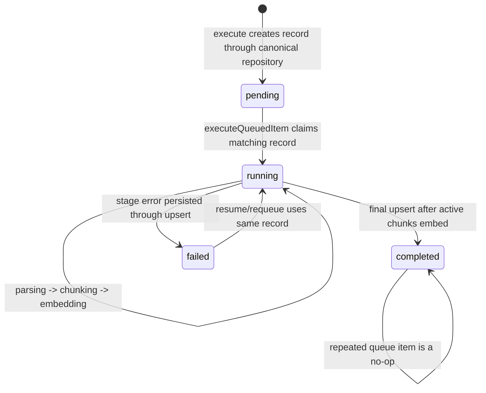

# Feature: Domain-Aligned RAG Workflow Persistence

## 1. Architectural Context

### Relevant Existing Components

| Component | Responsibility | Relevance to Feature |
| ----------- | ---------------- | -------------------- |
| `RagPipelineOrchestrator` | Creates, resumes, queues, and executes document knowledge workflows | Currently depends on two incompatible workflow repository contracts. It should use one canonical durable contract. |
| `DocumentChunkingWorkflowRepository` | Persists chunking-stage workflow/checkpoint records used by parsing and chunking callers | Owns chunk-specific progress operations and the rich workflow-shaped record used during queued execution. |
| `KnowledgeEmbeddingRunRepository` | Owns the durable parent `KnowledgeEmbeddingRun` lifecycle | Canonical parent-run boundary for create, lookup, status restoration, and updates. |
| `DrizzleKnowledgeEmbeddingRunRepository` | SQLite implementation of `KnowledgeEmbeddingRunRepository` | Persists the parent workflow in `knowledge_embedding_runs` without a test-only adapter. |
| `DrizzleDocumentChunkingWorkflowRepository` | SQLite implementation of `DocumentChunkingWorkflowRepository` | Remains available to chunking-specific use cases and stage progress operations. |
| `KnowledgeEmbeddingRunEntity` | Validates and transforms the smaller parent-run model | May remain as a domain compatibility model for callers, but must not define a second persistence contract. |
| `InMemoryWorkflowQueue` | In-process projection of durable workflow work | Continues to publish queue items derived from the canonical workflow record. |
| `KnowledgeEmbeddingQueueConsumer` | Dequeues work and invokes the orchestrator | Must continue to use the same orchestrator instance and canonical repository. |
| `ParserRegistry` | Selects a parser and applies the shared text normalization pipeline | Should be reused by the integration test rather than bypassed with a test-only parser. |
| `PdfTextParser` | Parses PDF input, including supplied raw text, without requiring native PDF extraction for this fixture | Provides a deterministic production parser path for the SQLite test. |
| `ParseDocumentUseCase` | Validates parser input and persists extracted document text | Verifies the real parse-to-SQLite path. |
| `RagPipelineOrchestrator.integration.test.ts` | Verifies SQLite workflow and parsing behavior | Uses `DrizzleKnowledgeEmbeddingRunRepository` directly; the test-only adapter is removed. |

### Architectural Constraints

- `knowledge_embedding_runs` remains the durable parent workflow and the existing SQLite schema remains the source of truth.
- Repositories remain the only production boundary for raw SQLite access.
- The richer `DocumentChunkingWorkflowRecord` must preserve document version, checkpoint, retry, validation, and recovery fields.
- Parent lifecycle operations must use `KnowledgeEmbeddingRunRepository`; chunking-stage progress must use `DocumentChunkingWorkflowRepository`.
- DI must provide one cached instance of each repository boundary so parent and stage operations observe the same SQLite database.
- Existing callers of `execute()` should retain a stable result shape where practical. Mapping a persisted workflow record to `KnowledgeEmbeddingRun` is acceptable at the application boundary; mapping must not introduce a second persistence path.
- The refactor must update existing unit and integration test doubles to the canonical contract rather than add a production-only compatibility repository or a test-only SQLite adapter.
- Integration tests must reuse production parser behavior. `DeterministicTextParser` is unnecessary and should be removed; the test should register `PdfTextParser`, pass the fixture text through `rawText`, and use `sourceType: 'pdf'` so parser selection follows production behavior without native file extraction.

## 2. Proposed Architecture

### Abstract Interfaces/Contracts/DTOs Source Code Structure

Keep the repository boundaries aligned with the domain aggregate. `KnowledgeEmbeddingRunRepository` owns parent lifecycle operations, while `DocumentChunkingWorkflowRepository` remains the chunking-specific persistence boundary.

```text
src/shared/domain/repositories/DocumentChunkingWorkflowRepository.ts
  upsert(record: DocumentChunkingWorkflowRecord): Promise<void>
  findByDocumentVersion(documentId, version): Promise<DocumentChunkingWorkflowRecord | null>
  findLatestByDocumentId(documentId): Promise<DocumentChunkingWorkflowRecord | null>
  findByStatus(status): Promise<DocumentChunkingWorkflowRecord[]>

src/features/knowledge-embedding/application/services/RagPipelineOrchestrator.ts
        uses KnowledgeEmbeddingRunRepository for parent lifecycle
        uses DocumentChunkingWorkflowRepository for queued stage progress

src/features/knowledge-embedding/infrastructure/repositories/DrizzleKnowledgeEmbeddingRunRepository.ts
        implements parent lifecycle operations against knowledge_embedding_runs

src/features/knowledge-embedding/infrastructure/repositories/DrizzleDocumentChunkingWorkflowRepository.ts
        implements chunking-specific workflow operations against the same durable schema

src/features/knowledge-embedding/infrastructure/parsers/PdfTextParser.ts
        reused by the integration test with rawText input

src/shared/infrastructure/di/registerServices.ts
        registers separate parent and chunking repository instances

src/features/knowledge-embedding/tests/integration/RagPipelineOrchestrator.integration.test.ts
        uses DrizzleKnowledgeEmbeddingRunRepository directly
```

The recommended application boundary is:

```typescript
interface DocumentChunkingWorkflowRepository {
  upsert(record: DocumentChunkingWorkflowRecord): Promise<void>;
  findByDocumentVersion(documentId: string, version: number): Promise<DocumentChunkingWorkflowRecord | null>;
  findLatestByDocumentId(documentId: string): Promise<DocumentChunkingWorkflowRecord | null>;
  findByStatus(status: string): Promise<DocumentChunkingWorkflowRecord[]>;
}
```

`RagPipelineOrchestrator.execute()` creates a `KnowledgeEmbeddingRun` and persists it through `KnowledgeEmbeddingRunRepository`. `executeQueuedItem()` reads and updates the chunking-stage record through `DocumentChunkingWorkflowRepository`; both repositories target the same canonical SQLite schema and are wired as separate responsibilities. The parser path is `ParserRegistry -> PdfTextParser -> ParseDocumentUseCase -> DrizzleExtractedDocumentTextRepository`, with fixture content supplied through `rawText`.

### Data Flow

```text
RagPipelineOrchestrator.execute(documentId)
        ↓
KnowledgeEmbeddingRun
        ↓
DrizzleKnowledgeEmbeddingRunRepository
        ↓
knowledge_embedding_runs
        ↓
InMemoryWorkflowQueue publishes { runId, documentId, documentVersion }
        ↓
RagPipelineOrchestrator.executeQueuedItem(item)
        ↓
DocumentChunkingWorkflowRepository finds and updates stage progress
        ↓
ParserRegistry → PdfTextParser → ParseDocumentUseCase → extract → chunk → embed
        ↓
extracted_document_text, knowledge_chunks, knowledge_embeddings
```

### 3.1. Domain Entities & DTOs

- `DocumentChunkingWorkflowRecord` is the canonical persisted workflow DTO. Its required invariants are a non-empty id, document id, positive document version, status, workflow state, retry count, and timestamps.
- `KnowledgeEmbeddingQueueItem` is a runtime DTO derived from the persisted record. Its run id, document id, and document version must match the durable row.
- `KnowledgeEmbeddingRun` is the parent aggregate persisted by `KnowledgeEmbeddingRunRepository`.
- `DocumentChunkingWorkflowRecord.status` must use the existing durable values required by the pipeline, including `pending`, `running`, `partial`, `failed`, and `completed`.
- `workflowState`, `lastEvent`, `retryCount`, `validationReason`, and `resumeFromCheckpoint` must be updated atomically through the existing repository upsert behavior for each stage transition.

### 3.2. Workflow & State Transitions



- Creation guard: document id must be non-empty; a latest active record is reused instead of creating a duplicate.
- Queue guard: the queue item must match the persisted record id, document id, and version.
- Parent transition side effect: parent state changes are persisted through `DrizzleKnowledgeEmbeddingRunRepository`.
- Stage transition side effect: chunking progress changes are persisted through `DocumentChunkingWorkflowRepository`.
- Compatibility projection guard: if `execute()` returns `KnowledgeEmbeddingRun`, its status and current stage must be derived from the canonical record and never used to overwrite richer fields.

### 3.3. Application Behavior Abstractions

- `RagPipelineOrchestrator`: owns queue publication and stage orchestration. It receives parent-run and chunking repositories plus document, parser, chunking, embedding, and queue dependencies.
- `DrizzleKnowledgeEmbeddingRunRepository`: owns parent-run SQL for `knowledge_embedding_runs`.
- `DrizzleDocumentChunkingWorkflowRepository`: owns chunking-specific workflow SQL for the same canonical persistence chain.
- `KnowledgeEmbeddingQueueConsumer`: remains unchanged in responsibility and invokes `executeQueuedItem` with queue items produced from the canonical record.
- `KnowledgeEmbeddingRunRepository`: remains the parent aggregate boundary and is provided directly by production DI and integration tests.
- `ParserRegistry` and `PdfTextParser`: remain production parser components; the test supplies deterministic `rawText` rather than introducing a parser implementation.

## 4. Error Handling & Resilience

- Invalid input remains handled by the orchestrator before repository access.
- Duplicate requests use `findLatestByDocumentId`; active records are reused and queue deduplication prevents duplicate work.
- Missing records and queue/version mismatches fail before parsing and do not create downstream rows.
- Stage failures update the same canonical record with failed status, error reason, retry count, and resume checkpoint.
- App restart restoration queries the canonical repository by pending, partial, and running status, then hydrates the in-memory queue.
- Partial progress remains durable because workflow state and stage-specific persistence continue using the existing tables and repository boundaries.
- No schema migration is required unless the implementation discovers a missing column; this change is a repository/API consolidation, not a data-model redesign.

### Implementation Plan

1. Implement `DrizzleKnowledgeEmbeddingRunRepository` for parent lifecycle persistence.
2. Keep `DocumentChunkingWorkflowRepository` for chunking-stage persistence and remove the unsafe parent-repository cast from the orchestrator.
3. Update DI wiring so parent and chunking repositories are registered separately.
4. Remove `SqliteKnowledgeEmbeddingRunRepository` and `DeterministicTextParser` from `RagPipelineOrchestrator.integration.test.ts`; use `DrizzleKnowledgeEmbeddingRunRepository`, `ParserRegistry`, and `PdfTextParser` directly.
5. Change the integration fixture to `sourceType: 'pdf'` with `rawText`, preserving the test’s deterministic text assertions while exercising production parser selection and normalization.
6. Run the focused integration test, the knowledge-embedding tests, and `npx tsc --noEmit`.
