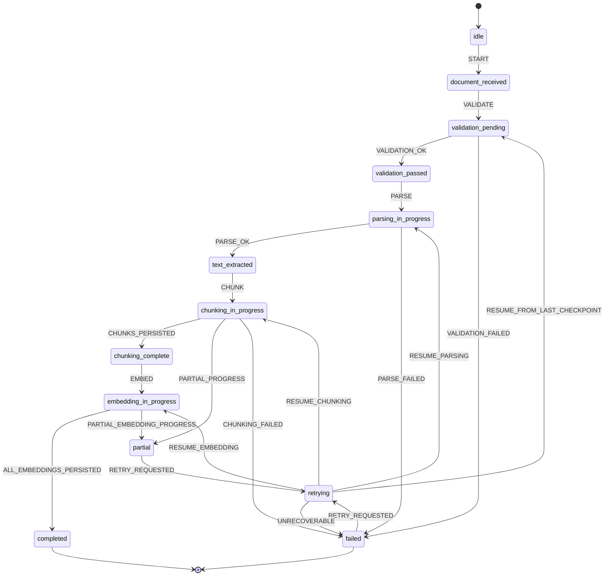

# Feature: RAG Pipeline Orchestrator

## 1. Architectural Context

### Relevant Existing Components

| Component | Responsibility | Relevance to Feature |
| --- | --- | --- |
| `src/features/knowledge-embedding/application/usecases/ReceiveDocumentUseCase.ts` | Creates or rehydrates a document version workflow entry when a document is received. | This is the natural entry point for the orchestrator’s document-version lifecycle and duplicate detection. |
| `src/features/knowledge-embedding/application/usecases/ValidateDocumentUseCase.ts` | Evaluates input validity and emits a validation outcome for the current document version. | It owns the required validation gate before parsing or chunking begins. |
| `src/shared/domain/entities/DocumentVersion.ts` | Represents the parent document-version workflow and its current status/state. | This is the closest existing aggregate root for a durable, resumable document lifecycle. |
| `src/shared/domain/services/DocumentChunkingWorkflow.ts` | XState workflow for document chunking lifecycle state transitions and retry/circuit metadata. | Reuse the current lifecycle semantics instead of introducing a parallel workflow engine. |
| `src/features/knowledge-embedding/application/usecases/ParseDocumentUseCase.ts` | Parses a submitted file into raw extracted text and parser metadata. | This is the stage immediately downstream of validation and upstream of chunk generation. |
| `src/features/knowledge-embedding/application/usecases/ExtractParsedDocumentUseCase.ts` | Retrieves the persisted extracted artifact for the current document version. | This is the hand-off boundary that lets chunking resume without reparsing a valid document. |
| `src/features/knowledge-embedding/application/usecases/ChunkDocumentUseCase.ts` | Generates and persists chunks while advancing stage-local retry/checkpoint state. | This is the existing orchestration owner for the chunking stage and the closest implementation boundary for safe resumption. |
| `src/features/knowledge-embedding/application/services/DefaultDocumentChunkingService.ts` | Normalizes text and creates ordered chunk records using config-driven splitting. | This should remain the default deterministic chunking strategy behind the orchestrator’s stage contract. |
| `src/features/knowledge-embedding/application/services/StructuredDocumentChunkingStrategy.ts` | Applies structured/page-aware chunking logic to extracted content. | It is the natural extension point for preserving section/page context without changing the outer workflow contract. |
| `src/shared/infrastructure/database/schema.ts` | Stores `extracted_document_text`, `knowledge_chunks`, `knowledge_embeddings`, and workflow metadata. | This is the current persistence source of truth and should remain the durable state for this feature. |
| `src/shared/infrastructure/di/registerServices.ts` | Wires parser, extracted-text repository, chunking use case, and semantic search services. | This is where the orchestrator’s dependencies are stitched together without creating a separate subsystem. |
| `src/features/knowledge-embedding/application/services/SemanticSearchService.ts` | Consumes the completed knowledge artifacts for retrieval. | It validates that the orchestrator completes the document-to-knowledge pipeline before the search feature can use the data. |

### Architectural Constraints

* Preserve the current clean-architecture separation: feature use cases orchestrate domain contracts; infrastructure implementations remain persistence and adapter-specific.
* Keep the parent document-version workflow as the durable record of overall processing state; stage-specific retry progress stays subordinate to that parent run rather than becoming a second workflow engine.
* Reuse existing SQLite + Drizzle persistence instead of introducing a separate state store or orchestration framework.
* Maintain a runtime in-memory queue for message-style dispatch and pub/sub behavior. This queue is not the durable source of truth; it is a live runtime projection of persisted workflow rows that is hydrated at app startup from `knowledge_embedding_runs`.
* Treat `knowledge_embedding_runs` as the durable queue of work and the authoritative state model. `pending` rows are queue-eligible work items; `running` rows are active in-flight work and must not be re-enqueued or retried while still active.
* Hydrate the in-memory queue at startup by selecting only `pending` and `partial` rows that are not currently `running`; `failed` rows are not automatically requeued and are treated as terminal unless a new explicit reprocessing trigger is supplied.
* If the app crashes or a worker is terminated unexpectedly while a row is still marked `running`, the next startup or scheduler cycle must treat that row as a stale in-flight lease, not as fresh work. The in-memory queue must reconcile that stale lease before the orchestrator resumes the step from its last durable checkpoint.
* Maintain idempotency at the chunk and embedding boundaries by using deterministic document-version and chunk identities.
* Treat the pipeline as resumable but not magically idempotent: completed work must be skipped on retry, while incomplete work resumes only for the relevant stage or unit. `failed` rows are intentionally not retried automatically unless the business process explicitly decides to re-enter them with a new version or a manual restart.
* Keep validation, parsing, chunking, embedding, and completion as observable workflow states rather than hidden implementation details.
* Do not define a new UI flow or retrieval model; this feature is scoped to durable orchestration and retry-safe completion.

---

## 2. Proposed Architecture

### Abstract Interfaces/Contracts/DTOs Source Code Structure

The important change from the earlier draft is that the orchestrator is introduced as an explicit application-layer coordinator, while the existing use cases remain the stage-specific workers. This keeps the architecture consistent with the current codebase: use cases do the concrete work, and the orchestrator decides the next step and resume policy.

This design includes a runtime in-memory queue for live dispatch and pub/sub-style fan-out, but it is always hydrated from the persisted workflow rows at app startup. The database remains the durable source of truth; the in-memory queue is a runtime projection used for work dispatch and listener notification.

```text
src/
  features/
    knowledge-embedding/
      domain/
        entities/
          KnowledgeEmbeddingRun.ts          // aggregate root for the document pipeline
          KnowledgeDetailRun.ts             // child retry record for a stage
        repositories/
          KnowledgeEmbeddingRunRepository.ts
          KnowledgeDetailRunRepository.ts
          ExtractedDocumentTextRepository.ts
        value-objects/
          KnowledgeEmbeddingStep.ts
      application/
        queue/
          InMemoryWorkflowQueue.ts          // runtime pub/sub queue hydrated from persisted workflow rows
        orchestrators/
          RagPipelineOrchestrator.ts         // owns cross-stage orchestration and resume policy
        usecases/
          ReceiveDocumentUseCase.ts
          ValidateDocumentUseCase.ts
          ParseDocumentUseCase.ts
          ExtractParsedDocumentUseCase.ts
          ChunkDocumentUseCase.ts
          SearchKnowledgeUseCase.ts
        services/
          DefaultDocumentChunkingService.ts
          StructuredDocumentChunkingStrategy.ts
      infrastructure/
        repositories/
          DrizzleExtractedDocumentTextRepository.ts
          DrizzleDocumentChunkingWorkflowRepository.ts
          DrizzleChunkDocumentProgressRepository.ts
        parsers/
          PdfTextParser.ts
  shared/
    domain/
      entities/
        DocumentVersion.ts
        KnowledgeEmbedding.ts
    domain/services/
      DocumentChunkingWorkflow.ts
    infrastructure/
      database/
        schema.ts
      di/
        registerServices.ts
```

```ts
interface InMemoryWorkflowQueue {
  hydrateFromRuns(runs: KnowledgeEmbeddingRun[]): void;
  enqueue(run: KnowledgeEmbeddingRun): void;
  dequeue(): KnowledgeEmbeddingRun | undefined;
  subscribe(listener: (run: KnowledgeEmbeddingRun) => void): () => void;
  clearStaleRunning(): void;
}

interface RagPipelineOrchestrator {
  execute(documentId: string, documentVersion?: number): Promise<KnowledgeEmbeddingRun>;
  resume(documentId: string, documentVersion: number): Promise<KnowledgeEmbeddingRun>;
  restoreQueue(): Promise<KnowledgeEmbeddingRun[]>;
  publish(run: KnowledgeEmbeddingRun): void;
}

interface KnowledgeEmbeddingRun {
  id: string;
  documentId: string;
  projectId?: string;
  documentVersion: number;
  status: 'pending' | 'running' | 'partial' | 'completed' | 'failed' | 'cancelled';
  workflowState: 'idle' | 'document_received' | 'validation_pending' | 'validation_passed' | 'validation_failed' | 'text_extracted' | 'chunking_in_progress' | 'chunking_complete' | 'persisting_chunks' | 'completed' | 'failed' | 'superseded';
  currentStage?: 'validation' | 'parsing' | 'chunking' | 'embedding' | 'indexing';
  retryCount: number;
  lastError?: string;
  updatedAt: Date;
  createdAt: Date;
}

interface KnowledgeDetailRun {
  id: string;
  runId: string;
  stage: 'validation' | 'parsing' | 'chunking' | 'embedding' | 'indexing';
  status: 'pending' | 'running' | 'succeeded' | 'failed' | 'retrying';
  retryCount: number;
  checkpoint?: string;
  failureReason?: string;
  lastCompletedUnit?: string;
  createdAt: Date;
  updatedAt: Date;
}

interface ExtractedDocumentText {
  id: string;
  documentId: string;
  documentVersion: number;
  projectId?: string;
  text: string;
  pageMetadata: Array<{ pageNumber: number; startOffset: number; endOffset: number }>;
  sectionHints?: Array<{ title?: string; startOffset: number; endOffset: number }>;
  elements?: unknown[];
  language?: string;
  warnings?: string[];
  createdAt: Date;
  updatedAt: Date;
}
```

Key invariants:

* The `knowledge_embedding_runs` table is the durable queue. It stores all requested pipeline work, and the queue is reconstructed from persisted rows rather than an external queue service.
* A single document version has exactly one parent run record, and the orchestrator must resume that record instead of creating a second run for the same version.
* `pending` rows are queued work; `running` rows are in-flight work and are excluded from queue restoration so they are not retried while actively processing.
* `partial` rows are recoverable queue items and can be rehydrated for resume or continuation after an interruption or stale in-flight lease.
* `failed` rows are intentionally non-automatic retry items; they are terminal unless the caller explicitly creates a new version or issues a deliberate reprocessing command.
* A stale `running` row is a recoverable ownership failure, not a completed task: if the lease has expired or the worker is no longer alive, the orchestrator must recover it by resuming the last unfinished stage from the last durable checkpoint.
* A `KnowledgeDetailRun` must always belong to the same `runId` as the parent lifecycle record.
* `ExtractedDocumentText` must be persisted before the run can advance to chunking.
* A chunk or embedding is considered complete only when the persisted artifact exists under its deterministic identity; retries must not create a duplicate under the same identity.
* The orchestrator may re-enter a failed or partial run, but it must never restart a completed run without a new version or an explicit reprocessing trigger.

### Data Flow

```text
knowledge_embedding_runs (durable state / source of truth)
    ↓
startup hydration: InMemoryWorkflowQueue.hydrateFromRuns(...)
    ↓
InMemoryWorkflowQueue (runtime pub/sub dispatch)
    ↓
subscribe(listener) / publish(run)
    ↓
RagPipelineOrchestrator
    ↓
ReceiveDocumentUseCase
    ↓
ValidateDocumentUseCase
    ↓
DocumentVersion / knowledge_embedding_runs workflow record
    ↓
ParseDocumentUseCase
    ↓
Persist ExtractedDocumentText
    ↓
ExtractParsedDocumentUseCase
    ↓
ChunkDocumentUseCase
    ↓
Chunk persistence + checkpoint update
    ↓
Embedding provider
    ↓
KnowledgeEmbedding persistence
    ↓
completed / retryable / failed result
```

Important transitions:

1. The orchestrator is the single application boundary for the end-to-end pipeline. It invokes the existing stage-specific use cases in order, but keeps all retry decisions in one place.
2. The durable source of truth remains `knowledge_embedding_runs`. At app startup, the runtime in-memory queue is hydrated from persisted rows so the in-process scheduler can dispatch work using pub/sub-style callbacks and subscriptions without relying on the database as the runtime queue.
3. The memory queue is a live runtime projection: it subscribes to pending work, emits queued items to listeners, and can be rebuilt from the database after process restart. It does not replace the database record; it mirrors it.
4. `ReceiveDocumentUseCase` and `ValidateDocumentUseCase` establish or validate the document-version workflow. If validation fails, the orchestrator stops before parsing or chunking begins.
5. `ParseDocumentUseCase` persists the extracted text. The orchestrator does not allow chunking to continue without that data being available and valid.
6. `ExtractParsedDocumentUseCase` is the resume gate: on retry, the orchestrator loads the persisted extracted artifact and reuses it, avoiding a reparse unless the artifact is missing or invalid.
7. `ChunkDocumentUseCase` owns the chunking stage and stores the checkpoint/progress required for safe resumption.
8. The orchestrator checks the parent run state before each next stage and chooses `resume` vs `start` logic based on the last persisted checkpoint and the current stage status.
9. If a stage fails, the orchestrator leaves earlier successful artifacts in place, records the reason, and returns a retryable or recoverable outcome rather than resetting the whole pipeline.
10. A `running` row is treated as an active lease. It is never re-enqueued by the in-memory queue collector until the worker explicitly transitions it to `failed`, `partial`, `completed`, or `cancelled`.

### State Flow



Side effects and guard conditions:

* The orchestrator may only move forward when the parent workflow record exists for the specific document version.
* Queue reconstruction is read-only: it loads rows from `knowledge_embedding_runs` into the runtime queue, but never replays an active `running` record into the pending queue.
* A stale `running` row must be reconciled before it is resumed; the lease timeout or heartbeat check is the guard that decides whether the row is abandoned and safe to continue from the last durable checkpoint.
* `VALIDATION_OK` requires a supported file type and non-empty document payload.
* `PARSE_OK` requires the extracted text to be persisted before the run is advanced.
* `CHUNKS_PERSISTED` requires the chunk repository to confirm the current unit is durable before the checkpoint is marked complete.
* `RESUME_*` is allowed only when the parent run is `running` or `partial`; a completed run requires a new version or explicit reprocessing, and a `failed` row is not auto-resumed unless the caller intentionally re-enters it.
* `PARTIAL_PROGRESS` indicates the pipeline is recoverable and must preserve the last durable checkpoint for a later retry.
* A `running` row is considered an active lease and must be protected from duplicate dequeueing or emergency retry logic until it is proven stale or has been explicitly marked partial or completed.
* The orchestrator decides whether the next action is validation, parsing, chunking, embedding, or completion based on the persisted run state, not the caller’s memory.

---

## 4. Data / Persistence Changes

The current schema already covers the required durability points, so the orchestrator should not require a separate store or new persistence technology.

* `knowledge_embedding_runs` continues to be the parent workflow record for the overall RAG pipeline.
* `extracted_document_text` remains the durable parse artifact that must exist before chunking begins.
* `knowledge_chunks` remains the canonical chunk result set and should be treated as idempotent by deterministic chunk identity.
* `knowledge_embeddings` remains the completed vector representation for each chunk and is only created after chunk persistence succeeds.
* A `KnowledgeDetailRun` or equivalent child stage record is optional, but it must be stage-local and must not replace the parent workflow record.

Required modifications for the orchestrator feature:

* Add an explicit `RagPipelineOrchestrator` application service and related orchestration contract in the knowledge-embedding feature boundary.
* Ensure the workflow repository is consulted before each stage transition so retries resume from the last durable checkpoint instead of starting from scratch.
* Keep retry metadata on the parent run and the child stage record; do not duplicate that state in the chunk or embedding tables.
* Preserve the existing Drizzle-backed SQLite model; do not add a second runner/process manager.

> No persistence changes are required beyond the workflow/orchestrator state and any minimal checkpoint metadata needed for resume safety.

---

## 5. Error Handling & Resilience

* Invalid input: validation fails before parsing or chunking and the orchestrator records the reason without advancing the workflow.
* Parsing failure: the run remains recoverable and is not marked ready for retrieval. The orchestrator keeps the last durable state and surfaces a retryable failure.
* Chunking failure: the orchestrator preserves already persisted chunks, records the failed unit, and retries only the failed or incomplete section.
* Embedding dependency failure: the orchestrator keeps the chunk records and emits a retryable result while leaving the workflow in a recoverable state.
* Duplicate requests/events: the orchestrator reuses the document-version run and does not create a second persisted workflow if the same version is already active or completed.
* Retry behaviour: the orchestrator resumes from the last recorded stage and the last safe checkpoint for `partial` or stale `running` rows, rather than replaying the whole pipeline from the start. It does not auto-retry terminal `failed` rows.
* Crash recovery: if the app crashes while a row is still in `running`, the orchestrator treats it as a stale in-flight lease, checks whether the stage is still recoverable, and re-enters the step from the last durable checkpoint before continuing.
* Partial failures: all earlier successful results remain durable and are not overwritten; only the incomplete stage is retried.
* Recovery after interruption: the next orchestration execution loads the parent workflow state, checks the persisted checkpoint, and continues from the correct stage.
* Cancellation/navigation: cancellation is only relevant at the caller boundary; the durable run state remains stable so the work can be resumed later.

---

## 6. Implementation Sequence

1. Add the `RagPipelineOrchestrator` application boundary and keep its contract aligned to the existing `KnowledgeEmbeddingRun` aggregate rather than introducing a separate request/result DTO layer.
2. Reuse and tighten the current `KnowledgeEmbeddingRun` aggregate semantics so the orchestrator can resume or retry only eligible runs.
3. Keep `ReceiveDocumentUseCase`, `ValidateDocumentUseCase`, `ParseDocumentUseCase`, `ExtractParsedDocumentUseCase`, and `ChunkDocumentUseCase` as stage workers; wire the orchestrator to call each one in the correct order.
4. Make the orchestrator consult the workflow repository before each stage transition and route to `resume` behavior when a failed or partial run already exists.
5. Ensure `ParseDocumentUseCase` persists extracted text before a chunking resume is allowed to continue.
6. Ensure `ChunkDocumentUseCase` remains the source of checkpoint/progress for chunking stage retries while the orchestrator remains the source of cross-stage orchestration policy.
7. Add focused tests for successful end-to-end execution, validation rejection, parse failure recovery, partial chunking recovery, and duplicate re-entry without duplicate persisted chunks.
8. Run the targeted typecheck and relevant knowledge-embedding tests to confirm that the orchestrator’s retry logic stays within the existing architecture and repository model.

This keeps the feature consistent with the repo’s present structure: a parent workflow record, runtime queue hydration, stage-specific use cases, and an explicit orchestration layer for retry-safe progression.
