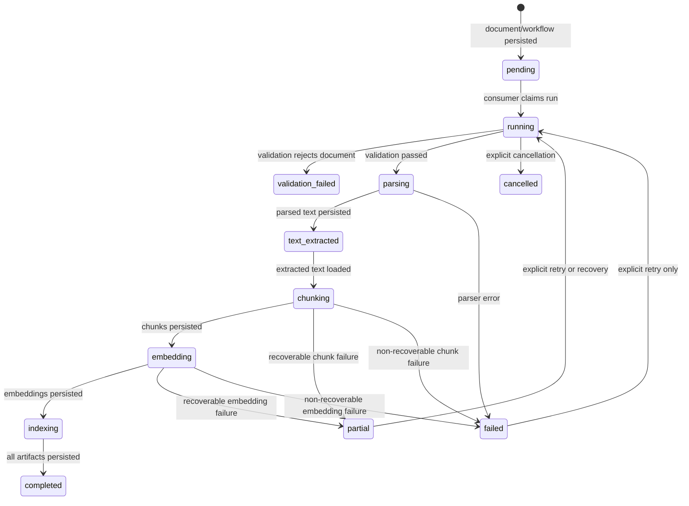

# Feature: RAG Pipeline Queue Consumer

## 1. Architectural Context

### Relevant Existing Components

| Component | Responsibility | Relevance to Feature |
| --- | --- | --- |
| `KnowledgeEmbeddingDocumentService` | Persists documents and `knowledge_embedding_runs` workflow rows, then publishes queue items. | Current producer of pending work. It already owns document metadata, duplicate detection, and recovery publication. |
| `InMemoryWorkflowQueue` | In-memory runtime queue with deduplication, hydration, dequeue, and listener support. | Runtime dispatch mechanism. It currently has no production consumer. |
| `RagPipelineOrchestrator` | Creates, resumes, and restores workflow runs. | Should own stage ordering and resume policy, while the consumer owns queue draining and worker lifecycle. |
| `DrizzleDocumentChunkingWorkflowRepository` | SQLite repository for durable workflow state and checkpoints. | Authoritative state for claiming, progressing, failing, and recovering work. |
| `ParseDocumentUseCase` / `ExtractParsedDocumentUseCase` | Parses a stored document and reloads persisted extracted text. | Parsing and resume stages used by the consumer's orchestration path. |
| `ValidateDocumentUseCase` / `ReceiveDocumentUseCase` | Establishes and validates document-version workflow state. | Existing validation boundary that must run before parsing or chunking. |
| `ChunkDocumentUseCase` | Creates and persists deterministic document chunks with progress checkpoints. | Existing chunking worker; must be invoked rather than duplicated. |
| `EmbedChunkUseCaseImpl` and `DrizzleEmbeddingRepository` | Produces embeddings and persists vector records through the embedding path. | Existing embedding worker and persistence boundary for each chunk. |
| `registerServices.ts` | Registers shared repositories and knowledge-embedding services with tsyringe. | Required location for one shared queue, orchestrator, and consumer instance. |
| `useKnowledgeEmbeddingFlow` | Commits selected files and observes run status for the processing screen. | Producer/UI behavior is already present; it should not perform pipeline work itself. |

### Architectural Constraints

* `knowledge_embedding_runs` remains the durable source of truth; the in-memory queue is only a runtime projection.
* All SQLite access remains inside repository implementations. The consumer and orchestrator use repositories and use cases, never raw SQL.
* The consumer must reuse the existing parser, validation, chunking, embedding, and progress components.
* The parent workflow record must be checked before every stage transition. Child chunk and embedding work cannot advance a completed, cancelled, or invalid parent run.
* A document version has one workflow run. Duplicate queue events must be idempotent and must not create duplicate chunks or embeddings.
* Queue processing must be single-flight per run. A second event for an actively processed run is ignored or coalesced.
* The existing UI contract remains asynchronous: committing a document means queued, not completed.
* No new queue technology, background service dependency, or second database is introduced.

## 2. Proposed Architecture

### Abstract Interfaces/Contracts/DTOs Source Code Structure

```text
src/features/knowledge-embedding/
  application/
    contracts/
      KnowledgeEmbeddingQueueConsumerContracts.ts
      KnowledgeEmbeddingRunContracts.ts        (extend only if needed)
    services/
      InMemoryWorkflowQueue.ts                 (existing queue)
      KnowledgeEmbeddingQueueConsumer.ts       (new runtime worker)
      RagPipelineOrchestrator.ts                (extend with stage execution)
    usecases/
      ReceiveDocumentUseCase.ts                 (existing)
      ValidateDocumentUseCase.ts                (existing)
      ParseDocumentUseCase.ts                   (existing)
      ExtractParsedDocumentUseCase.ts            (existing)
      ChunkDocumentUseCase.ts                   (existing)
  tests/
    unit/KnowledgeEmbeddingQueueConsumer.test.ts
    unit/RagPipelineOrchestrator.test.ts        (extend)
```

The consumer subscribes to queue publication for prompt execution and also exposes an explicit drain operation for startup hydration and tests. It dequeues one item at a time, tracks active run IDs, and delegates the item to the orchestrator. The orchestrator loads the durable workflow record and selects the next stage from persisted state.

Conceptual contracts:

```ts
interface KnowledgeEmbeddingQueueConsumer {
  start(): void;
  stop(): void;
  drain(): Promise<void>;
  processNext(): Promise<boolean>;
}

interface KnowledgeEmbeddingPipelineExecutor {
  execute(item: KnowledgeEmbeddingQueueItem): Promise<KnowledgeEmbeddingRunView>;
}
```

The executor/orchestrator must accept the queue item identity (`runId`, `documentId`, and `documentVersion`) and return the latest persisted run view. It must not trust stale status or stage values carried in the queue item.

### Data Flow

```text
KnowledgeEmbeddingDocumentService.commitDocuments()
    -> InMemoryWorkflowQueue.publish()
    -> KnowledgeEmbeddingQueueConsumer
    -> RagPipelineOrchestrator.executeQueuedItem()
    -> ValidateDocumentUseCase
    -> ParseDocumentUseCase or ExtractParsedDocumentUseCase
    -> ChunkDocumentUseCase
    -> EmbedChunkUseCaseImpl + DrizzleEmbeddingRepository
    -> workflow/checkpoint repositories
    -> KnowledgeEmbeddingDocumentService.getRuns()
    -> processing screen
```

The queue listener schedules a drain rather than doing all work synchronously inside `publish()`. The drain loop prevents concurrent runs of the same queue and continues until the queue is empty. Each stage persists its durable state before the next stage is selected. The UI receives progress by refreshing the existing run view when queue events or persisted updates are observed.

### State Flow



The existing persisted vocabulary does not need to be replaced. Where the current workflow record uses a broader status/stage combination, the orchestrator maps it to the next executable stage and records the concrete stage result in the existing fields.

## 4. Data / Persistence Changes

No new tables are required.

The existing `knowledge_embedding_runs` row must be updated transactionally at stage boundaries, at minimum for:

* `status` (`pending`, `running`, `partial`, `failed`, `completed`, or `cancelled`)
* `workflow_state` / current stage
* `last_event`
* `retry_count`
* `validation_reason` or error message
* `resume_from_checkpoint`
* `checkpoint_id` and `updated_at`

Existing extracted text, chunk, chunk-progress, and embedding repositories remain the persistence boundaries for their artifacts. A migration is unnecessary unless implementation discovers that an atomic claim or lease requires a field not already represented by the current workflow schema. Prefer the existing status/checkpoint fields before adding a lease column.

## 5. Error Handling & Resilience

* **Invalid input:** Reject malformed queue items before processing and record a terminal workflow failure only when a durable run can be identified.
* **Missing document or workflow row:** Do not create a replacement run. Log the correlation identifiers and leave the event discarded because the durable source of truth is absent.
* **Validation failure:** Persist `validation_failed`, stop the pipeline, and expose the validation reason without attempting parsing or embedding.
* **Parser failure:** Preserve the document and workflow row, persist a retryable failure/checkpoint, and do not run chunking against missing text.
* **Chunk or embedding failure:** Preserve successful earlier artifacts, record the failed stage and retry count, and transition to `partial` when the stage can safely resume.
* **Duplicate events:** Deduplicate by `runId` plus document version in the queue and by the durable workflow row in the orchestrator. Existing chunks and embeddings must be reused or treated as duplicates.
* **Concurrent events:** Maintain an active-run set in the consumer. A duplicate event for an active run is coalesced; it must not start a second stage execution.
* **Retry:** Only `pending`, `partial`, or explicitly retryable `failed` runs may be reprocessed. Completed and cancelled runs are terminal unless a new document version is created.
* **Interruption:** On app startup or foreground recovery, hydrate pending/partial work and reconcile stale running rows before draining. A running row must not be blindly duplicated while another worker is active.
* **Consumer errors:** Catch errors at the item boundary, persist the workflow failure through the orchestrator, release the active-run guard, and continue processing unrelated queue items.
* **Shutdown/navigation:** Stopping the consumer prevents new work from being claimed but does not delete queue items or durable rows. The next startup resumes from persisted state.

## 6. Implementation Sequence

1. Define the queue-consumer and pipeline-executor contracts using the existing queue item and run-view types.
2. Extend `RagPipelineOrchestrator` with the stage execution/resume method. Keep `execute`, `resume`, and `restoreQueue` compatible with current callers.
3. Implement `KnowledgeEmbeddingQueueConsumer` with one drain loop, active-run deduplication, explicit `start`/`stop`, and item-level error handling.
4. Wire the consumer's dependencies through `registerServices.ts` using the existing singleton `InMemoryWorkflowQueue`, workflow repository, parser services, chunking use case, embedding use case, and repositories.
5. Start the singleton consumer during app bootstrap after database initialization, then restore durable pending/partial work and drain it. Foreground recovery should call the same recovery entry point rather than creating a second worker.
6. Update `KnowledgeEmbeddingDocumentService.restoreAndResume()` or its caller so recovery publishes work and invokes the consumer drain, without adding a second queue implementation.
7. Add unit tests for immediate publication, FIFO draining, one active execution per run, duplicate events, stage failure persistence, retry/resume, and queue shutdown.
8. Add an integration test covering document commit through parsing, chunking, embedding, and final `completed` workflow state using the existing SQLite test setup.
9. Run the targeted knowledge-embedding tests and `npx tsc --noEmit`; verify that the processing screen moves from pending to completed or a visible failure state.

Implementation must remain limited to the queue consumer and the missing orchestration wiring. Parser-quality changes, UI redesign, new persistence technologies, cloud queues, and unrelated feature repairs are out of scope.