# Feature: Step-Level RAG Pipeline Resume and Retry

## 1. Architectural Context

### Relevant Existing Components

| Component | Responsibility | Relevance to Feature |
| ----------- | ---------------- | -------------------- |
| `RagPipelineOrchestrator` | Loads workflow/document state, runs parse/chunk/embed stages, persists parent status, and publishes completion/failure state | Current execution owner; must change from hardcoded stage calls to generic ordered step dispatch. |
| `KnowledgeEmbeddingRunEntity` | Models parent workflow identity, status, current stage, retry eligibility, and parent/child consistency | Existing domain boundary for pipeline-level state and workflow identity. |
| `knowledge_embedding_runs` / `DocumentChunkingWorkflowRepository` | Persists parent workflow status, workflow state, retry count, checkpoint, circuit state, and recovery flag | Remains the pipeline-level durable state store. |
| `KnowledgeDetailRunEntity` | Models per-stage status, retry count, checkpoint, item counts, and failure details | Existing child state model to use for step-level status; requires stable step identity/order semantics. |
| `knowledge_detail_runs` | Persists per-run stage progress and retry metadata | Existing persistence table; requires repository wiring and likely metadata extension for step version/order. |
| `ChunkDocumentUseCase` | Chunks extracted text, persists chunks, and resumes page/unit work through progress storage | Existing step implementation with its own durable checkpoint behavior. |
| `ChunkDocumentProgressRepository` | Stores completed units, failures, and fallback events for chunking | Remains step-specific checkpoint persistence beneath the generic step record. |
| `ParseDocumentUseCase` / extracted-text repository | Parses a source and persists/reloads extracted text | Existing parse step; successful extracted text is its reusable output. |
| `EmbedChunkUseCase` / embedding repository | Creates and persists vectors for chunks | Existing embedding step; existing vectors are its reusable output guard. |
| `KnowledgeEmbeddingQueueConsumer` / `InMemoryWorkflowQueue` | Drains durable work items and prevents concurrent execution of the same run ID | Remains runtime dispatch; queue items continue to identify one durable workflow. |
| `KnowledgeEmbeddingDocumentService` | Creates, retries, restores, and publishes document workflows | Must retry the same workflow and preserve its persisted step order/state. |
| `knowledge_embedding_runs` and `knowledge_detail_runs` schema definitions | Define current parent and child storage columns | Source for migration planning; no parallel workflow engine should be introduced. |

### Architectural Constraints

- SQLite and existing repository implementations remain the canonical persistence boundary.
- The parent workflow and child step records must remain separate: parent state represents overall pipeline state; child state represents one step's execution.
- Existing workflows retain the step order and step definitions captured at creation; configuration changes apply only to new workflows unless an explicit migration is introduced.
- Every step receives the durable workflow ID plus document/version context and must be safe to retry from persisted state.
- Successful outputs are reused only when their identity/version/contract remains compatible.
- The in-memory queue is a disposable projection; restart recovery must be driven by durable parent and step records.
- Sequential dependencies remain ordered; generic orchestration must not add parallel execution for dependent steps.

### Technology Decision: In-House Durable Workflow vs Third-Party Engine

Implement the durable pipeline/workflow semantics in the existing application architecture rather than adopting a general-purpose workflow engine. This is the smaller and lower-risk change because the repository already has the controlling persistence and recovery boundaries: SQLite parent workflow rows, per-stage `knowledge_detail_runs`, document/version identity, chunk-level progress, embedding idempotency, and an application-owned queue consumer.

The installed `xstate` dependency may be used later as a local state-transition helper if transition validation becomes difficult to maintain, but it must not become the workflow source of truth. XState actor snapshots can persist and restore machine state, but they do not replace the application's durable step records, output references, retry/backoff policy, circuit state, repository transactions, or step-specific checkpoints. Introducing it as the primary orchestrator would duplicate state ownership and require translating between XState snapshots and the existing SQLite workflow model.

Do not introduce Temporal, BullMQ, Agenda, or another external workflow/queue engine for this feature. Those systems are optimized for server-side durable workers and would conflict with the current local SQLite and React Native runtime model, while adding a second queue/recovery mechanism. Reconsider a dedicated workflow product only if the requirements expand to distributed workers, remote scheduling, cross-device execution, or externally managed long-running jobs.

## 2. Proposed Architecture

### Abstract Interfaces/Contracts/DTOs Source Code Structure

Use the existing feature ownership under `src/features/knowledge-embedding`:

```text
src/features/knowledge-embedding/
  application/contracts/
    RagPipelineStepContracts.ts
  application/services/
    RagPipelineOrchestrator.ts
    RagPipelineStepRegistry.ts
    RagPipelineRecoveryService.ts        # only if recovery policy is not kept in orchestrator
  domain/entities/
    KnowledgeEmbeddingRun.ts             # pipeline state
    KnowledgeDetailRun.ts                # step state
  domain/repositories/
    KnowledgeEmbeddingRunRepository.ts
    KnowledgeDetailRunRepository.ts
  infrastructure/repositories/
    DrizzleKnowledgeEmbeddingRunRepository.ts
    DrizzleKnowledgeDetailRunRepository.ts
  tests/unit/
    RagPipelineOrchestrator.test.ts
    KnowledgeDetailRunRepository.test.ts
  tests/integration/
    RagPipelineStepRecovery.integration.test.ts
```

The standardized step contract should be independent of parse/chunk/embed implementations:

```ts
interface RagPipelineStepContext {
  workflowId: string;
  documentId: string;
  documentVersion: number;
  projectId?: string;
  stepId: string;
  stepOrder: number;
  stepVersion: string;
  attempt: number;
  pipelineState: string;
  stepState: KnowledgeDetailRun;
  previousOutput?: RagPipelineOutputReference;
}

interface RagPipelineStep {
  readonly id: string;
  readonly version: string;
  execute(context: RagPipelineStepContext): Promise<RagPipelineStepResult>;
}

interface RagPipelineStepResult {
  status: 'completed' | 'partial' | 'failed' | 'cancelled';
  output?: RagPipelineOutputReference;
  checkpoint?: string;
  retryable: boolean;
  error?: { code: string; message: string };
  itemsTotal?: number;
  itemsProcessed?: number;
  itemsSucceeded?: number;
  itemsFailed?: number;
}

interface RagPipelineOutputReference {
  key: string;
  version: string;
  checksum?: string;
  documentId: string;
  documentVersion: number;
}
```

The registry/configuration should create an immutable workflow definition at workflow creation time:

```ts
interface RagPipelineDefinition {
  id: string;
  version: string;
  steps: Array<{ id: string; version: string; order: number }>;
}

interface RagPipelineStepRegistry {
  getDefinition(definitionId: string, version: string): RagPipelineDefinition;
  resolve(stepId: string, version: string): RagPipelineStep;
}
```

Required invariants:

- Step IDs are unique within a pipeline definition.
- A workflow stores its definition identity/version and ordered step snapshot; later global configuration changes do not reorder existing workflows.
- A child step record is uniquely addressable by workflow ID and step ID, not only by a display stage name.
- A step cannot execute before all prior steps in the workflow order are completed with valid outputs.
- A completed step can be reused only when its output reference and step version remain compatible.
- A failed or partial step must retain its error/checkpoint/retry state; retry increments the step attempt and does not reset successful upstream steps.
- Parent completion is allowed only when every active child step is completed.

The parent record should retain pipeline-level fields already present in `knowledge_embedding_runs`, plus a definition/version reference and current step ID if those are not represented by existing fields. The child record should retain `KnowledgeDetailRun` fields, add stable `stepId`, `stepOrder`, and step-version/output reference metadata, or use a serialized immutable workflow definition to derive order consistently.

### Data Flow

```text
Document/workflow creation
        |
        v
Persist parent workflow + immutable ordered step snapshot
        |
        v
Create one pending child step record per configured step
        |
        v
InMemoryWorkflowQueue -> KnowledgeEmbeddingQueueConsumer
        |
        v
RagPipelineOrchestrator loads parent and child records
        |
        v
Select earliest failed/partial/running-without-completion/pending step
        |
        v
Resolve step by stable ID + captured version
        |
        v
Execute step with workflow ID, document/version, prior output, and checkpoint
        |
        +--> Persist child result/checkpoint/output
        |
        +--> Update parent current step/status/retry/circuit state
        |
        v
Repeat in persisted order until all child steps complete
        |
        v
Mark parent workflow completed and make outputs available to retrieval/consumers
```

### Workflow & State Transitions

```mermaid
stateDiagram-v2
    [*] --> Pending
    Pending --> Running: queue item accepted
    Running --> Running: step completed; advance to next step
    Running --> Partial: step checkpoint saved with incomplete work
    Running --> Failed: non-retryable step failure
    Running --> RetryWaiting: retryable step failure and attempts remain
    RetryWaiting --> Running: backoff elapsed / retry permitted
    Running --> Completed: all active steps completed
    Running --> Cancelled: cancellation accepted
    Partial --> Running: resume from earliest incomplete step
    Failed --> RetryWaiting: explicit retry and policy permits
    RetryWaiting --> Failed: retry limit reached / circuit opens
    Completed --> Completed: duplicate resume request
    Cancelled --> Cancelled: duplicate cancellation or resume rejected
```



Transition rules:

- `Pending -> Running`: queue consumer validates workflow identity and loads the immutable step order.
- `Running -> Running`: after a child step is durably completed, the parent advances to the next step; already valid completed children are not invoked.
- `Running -> Partial`: a step persists a checkpoint while some step units remain incomplete.
- `Running -> Failed`: a child returns a non-retryable failure or required persistence fails.
- `Running -> RetryWaiting`: a retryable failure is persisted with attempt count, next-attempt/backoff metadata, and circuit state.
- `RetryWaiting -> Running`: retry policy allows the same step to run again from its checkpoint.
- `Partial -> Running`: recovery selects the earliest incomplete child in the workflow's captured order.
- `Running -> Completed`: every active child has a valid completed output.
- `Running -> Cancelled`: no new steps are scheduled; active-step cancellation is recorded according to the step's cancellation capability.

## 4. Error Handling & Resilience

- Invalid or missing workflow identity, document/version identity, step ID, definition version, or duplicate step ID is a non-retryable configuration failure. It must be persisted at parent level and must not run downstream steps.
- Step execution receives a stable workflow ID and its child record so it can load durable step-specific data through repositories. Steps must not create a second pipeline identity.
- Retry selection scans the workflow's captured ordered step list and chooses the earliest child in `failed`, `partial`, `running` without a completed output, or `pending` state. Later steps remain blocked until that step completes.
- Successful child outputs are reused only after compatibility validation. If a step version, output checksum, or contract is incompatible, that child and every downstream child are invalidated; valid upstream outputs remain reusable.
- Retry limits, exponential or configured backoff, and circuit breaking are applied per child step. A blocked retry leaves the parent recoverable or failed according to policy and records why execution was not attempted.
- Persistence ordering is durable-output-first, then child completion, then parent advancement. A step must not be reported completed if its output/checkpoint was not persisted.
- Duplicate queue items and concurrent resume requests are coalesced by workflow ID; `KnowledgeEmbeddingQueueConsumer` remains the runtime single-flight guard.
- Application restart reloads parent and child records, reconstructs the captured order, and queues only recoverable workflows. An interrupted `running` child without a completed output is treated as the earliest incomplete step and retried according to policy.
- Existing step-specific recovery remains intact: parsing reuses `extracted_document_text`, chunking reuses page progress and existing chunks, and embedding skips chunks that already have vectors.
- Existing workflow definitions are immutable for execution. New definitions and reordered steps apply only to new workflows; no automatic migration of active workflows is required.
- Cancellation stops scheduling downstream work, persists parent and active-child cancellation, and does not automatically resume unless explicitly requested by the recovery policy.

### Implementation Plan

1. Extend the workflow model and schema with an immutable pipeline definition/version reference and enough child metadata to identify stable step ID, order, version, output reference, and retry timing. Preserve existing document/version identity and parent workflow fields.
2. Complete the `KnowledgeDetailRunRepository` contract with a Drizzle implementation and DI registration. Support lookup by workflow ID, stable step ID, and ordered recovery state.
3. Add generic `RagPipelineStep` contracts and a registry/definition model under `application/contracts` and `application/services`. Adapt parse, chunk, and embed operations behind the common contract without moving their domain-specific persistence into the orchestrator.
4. Refactor `RagPipelineOrchestrator` to load the parent plus child records, select the earliest recoverable step, invoke the registry-resolved step, persist child state, and advance parent state generically. Remove hardcoded parse/chunk/embed branching from the control loop.
5. Adapt existing steps: parse output references `extracted_document_text`; chunk output references the document/version chunk set and retains `ChunkDocumentProgressRepository`; embed output references completed vector coverage and retains `EmbeddingRepository` idempotency checks.
6. Update workflow creation to snapshot the current ordered definition and create pending child records. Update retry/resume and startup restoration to enqueue the existing workflow without replacing its definition or creating a new run.
7. Add per-step retry policy data and enforcement for attempt limits, backoff, retryability, and circuit-open state. Keep parent state derived from child states plus persisted pipeline events.
8. Keep the first implementation in the existing domain/repository/orchestrator layer. Do not add a third-party workflow engine; optionally evaluate XState later as a pure transition-validation helper after durable behavior is covered by tests.
9. Add unit tests for step selection, successful-step reuse, contract/version invalidation, order preservation, retry policy, duplicate requests, and parent/child transitions.
10. Add integration tests covering restart recovery, parse/chunk/embed stage failure, chunk-level checkpoints, missing vector recovery, and changed definitions applying only to new workflows.
11. Run the targeted knowledge-embedding tests and TypeScript typecheck; update `docs/Embedding-Data-Flow.md` after implementation to describe the generic step lifecycle.

No separate orchestration engine or new persistence store is required. The change should evolve the existing parent/child workflow model and repository boundaries.
