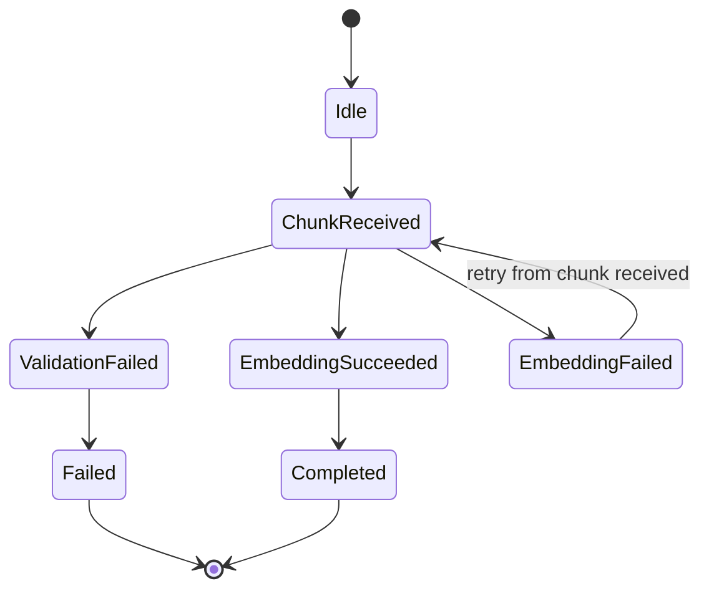

# Feature: React Native Embedding Service

## 1. Architectural Context

### Relevant Existing Components

| Component | Responsibility | Relevance to Feature |
| --- | --- | --- |
| `src/features/knowledge-embedding/application/services/EmbeddingProviderEmbeddingService.ts` | Defines the embedding provider abstraction and the local fallback model used by the feature. | This is the canonical extension point for the React Native local embedder and should be the primary site for the new provider selection logic. |
| `src/features/knowledge-embedding/application/usecases/ChunkDocumentUseCase.ts` | Produces `KnowledgeChunk` records from validated extracted text, persists them, and records workflow/progress state. | This is the immediate upstream producer of text that must be embedded. It should feed the embedding step, not replace it. |
| `src/shared/domain/entities/KnowledgeChunk.ts` | Validates the chunk content contract. | The chunk text is the exact input to embedding generation and must remain non-empty and deterministic for idempotent retries. |
| `src/shared/domain/entities/DocumentVersion.ts` | Tracks processing lifecycle, validation state, errors, and circuit/retry flags. | This is the existing record used to persist validation and failure states, including the feature requirement that invalid input and embedding failures be recorded. |
| `src/shared/domain/services/DocumentChunkingWorkflow.ts` | Represents the outer document lifecycle state machine with retry/circuit semantics. | This is the existing document-level pattern for retry and circuit behavior and should be reused for stage-level fail/retry semantics. |
| `src/shared/infrastructure/database/schema.ts` | Declares persisted project facts, extracted text, chunk records, embedding records, and workflow records. | The `knowledge_embeddings` table already exists and should be reused; no new storage technology is required. |
| `src/shared/infrastructure/repositories/DrizzleEmbeddingRepository.ts` | Saves and retrieves embedding rows keyed by chunk ID. | This is the persistence boundary for embedding output and should stay aligned with the local provider configuration and dimension validation. |
| `src/shared/infrastructure/database/migrations.ts` | Creates the SQLite schema and indexes for embeddings and workflow records. | Any change should be schema-compatible and should avoid introducing a second persistence path. |
| `src/features/knowledge-embedding/domain/entities/KnowledgeEmbeddingSession.ts` | Feature-local onboarding/session state for the knowledge-embedding flow. | Not the embedding provider itself, but it confirms the feature already owns a local workflow boundary for mobile behavior. |

### Architectural Constraints

* Preserve the existing Clean Architecture dependency direction: feature/application orchestration depends on shared domain contracts and infrastructure adapters, not the other way around.
* Keep the local embedding provider as the preferred default for all chunk embedding generation in the React Native app unless the provider is unavailable.
* Reuse the existing SQLite persistence model and Drizzle repository pattern; do not add a second vector database or a second persistence strategy for the initial implementation.
* Keep the feature limited to local chunking, embedding, and embedding search; all LLM inference remains backend/API-driven.
* Idempotency is required across retry and duplicate requests. Embedding generation must avoid creating duplicate records for the same chunk text.
* `DocumentVersion` is the existing place to record validation and failure status, so validation failures and embedding failures should not bypass that lifecycle record.
* The embedding service should not silently fall back to the default non-local provider when an on-device provider is selected and available; if the provider fails, the operation fails and the circuit state is opened.

---

## 2. Proposed Architecture

### 2.1. Domain Entities & DTOs

```ts
interface EmbeddingProviderConfig {
  provider: 'react-native-executorch' | string;
  modelVersion?: string;
  dimension: number;
}

interface EmbeddingInput {
  text: string;
  documentId: string;
  documentVersion: number;
  chunkId?: string;
}

interface EmbeddingRecord {
  id: string;
  chunkId: string;
  vector: number[];
  dimension: number;
  provider?: string;
  modelVersion?: string;
  fingerprint?: string;
  createdAt: Date;
}

interface EmbeddingService {
  readonly provider: string;
  readonly modelVersion?: string;
  readonly dimension: number;
  embed(text: string): Promise<Float32Array>;
  embedBatch(texts: string[]): Promise<Float32Array[]>;
  embedWithRetry(text: string, retries?: number): Promise<Float32Array>;
}

// Concrete provider-specific implementations may be named as follows:
// - ExecutorchEmbeddingService
// - OnDeviceEmbeddingService
// - RemoteEmbeddingService
// The abstraction remains generic; locality is an implementation detail.

interface EmbeddingSearchQuery {
  text: string;
  dimension: number;
  provider?: string;
  modelVersion?: string;
}
```

Key invariants:

* `text` must be non-empty after trimming.
* `vector.length` must equal configured `dimension`.
* The generated vector must contain finite numeric values only.
* Provider/model metadata must be persisted with the embedding so a vector search can be interpreted correctly later.
* A duplicate chunk text must resolve to a single durable embedding record for the same document version and chunk identity.

### 2.2. Workflow & State Transitions



State responsibilities:

* `Idle`: no active embedding work.
* `ChunkReceived`: a `KnowledgeChunk` has been handed to the embedding flow and is eligible to be retried after any failure.
* `ValidationFailed`: invalid chunk content is rejected and recorded as a failure for the document version.
* `EmbeddingSucceeded`: the embedding was generated and persisted successfully.
* `EmbeddingFailed`: the embedding attempt failed; the entire step is treated as failed and is retried from `ChunkReceived`.
* `Completed`: the chunk has succeeded and no further embedding work is required.
* `Failed`: terminal failure caused by invalid input or an unrecoverable failure after the process has been explicitly stopped.

Guard conditions:

* Validation fails when the trimmed text is empty or structurally invalid.
* Any embedding generation failure is treated as a failed step and re-enters the workflow at `ChunkReceived`; the process does not maintain intermediate retry states.
* Duplicate requests do not create a second persisted row when the same chunk ID or canonical chunk content already exists.
* Only the final outcome matters to the workflow: `EmbeddingSucceeded` or `EmbeddingFailed`.

### 2.3. Application State & Behavior Abstractions

The application boundary should use a minimal orchestration contract, not a full new engine.

```ts
interface EmbedChunkCommand {
  documentId: string;
  documentVersion: number;
  chunkId: string;
  text: string;
}

interface EmbedChunkResult {
  chunkId: string;
  status: 'embedded' | 'duplicate' | 'failed';
  vector?: number[];
  provider?: string;
  modelVersion?: string;
  error?: string;
}

interface EmbedChunkUseCase {
  execute(input: EmbedChunkCommand): Promise<EmbedChunkResult>;
}

interface QueryEmbeddingUseCase {
  execute(input: EmbeddingSearchQuery): Promise<Float32Array>;
}
```

Primary responsibilities:

* `EmbedChunkUseCase` validates chunk content, checks for existing embeddings, invokes the local provider, persists the vector, and updates the `DocumentVersion` failure or status record if validation or persistence fails.
* `QueryEmbeddingUseCase` generates a search vector for a query using the same model/dimension contract so vector-search operations remain compatible with stored chunk embeddings.
* Application state should remain thin and ephemeral: the feature should keep the current request state, path selection, and retry/circuit metadata in memory or in the existing workflow record; persisted domain state remains in `DocumentVersion`, `KnowledgeChunk`, and `knowledge_embeddings`.

### 2.4. Implementation Boundaries & Constraints

* The local embedding provider must be the only provider used by the React Native path when available; no fallback to the default remote service is allowed for this feature.
* The abstraction should remain generic under `EmbeddingService`, while the concrete implementation is the local on-device provider (for example `ExecutorchEmbeddingService` or `OnDeviceEmbeddingService`). Only one concrete provider should be active in the initial version.
* The actual chunking step remains upstream and should continue to return `KnowledgeChunk` objects; the embedding step should consume those chunks without owning chunk parsing or document validation logic.
* The `DocumentVersion` record remains authoritative for validation and failure status, not the embedding repository.
* Circuit/retry behavior is coarse-grained and should align with the existing `DocumentChunkingWorkflow` pattern rather than inventing a second retry model.
* Query embeddings must share the exact provider and dimension contract as chunk embeddings to preserve retrieval correctness.
* The feature should not include LLM inference in the mobile app; any LLM call sits in the backend API layer and remains out of scope.

---

## 4. Data / Persistence Changes

No new persistence technology is required. The existing SQLite schema already supports the required behavior:

* `knowledge_chunks` stores the original source text and chunk metadata.
* `knowledge_embeddings` stores the generated vector, dimension, provider, model version, and creation timestamp.
* `document_chunking_workflows` and `DocumentVersion` already provide the lifecycle and retry/failure status patterns needed for the embedding flow.

Required persistence changes are limited to:

* ensuring the chunk-to-embedding relationship is unique per chunk identity;
* ensuring vector length matches the configured dimension;
* storing provider and model version alongside the prediction;
* recording validation or embedding failures in `DocumentVersion` or the workflow record when the flow is rejected or retried.

No new database schema is required unless a later implementation decides that search-history or query embedding persistence must be retained. For the first version, persisted embeddings are created only for chunk text and are written to the existing `knowledge_embeddings` table.

> No persistence changes are required.

---

## 5. Error Handling & Resilience

The architecture should handle the following failures explicitly:

* Invalid input: empty or whitespace-only chunk text is rejected before embedding generation begins.
* Local provider failure: if `react-native-executorch` fails during inference, the step is marked as `EmbeddingFailed` and the workflow re-enters from `ChunkReceived` for the next retry attempt.
* No fallback: the request must not fall back to the default non-local embedding service when the local provider was selected and available.
* Duplicate requests: repeated retry or duplicate event handling must resolve to a single persisted embedding record for the same chunk identity or canonical text.
* Persistence failure: if vector persistence fails, the request remains failed and the app must not report success; the request is re-tried from `ChunkReceived`.
* Validation and failure recording: invalid input or failed embedding generation must be written to `DocumentVersion` and/or workflow state for later diagnosis.
* Partial failure: if embedding generation succeeds but storage fails, the system must not report success and must leave enough durable state to retry cleanly later by re-entering from `ChunkReceived`.
* Recovery after interruption: because the process is idempotent and the repository is already durable, a retry should resume safely without duplicating chunk embeddings.

---

## 6. Implementation Sequence

1. Add or update the domain contracts for `EmbeddingProviderConfig`, `EmbeddingRecord`, and the generic `EmbeddingService` abstraction in the feature-local layer.
2. Update `EmbeddingProviderEmbeddingService.ts` to support the `react-native-executorch` provider as the concrete on-device implementation for the React Native app while preserving the generic provider abstraction.
3. Ensure the service validates empty input, dimension mismatch, and invalid vector generation before returning a result.
4. Wire the existing document/chunk pipeline to invoke the local embedding service for each chunk instead of any default remote provider.
5. Reuse `DocumentVersion` and existing workflow records to persist validation and failure state for invalid input or failed embedding attempts.
6. Add the idempotency check before persisting a vector or embedding row so retries do not create duplicate rows for the same chunk content.
7. Add the query-embedding contract and validation so embedding-based search uses the same provider, model, and dimension as stored chunk embeddings.
8. Add focused unit tests for empty input, duplicate content, failed embedding retry behavior from `ChunkReceived`, persistence failure, and provider selection.
9. Run the repository typecheck and the focused knowledge-embedding tests to verify the contract remains compatible with the current architecture.

Implementation guardrails:

* Do not introduce a new vector database or a second persistence mechanism.
* Do not add LLM inference to the mobile app.
* Do not add a remote embedding fallback for this feature.
* Do not broaden the feature beyond chunk embedding + local search compatibility.
* Keep the change small and aligned with the existing `EmbeddingProviderEmbeddingService` and SQLite repository patterns.
