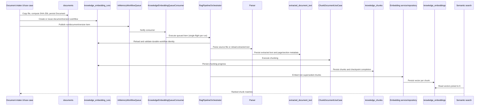

# Embedding Data Flow

## Scope

This document describes the current document-to-RAG persistence path in Builder Assistant: document capture, content identity, parsing, chunking, embedding storage, workflow state, and retrieval. SQLite is the only persistence store. Drizzle defines the schema and migrations; repository implementations execute runtime SQL through the SQLite connection.

## High-Level Flow



`KnowledgeEmbeddingDocumentService` persists the document and parent workflow before publishing a runtime queue item. At app startup, `RagPipelineOrchestrator.restorePipelineQueue()` hydrates pending, partial, and running parent rows, then the container-cached `KnowledgeEmbeddingQueueConsumer` drains the shared queue. The consumer prevents concurrent execution of the same run and delegates stage execution to `RagPipelineOrchestrator.executeQueuedItem()`.

## Document Capture and Content Identity

`documents` is the user-facing file record. It is separate from the RAG workflow and remains one row per uploaded document, including exact-content duplicates.

| Field | Meaning |
|---|---|
| `id` | Stable text domain identifier used by application and RAG rows. |
| `local_id` | SQLite internal auto-increment key; not the domain identity. |
| `filename`, `title`, `type`, `mime_type`, `size` | File metadata. |
| `uri`, `local_path`, `storage_key`, `cloud_url` | Source and storage locations. |
| `status` | Document storage state such as `local-only`, `upload-pending`, `uploaded`, or `failed`. |
| `checksum` | SHA-256 content hash used for exact-content matching. Indexed by `idx_documents_checksum`; not unique because duplicate document rows are allowed. |
| `rag_source_document_id` | Optional ID of the original document whose chunks/embeddings are reused by this duplicate. |
| `project_id`, `task_id` | Optional soft links to application records. |

The knowledge embedding document service performs this sequence:

1. Copy the source file to app storage.
2. Compute SHA-256 from the stored path, unless the command already supplies `contentHash`.
3. Search `documents` by checksum.
4. Always persist the new `Document` row.
5. If a matching source document has a workflow for the requested version, set `rag_source_document_id`, return the source workflow as an already-handled result, and do not publish another queue item.
6. Otherwise create the normal workflow and publish it.

Deleting a duplicate document removes only that document row and its local file. It must not remove the source document's chunks or embeddings.

## Embedding Database Tables

### 1. `documents`

**Purpose:** Canonical file/document record and content-deduplication entry point.

**Relationships:** One document can have zero or one `rag_source_document_id` alias to another document. RAG tables refer to the document's domain `id` through soft relationships.

**RAG relevance:** Stores the checksum used to avoid repeating processing for identical bytes while preserving independent uploads.

### 2. `knowledge_embedding_runs`

**Purpose:** Durable workflow/run state for a document version.

| Field group | Stored information |
|---|---|
| Identity | `id`, `document_id`, `document_version`, optional `project_id`. |
| State | `status`, `workflow_state`, `last_event`, `validation_reason`. |
| Recovery | `checkpoint_id`, `retry_count`, `circuit_open`, `resume_from_checkpoint`. |
| Analysis flags | `supported_for_analysis`, `is_already_analyzed`. |
| Audit | `created_at`, `updated_at` as Unix milliseconds. |

The repository is keyed operationally by `(document_id, document_version)`. A duplicate document that reuses an existing RAG source does not create a second run; its `documents.rag_source_document_id` points back to the source run's document.

### 3. `knowledge_detail_runs`

**Purpose:** Domain and schema representation for per-stage workflow progress beneath a parent embedding run.

| Field group | Stored information |
|---|---|
| Identity | `id`, `run_id`, `stage`. |
| State | `status`, `started_at`, `completed_at`, `error_message`. |
| Progress | `items_total`, `items_processed`, `items_succeeded`, `items_failed`. |
| Recovery | `retry_count`, `checkpoint`. |
| Audit | `created_at`, `updated_at`. |

`KnowledgeDetailRunEntity` validates stage transitions and retry rules. The current queued executor persists the parent workflow record through `DocumentChunkingWorkflowRepository`; detail-run persistence is a separate schema/domain capability and must not be mistaken for the parent run's `workflow_state` fields.

### 4. `extracted_document_text`

**Purpose:** Parsed text artifact for a document version, kept separate from the original file record and from chunk rows.

| Field | Stored information |
|---|---|
| `document_id`, `document_version`, `project_id` | Source identity and optional project scope. |
| `text` | Full normalized/extracted document text. |
| `page_metadata` | JSON page boundaries, page numbers, offsets, and page text metadata. |
| `section_hints` | JSON section/heading hints when available. |
| `elements` | JSON structured elements such as headings, paragraphs, lists, tables, and figures. |
| `language`, `warnings` | Parser metadata and non-fatal parse warnings. |
| `created_at`, `updated_at` | Unix-millisecond timestamps. |

The `ParseDocumentUseCase` validates the input, invokes the selected parser, rejects empty output, and persists this artifact through `DrizzleExtractedDocumentTextRepository`.

### 5. `knowledge_chunks`

**Purpose:** Searchable text segments generated from extracted document text.

| Field group | Stored information |
|---|---|
| Identity | `id`, `document_id`, `document_version`, optional `project_id`. |
| Content | `content`, `chunk_index`. |
| Measurements | `token_count`, `word_count`, `char_count`, `start_offset`, `end_offset`. |
| Lifecycle | `is_outdated`, `is_superseded`, `superseded_by_chunk_id`, `superseded_at`. |
| Metadata | JSON page number, boundary, and other chunk context. |
| Audit | `created_at`, `updated_at`. |

`ChunkDocumentUseCase` loads extracted text, checks validation state, resumes page-level progress, generates chunks with the configured strategy, saves them, and marks replaced chunks as superseded. Chunks are not vectors; they are the source text that embeddings reference.

### 6. `knowledge_embeddings`

**Purpose:** Vector representation of a chunk for semantic retrieval.

| Field | Stored information |
|---|---|
| `id` | Embedding record identifier. |
| `chunk_id` | Soft link to `knowledge_chunks.id`. |
| `vector` | JSON-serialized numeric vector. |
| `dimension` | Vector length; must equal the stored vector length. |
| `provider`, `model_version` | Embedding runtime provenance. |
| `fingerprint` | Optional embedding/content fingerprint. |
| `created_at` | Unix-millisecond timestamp. |

`KnowledgeEmbeddingEntity` validates vector presence, finite values, and dimension consistency. `DrizzleEmbeddingRepository` serializes vectors to JSON on write and parses them on read.

### 7. `project_facts` (adjacent RAG data)

**Purpose:** Persisted, project-scoped facts for downstream analysis and retrieval context. It is not required to create a chunk or embedding and is not part of the document-to-vector foreign-key chain.

It stores `fact_type`, canonical and normalized text, lifecycle `status`, confidence, project scope, and timestamps.

## Key Relationships

```text
documents.id
  ├── knowledge_embedding_runs.document_id + document_version
  │       └── knowledge_detail_runs.run_id
  ├── extracted_document_text.document_id + document_version
  └── knowledge_chunks.document_id + document_version
          └── knowledge_embeddings.chunk_id

Duplicate documents:
  documents[duplicate].checksum = documents[source].checksum
  documents[duplicate].rag_source_document_id = documents[source].id
  documents[duplicate] --uses--> source workflow/chunks/embeddings
```

These are application-enforced relationships rather than declared SQLite foreign keys. This allows the existing schema to preserve soft-link behavior and lets duplicate document records remain independently removable.

## Pipeline Stages

### 1. Receive and register

The document service path persists the `documents` row, storage path, checksum, and a `pending` parent workflow before publishing work. Legacy receive/validate use cases may create earlier workflow states such as `document_received`; the queue executor consumes the persisted document/version identity and does not create a replacement run.

### 2. Validate

Validation determines whether the document can be analyzed. The queued orchestrator currently passes the chunking use case a `passed` validation status after loading or parsing extracted text; validation failure handling remains represented by the parent workflow fields and the dedicated validation boundaries. No chunks should be generated from a failed document.

### 3. Parse

The parser registry selects a parser by source type. Successful parsing produces full text plus page metadata, section hints, structured elements, language, and warnings. The extracted result is persisted in `extracted_document_text` and can be reloaded by document/version.

### 4. Chunk

`RagPipelineOrchestrator.executeQueuedItem()` invokes `ChunkDocumentUseCase` with the persisted project/document version and extracted text. The use case requires a passed validation state and non-empty extracted text, processes pages, records page-level progress, uses the structured chunking strategy with deterministic fallback, persists `knowledge_chunks`, and reports failure to the parent workflow.

### 5. Embed

The embedding runtime chooses the configured provider, native ExecuTorch when available, or the deterministic local fallback. The resulting vector is validated and persisted by `DrizzleEmbeddingRepository` against the chunk ID. Provider, model version, dimension, and optional fingerprint remain attached to each embedding row.

### 6. Complete and recover

Parent workflow rows carry status, stage, retry, and checkpoint fields; `knowledge_detail_runs` provides the finer-grained stage model. `RagPipelineOrchestrator.restorePipelineQueue()` rehydrates `pending`, `partial`, and `running` rows into `InMemoryWorkflowQueue`, and the consumer drains them after startup. Resume/retry must operate against the existing document/version run and must not create duplicate chunks or embeddings for completed work.

## Retrieval Path

`SearchKnowledgeUseCaseImpl` normalizes the request and combines semantic and keyword results. `DefaultSemanticSearchService` embeds the query, then `DrizzleSemanticSearchRepository` joins `knowledge_embeddings` to `knowledge_chunks`, filters outdated chunks, applies project/metadata filters, calculates cosine similarity in application code, and returns ranked matches.

For a duplicate document filter, the repository resolves `documents.rag_source_document_id` and accepts chunks belonging to either the requested document or its source. Returned matches retain the requested duplicate document ID for the caller while the stored chunk remains owned by the source document.

## Invariants

- A checksum identifies exact file content, not document lineage or user-visible identity.
- Duplicate uploads create separate `documents` rows but share one RAG processing run when the source workflow already exists.
- `(document_id, document_version)` identifies a workflow scope; chunk IDs include document and version context.
- Every embedding references a chunk, and every chunk belongs to a document/version.
- Reprocessing may supersede old chunks; it must not silently mix outdated chunks into retrieval.
- The in-memory queue is disposable runtime state; SQLite parent workflow rows are required for restart recovery.
- A queue item is identified by `runId`, `documentId`, and `documentVersion`; duplicate items are ignored or coalesced and must not execute the same run concurrently.
- Repository implementations own SQLite access. Screens, hooks, and use cases use repository contracts.
